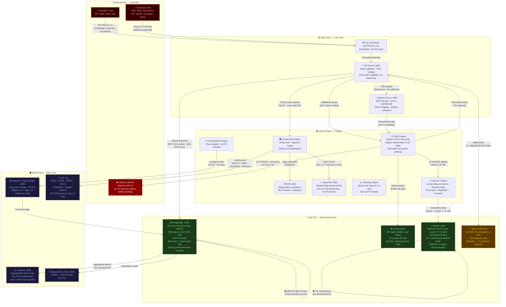
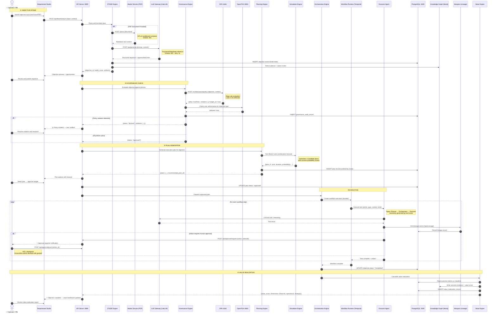

# Ecosystem Building Blocks Reference Guide

## 1. Executive Summary

Enterprise operations today are severely fragmented by disconnected communication systems, inconsistent ticketing workflows, and siloed data stores. As organizations attempt to resolve these inefficiencies by adopting artificial intelligence, they inevitably encounter **agent sprawl**—creating autonomous agents faster than they can govern, orchestrate, secure, or align them with actual business goals.

The **Universal AI Workforce Operating System (UAWOS)** is a governed, objective-centric execution fabric designed to serve as the control plane for the autonomous enterprise. UAWOS shifts the operational paradigm from task-tracking tools to **Objectives** as the primary system abstraction. It provides a standardized environment where human operators and AI agents collaborate within strict, code-enforced boundaries of compliance, safety, and budget.

This reference guide serves as the definitive architecture and ecosystem catalog for UAWOS. It details every system, platform engine, user interface, database, security control, and integration pathway across the platform.

### Strategic Vision and Success Metrics
Success in UAWOS is defined by value delivered, not by task volume. The platform tracks its efficacy using five core metrics:
*   **Objective Success Rate**: Percentage of objectives successfully transitioned to the `Completed` state.
*   **Value Realization Rate**: Actual business value delivered mapped against original hypotheses.
*   **Governance Compliance Rate**: Percentage of executions complying with active Open Policy Agent (OPA) rules.
*   **Total Cost of Ownership (TCO) Reduction**: Optimization of token and compute spending per objective.
*   **Planning Accuracy**: Correlation between simulated plan costs/durations and actual execution metrics.

---

## 2. Ecosystem Overview

UAWOS operates as a unified execution fabric spanning six distinct layers:

1.  **Experience Layer**: High-fidelity, single-page web applications for operators, compliance officers, and executives.
2.  **Control Plane**: An asynchronous API server handling ingestion, routing, and lifecycle states.
3.  **Platform Engines**: Twenty-one independent Python engines governing specific domain capabilities.
4.  **Federated Graph Layer**: Connected schemas scoping objectives, agent capabilities, policies, and value.
5.  **Integration Layer**: Standardized protocols (such as MCP) linking external enterprise tools.
6.  **Infrastructure Layer**: Transactional databases, vector indexing engines, and security analysis tools.

### Core Design Philosophy
*   **Objective-Centricity**: All workflows, plans, and actions must map to an active, structured objective.
*   **Governance-Native**: Policies are evaluated automatically before any external actions are executed.
*   **Knowledge-First**: Every execution telemetry stream is ingested back into the shared organizational memory.
*   **Human Accountability**: Humans remain in the loop for budget modifications and irreversible operations.

---

## 3. Ecosystem Capability Map

The capabilities of UAWOS are organized into six functional capability areas:

```
┌────────────────────────────────────────────────────────────────────────────────┐
│                           UAWOS Core Capabilities                              │
├───────────────────────┬────────────────────────┬───────────────────────────────┤
│    Intake & Ingestion │ Ingests unstructured voice, text, PDFs and API payloads │
├───────────────────────┼────────────────────────┼───────────────────────────────┤
│  Governance & Control │ Enforces Rego policies, budget rules, and SoD constraints │
├───────────────────────┼────────────────────────┼───────────────────────────────┤
│  Planning & Forecast  │ Simulates execution paths and runs Monte Carlo forecasts │
├───────────────────────┼────────────────────────┼───────────────────────────────┤
│ Execution Orchestration│ Orchestrates Planner, Executor, and Reviewer agent loops      │
├───────────────────────┼────────────────────────┼───────────────────────────────┤
│  Knowledge & Memory   │ Captures temporal lineage and builds semantic indexes         │
├───────────────────────┼────────────────────────┼───────────────────────────────┤
│   Value Optimization  │ Tracks ROI metrics and maps strategic theme alignment         │
└───────────────────────┴────────────────────────┴───────────────────────────────┘
```

---

## 4. Architecture Landscape

UAWOS is structured around a six-layer architecture that separates experience from core platform logic.

### C4 System Context Diagram (C4-L1)
This diagram defines the system boundary of UAWOS, showing the human personas and external dependencies.

```mermaid
C4Context
    title UAWOS — System Context Diagram (C4-L1)

    Person(founder, "Founder / Executive", "Defines strategic objectives and reviews value realization")
    Person(pm, "Product / Program Manager", "Creates objectives, reviews plans, approves governance actions")
    Person(ops, "Operations Leader", "Monitors execution health, resolves conflicts, manages resources")
    Person(eng, "Engineer / Knowledge Worker", "Executes tasks, reviews artifacts, provides human-in-the-loop approvals")
    Person(compliance, "Governance / Compliance Officer", "Reviews policy evaluations, manages audit logs and exceptions")

    System_Boundary(uawos, "UAWOS — Universal AI Workforce Operating System") {
        System(core, "UAWOS Core Platform", "Governed, objective-centric execution fabric for human and AI workforce orchestration")
    }

    System_Ext(llm_gateway, "LLM Gateway (LiteLLM / Ollama)", "Provides access to local and cloud language models (TinyLlama, DeepSeek, Gemini, Llama3)")
    System_Ext(vector_db, "Vector Store (Qdrant)", "Stores semantic memory vectors and knowledge embeddings")
    System_Ext(graph_db, "Graph Database (Neo4j)", "Stores federated knowledge, objective, and agent graphs")
    System_Ext(relational_db, "Relational DB (PostgreSQL)", "Transactional store for objectives, budgets, policies, and audit records")
    System_Ext(lineage, "Lineage Tracker (Marquez / OpenLineage)", "Tracks execution data flow metadata and provenance")
    System_Ext(policy_engine, "Policy Engine (OPA)", "Evaluates declarative Rego governance rules and compliance checks")
    System_Ext(authz, "Authorization Engine (OpenFGA)", "Provides relationship-based access control")
    System_Ext(enterprise, "Enterprise Tools", "Jira, Slack, GitHub, Salesforce — integration targets")
    System_Ext(cloud, "Cloud / Infrastructure", "AWS · Azure · GCP — deployment targets for workloads and databases")
    System_Ext(mcp, "MCP Tool Servers", "Model Context Protocol servers exposing tools to AI agents")

    Rel(founder, core, "Defines objectives, sets priorities, reviews value dashboards")
    Rel(pm, core, "Submits requirements, reviews plans, approves governance actions")
    Rel(ops, core, "Monitors health, resolves conflicts, manages workforce capacity")
    Rel(eng, core, "Executes tasks, provides HITL approvals, reviews artifacts")
    Rel(compliance, core, "Reviews audit logs, manages policy exceptions")

    Rel(core, llm_gateway, "Routes model inference requests")
    Rel(core, vector_db, "Reads/writes semantic memory and knowledge vectors")
    Rel(core, graph_db, "Reads/writes knowledge, objective, and agent graphs")
    Rel(core, relational_db, "Reads/writes transactional data")
    Rel(core, lineage, "Emits execution lineage events")
    Rel(core, policy_engine, "Evaluates governance policies via OPA/Rego")
    Rel(core, authz, "Checks relationship-based authorization via OpenFGA")
    Rel(core, enterprise, "Integrates with external enterprise tools via APIs and MCP")
    Rel(core, mcp, "Dispatches tool calls to MCP servers")
    Rel(core, cloud, "Deploys workloads and manages cloud resources")

    UpdateLayoutConfig($c4ShapeInRow="3", $c4BoundaryInRow="1")
```



### C4 Container Diagram (C4-L2)
This diagram maps internal platform systems and their respective communication ports.

```mermaid
C4Container
    title UAWOS — Container Diagram (C4-L2)

    Person(user, "Operator / Decision Maker", "Human users: Founders, PMs, Engineers, Compliance")

    System_Boundary(uawos, "UAWOS Core Platform") {

        Container_Boundary(ui_layer, "User Interface Layer") {
            Container(dashboard, "UAWOS Dashboard", "HTML5 / Vanilla JS", "Real-time operational control center — objectives, workforce, budgets, health")
            Container(req_studio, "Requirement Studio", "HTML5 / Vanilla JS", "AI-assisted requirement ingestion, clarification, and DTASE output review")
            Container(arch_view, "Architecture View", "HTML5 / Vanilla JS", "Platform topology, service health, graph visualization")
            Container(delivery, "Delivery Board", "HTML5 / Vanilla JS", "Roadmap, milestones, traceability matrix")
        }

        Container_Boundary(intake_layer, "Objective Intake Layer") {
            Container(dtase, "DTASE Engine", "Python", "Domain Translation & Artifact Synthesis — converts unstructured inputs to structured objectives, artifacts, and evidence")
            Container(discovery, "Discovery Engine", "Python", "Generates assumptions, hypotheses, experiments, and business cases from context")
        }

        Container_Boundary(control_plane, "Governance Control Plane") {
            Container(governance, "Governance Engine", "Python + OPA/Rego", "Policy evaluation, approval management, risk controls, autonomy enforcement, compliance validation")
            Container(policy_reg, "Policy Registry", "PostgreSQL + OPA", "Stores declarative Rego rules, exception register, audit log")
        }

        Container_Boundary(exec_plane, "Execution Plane") {
            Container(planning, "Planning Engine", "Python", "Generates and ranks candidate execution plans with success probability and cost forecasts")
            Container(orchestrator, "Orchestration Engine", "Python + LangGraph", "Coordinates agent workflows — Planner, Executor, Reviewer agent loops")
            Container(workflow_rt, "Workflow Runtime", "Temporal", "Durable task execution with human-in-the-loop checkpoint support")
            Container(action_svc, "Action Service", "Python", "Executes atomic actions — tool calls, API requests, file writes, code commits")
        }

        Container_Boundary(intel_plane, "Intelligence Plane") {
            Container(learning, "Learning Engine", "Python", "Captures execution signals, generates organizational improvements")
            Container(simulation, "Simulation Engine", "Python", "Monte Carlo forecasting, scenario modeling, impact assessment")
            Container(recommendation, "Recommendation Engine", "Python", "Contextual recommendations for planning, resource allocation, and risk mitigation")
            Container(value_eng, "Value Engine", "Python", "Calculates value realization — financial, operational, strategic, risk, and learning dimensions")
            Container(resource_eng, "Resource Engine", "Python", "Capacity planning, resource allocation, optimization, and conflict detection")
        }

        Container_Boundary(graph_layer, "Graph Layer") {
            ContainerDb(obj_graph, "Objective Graph", "Neo4j", "Objectives, outcomes, plans, workflows, dependencies")
            ContainerDb(knowledge_graph, "Knowledge Graph", "Neo4j + Qdrant", "Knowledge assets, evidence, claims, memory vectors")
            ContainerDb(agent_graph, "Agent Graph", "Neo4j", "Agents, teams, capabilities, trust scores, reputation history")
            ContainerDb(policy_graph, "Policy Graph", "Neo4j", "Policies, risks, approvals, compliance records")
            ContainerDb(value_graph, "Value Graph", "Neo4j", "Metrics, outcomes, value realization calculations")
            ContainerDb(resource_graph, "Resource Graph", "Neo4j", "Resources, capacity, allocations, forecasts")
        }

        Container_Boundary(data_layer, "Data Layer") {
            ContainerDb(postgres, "Transactional Store", "PostgreSQL :5435", "Budget ledger, audit log, entity records, state management")
            ContainerDb(qdrant, "Vector Store", "Qdrant :6333", "Semantic memory embeddings, knowledge vector index")
            ContainerDb(state_files, "State Store", "JSON Files (MVP)", "Local file-based state — to be migrated to PostgreSQL")
        }

        Container_Boundary(observability, "Observability Layer") {
            Container(marquez, "Lineage Tracker", "Marquez / OpenLineage :5000", "Execution data flow metadata, provenance tracking")
            Container(superset, "Analytics Dashboard", "Apache Superset :8088", "BI visualizations, SLO dashboards, value metrics")
            Container(dep_track, "Dependency Track", "OWASP Dependency-Track :8081", "SBOM analysis, license compliance, vulnerability scanning")
        }

        Container_Boundary(gateway_layer, "Gateway Layer") {
            Container(http_server, "API Server", "Python HTTPServer :8099", "Core REST API — objective management, governance, budget, traceability")
            Container(litellm, "LLM Gateway", "LiteLLM / Ollama", "Routes inference to TinyLlama, DeepSeek, Gemini, Llama3 models")
            Container(opa_svc, "Policy Engine", "OPA :8181", "Evaluates declarative governance policies via Rego")
            Container(openfga, "AuthZ Engine", "OpenFGA :8083", "Relationship-based access control — fine-grained authorization")
            Container(marker, "Document Parser", "Marker Service (GPLv3 sandboxed)", "PDF/document to markdown transcription — isolated container")
            Container(mock_svc, "Mock Services", "Docker :various", "Stub integrations for Jira, Slack, GitHub during development")
        }
    }

    Rel(user, dashboard, "Uses", "HTTPS")
    Rel(user, req_studio, "Submits requirements", "HTTPS")
    Rel(user, arch_view, "Views topology", "HTTPS")
    Rel(user, delivery, "Tracks delivery", "HTTPS")

    Rel(dashboard, http_server, "API calls", "REST/JSON")
    Rel(req_studio, dtase, "Analyzes input", "REST/JSON")
    Rel(dtase, litellm, "LLM inference", "REST/JSON")
    Rel(dtase, marker, "Parse documents", "REST/JSON")

    Rel(http_server, planning, "Generates plans", "internal")
    Rel(http_server, governance, "Policy checks", "internal")
    Rel(planning, orchestrator, "Dispatches workflows", "internal")
    Rel(orchestrator, workflow_rt, "Durable execution", "gRPC")
    Rel(workflow_rt, action_svc, "Execute actions", "internal")

    Rel(governance, opa_svc, "Rego evaluation", "REST/JSON")
    Rel(governance, openfga, "AuthZ check", "REST/JSON")
    Rel(governance, policy_reg, "Policy lookup", "SQL")

    Rel(action_svc, litellm, "LLM tool calls", "REST/JSON")

    Rel(learning, knowledge_graph, "Writes learnings", "Bolt")
    Rel(simulation, obj_graph, "Reads objectives", "Bolt")
    Rel(value_eng, value_graph, "Writes metrics", "Bolt")
    Rel(resource_eng, resource_graph, "Reads/writes resources", "Bolt")

    Rel(http_server, postgres, "CRUD", "SQL/TCP")
    Rel(learning, qdrant, "Write embeddings", "gRPC")
    Rel(marquez, postgres, "Lineage events", "REST")
    Rel(http_server, marquez, "Emit lineage", "REST")

    UpdateLayoutConfig($c4ShapeInRow="4", $c4BoundaryInRow="2")
```



---

## 5. Technology Stack Inventory

| Category | Technology | Purpose | Layer | Used By |
|---|---|---|---|---|
| **Programming Language** | Python 3.10+ | Primary execution runtime for engines and API | Control Plane / Engine Layer | Main UAWOS platform |
| **Web Server** | FastAPI / Uvicorn | High-performance async REST API Gateway | Experience / Control Plane | UI Dashboards |
| **Database (Relational)** | PostgreSQL 15 | Transactions, metadata storage, audit tables | Data Layer | All Engines |
| **Database (Vector)** | Qdrant | Storage and semantic search of agent memories | Data Layer | Memory & Knowledge Engines |
| **Database (Graph)** | Neo4j | Relational graphing of ontologies and objectives | Data Layer | Learning & Knowledge Engines |
| **Policy Engine** | Open Policy Agent (OPA) | Declarative Rego policy evaluation | Security Layer | Governance Engine |
| **Authorization Engine** | OpenFGA | Fine-grained, relationship-based access control | Security Layer | Governance Engine |
| **LLM Gateway** | LiteLLM / Ollama | Unified proxy for TinyLlama, Llama3, DeepSeek | Integration Layer | DTASE / Planning Engine |
| **Lineage Tracking** | Marquez / OpenLineage | Job metadata and data lineage collection | Observability Layer | Execution Engine |
| **Supply Chain Security**| OWASP Dependency-Track | Software Bill of Materials (SBOM) ingestion | Security Layer | CI/CD Pipelines |
| **SAST Vulnerability** | Semgrep | Code auditing for security defects | Security Layer | CI/CD Pipelines |
| **Container Scanning** | Trivy | Image vulnerability scanning | Security Layer | Devops Deployment |
| **Visual Analytics** | Apache Superset | Business Intelligence and value dashboards | Observability Layer | Value Realization |
| **Durable Execution** | Temporal.io | Distributed, reliable task orchestration | Platform Layer | Workflow Runtime |

---

## 6. Repository Catalog

| Repository | Purpose | Language | Frameworks | Dependencies |
|---|---|---|---|---|
| **[rjmad1/UAWOS](file:///C:/Users/rajaj/Projects/UAWOS)** | Core product code, engine implementations, shell scripts, and frontend files | Python, HTML, PowerShell | FastAPI, LangGraph, Haystack-AI, Mesa | PostgreSQL, Qdrant, Marquez, OpenFGA, LiteLLM, OPA, Marker |
| **[rjmad1/UAWOS.wiki](file:///C:/Users/rajaj/Projects/UAWOS/wiki_repo)** | Comprehensive documentation repo housing the C4 diagrams and wiki | Markdown | None | Mermaid.js rendering engine |

---

## 7. System Catalog

### UAWOS Core Platform
*   **Purpose**: The central coordinator and execution fabric of UAWOS. It routes requests, initializes states, and manages objective lifecycle lifespans.
*   **Business Value**: Provides the primary operational control plane, consolidating disjointed enterprise tools into a unified objective dashboard.
*   **Technical Role**: Serves as the FastAPI backend server (`port 8099`) hosting endpoints, orchestrating modules, and checking state caches.
*   **Dependencies**: PostgreSQL, Qdrant, OpenFGA, OPA, Marquez, Marker.
*   **Consumers**: Experience layer UIs, API integration partners, automated scheduled daemons.

### LLM Gateway (LiteLLM / Ollama)
*   **Purpose**: Abstracts model-specific APIs, routing prompts to local models (TinyLlama) and cloud-based models.
*   **Business Value**: Prevents vendor lock-in and enables cost-optimization via linear token usage tracking.
*   **Technical Role**: Runs as a gateway container providing an OpenAI-compatible API interface.
*   **Dependencies**: Ollama Local Runtime (`port 11434`), external model provider endpoints.
*   **Consumers**: DTASE Engine, Planning Engine, Execution Engine.

### Policy Engine (OPA)
*   **Purpose**: Evaluates declarative, Rego-based compliance rules.
*   **Business Value**: Hard-blocks illegal agent workflows (e.g. GPLv3 imports or budget overruns) prior to runtime execution.
*   **Technical Role**: Evaluates policies via JSON payloads at `port 8181`.
*   **Dependencies**: Policy Graph state.
*   **Consumers**: Governance Engine.

---

## 8. Subsystem Catalog

Here we document the **21 platform engines** defined within UAWOS. Each module exposes specific API functions and includes a built-in verification suite.

### 1. Objective Management Engine
*   **Module**: [uawos_objective.py](file:///C:/Users/rajaj/Projects/UAWOS/uawos_objective.py) (FR-011 to FR-030)
*   **Overview**: Translates raw inputs into structured objectives containing priority, owner, sponsor, and deadline.
*   **Purpose**: Converts unstructured intent into a formal execution contract.
*   **Business Value**: Prevents vague or unmeasurable objectives from being routed to autonomous agents.
*   **Technical Value**: Computes live objective health scores and runs Depth-First Search (DFS) for cycle conflict detection.
*   **Dependencies**: PostgreSQL, Qdrant, DTASE Engine.
*   **Interfaces**: `create_objective()`, `detect_conflicts()`, `recalculate_scores()`, `archive_objective()`.
*   **Consumers**: FastAPI API Gateway, Requirement Studio.
*   **Risks**: Cycle detection complexity scales with large graph sizes; file-based fallback state writing creates write contention.
*   **Future Considerations**: Real-time graph partition updates to scale conflict checks.

### 2. Budget & Cost Management Engine
*   **Module**: [uawos_budget.py](file:///C:/Users/rajaj/Projects/UAWOS/uawos_budget.py) (FR-151 to FR-160)
*   **Overview**: Manages budget allocations and records agent compute tokens.
*   **Purpose**: Provides visibility and policy thresholds over agent operational costs.
*   **Business Value**: Automatically shuts down runaway agent loops that exceed budget parameters.
*   **Technical Value**: Computes linear cost forecasting run-rates and evaluates governance verdicts (`APPROVED`, `WARNING`, `BREACHED`).
*   **Dependencies**: PostgreSQL, Governance Engine.
*   **Interfaces**: `allocate_objective_budget()`, `record_agent_cost()`, `calculate_forecasts_and_variance()`.
*   **Consumers**: Execution Engine, Portfolio Governor Agent.
*   **Risks**: Inaccurate token pricing schemas can skew forecasts.
*   **Future Considerations**: Dynamic token pricing ingestion via real-time LLM billing APIs.

### 3. Governance & Compliance Engine
*   **Module**: [uawos_governance.py](file:///C:/Users/rajaj/Projects/UAWOS/uawos_governance.py) (FR-101 to FR-111)
*   **Overview**: The core policy enforcement subsystem of UAWOS.
*   **Purpose**: Guarantees that all operations comply with constitutional laws and separation of duty (SoD) policies.
*   **Business Value**: Automatically blocks copyleft license violations and unauthorized budget allocations.
*   **Technical Value**: Evaluates action contexts against Rego-driven OPA policies. Enforces strict role authorization (CEO, Lead Engineer, Database Expert, Admin).
*   **Dependencies**: OPA, OpenFGA, PostgreSQL.
*   **Interfaces**: `evaluate_action_governance()`, `request_exception()`, `process_exception()`, `log_audit()`.
*   **Consumers**: All platform engines executing external actions.
*   **Risks**: OPA availability bottlenecks execution if network timeouts are misconfigured.
*   **Future Considerations**: Localized, in-memory Rego compilers to eliminate HTTP overhead.

### 4. Planning Engine
*   **Module**: [uawos_planning.py](file:///C:/Users/rajaj/Projects/UAWOS/uawos_planning.py) (FR-041 to FR-060)
*   **Overview**: Generates, simulates, and ranks execution paths.
*   **Purpose**: Prevents engines from blindly executing objectives without evaluating alternative plans.
*   **Business Value**: Evaluates the cost, duration, and safety of candidate plans prior to spending actual budget.
*   **Technical Value**: Generates multiple candidate plans, applying Monte Carlo simulation curves to calculate success probabilities.
*   **Dependencies**: Simulation Engine, Budget Engine, Objective Engine.
*   **Interfaces**: `generate_plans()`, `rank_plans()`, `simulate_plan()`, `trigger_replanning()`.
*   **Consumers**: Execution Engine, User Interface Layer.
*   **Risks**: High latency when running simulations using complex heuristic models.
*   **Future Considerations**: Pre-computed plan templates stored as embeddings for instant lookup.

### 5. Outcome Management Engine
*   **Module**: [uawos_outcome.py](file:///C:/Users/rajaj/Projects/UAWOS/uawos_outcome.py) (FR-031 to FR-040)
*   **Overview**: Connects objectives to measurable business and technical metrics.
*   **Purpose**: Validates completion using tangible outcomes (e.g. "Checkout conversion rate >= 3.5%").
*   **Business Value**: Eliminates subjective task-completion metrics in favor of quantifiable value.
*   **Technical Value**: Models outcomes as stateful variables tracking baseline, target, current, and forecast values.
*   **Dependencies**: Objective Engine, PostgreSQL.
*   **Interfaces**: `create_outcome()`, `update_outcome_state()`, `verify_outcome()`.
*   **Consumers**: Reviewer Agent, Value Engine.
*   **Risks**: Fragile data connectors could fail to update outcome variables.
*   **Future Considerations**: Integrations with Prometheus and Data Warehouse engines for automated state synchronization.

### 6. Workflow Engine
*   **Module**: [uawos_workflow.py](file:///C:/Users/rajaj/Projects/UAWOS/uawos_workflow.py) (FR-061 to FR-070)
*   **Overview**: Translates approved plans into structured Task DAGs.
*   **Purpose**: Dictates execution order and tracks state transitions of workflows.
*   **Business Value**: Ensures orchestrator agents follow sequential operations.
*   **Technical Value**: Formulates task dependencies, handling parallel execution branches.
*   **Dependencies**: Planning Engine, Temporal.io.
*   **Interfaces**: `create_workflow()`, `execute_workflow()`, `cancel_workflow()`.
*   **Consumers**: Orchestration Engine.
*   **Risks**: Workflow runtime crashes can lead to orphaned actions.
*   **Future Considerations**: Full state recovery integration with Temporal workflow queues.

### 7. Action Engine
*   **Module**: [uawos_action.py](file:///C:/Users/rajaj/Projects/UAWOS/uawos_action.py) (FR-071 to FR-080)
*   **Overview**: Executes atomic, platform-level actions (e.g. tool calls, API dispatches).
*   **Purpose**: Abstracts execution details, ensuring safety gates are evaluated.
*   **Business Value**: Acts as a sandbox for third-party tools, verifying approval credentials.
*   **Technical Value**: Enforces human-in-the-loop (HITL) validations for irreversible mutations.
*   **Dependencies**: Governance Engine, PostgreSQL.
*   **Interfaces**: `create_action()`, `execute_action()`, `rollback_action()`.
*   **Consumers**: Executor Agent.
*   **Risks**: Command execution in un-sandboxed environments.
*   **Future Considerations**: Integration with Falco and containerized secure sandboxes for execution.

### 8. Human Workforce Engine
*   **Module**: [uawos_workforce.py](file:///C:/Users/rajaj/Projects/UAWOS/uawos_workforce.py) (FR-081 to FR-090)
*   **Overview**: Registers and schedules human workforce assets.
*   **Purpose**: Enables tasks to be dispatched to human operators when agents lack confidence.
*   **Business Value**: Promotes seamless human-AI collaboration.
*   **Technical Value**: Models user roles, skills, and availability schedules.
*   **Dependencies**: PostgreSQL.
*   **Interfaces**: `register_human()`, `assign_task()`, `get_workforce_availability()`.
*   **Consumers**: Planning Engine, Execution Engine.
*   **Risks**: Manual assignment bottlenecks if notifications are ignored.
*   **Future Considerations**: Automated Slack or Teams dispatch notifications.

### 9. AI Agent Workforce Engine
*   **Module**: [uawos_agent_workforce.py](file:///C:/Users/rajaj/Projects/UAWOS/uawos_agent_workforce.py) (FR-091 to FR-100)
*   **Overview**: The directory and status monitor for all platform agents.
*   **Purpose**: Validates agent registrations and checks capability mappings.
*   **Business Value**: Limits agent sprawl by maintaining a centralized registry of active agents.
*   **Technical Value**: Monitors agent trust scores and checks module readiness flags.
*   **Dependencies**: PostgreSQL, Neo4j.
*   **Interfaces**: `register_agent()`, `update_agent_status()`, `verify_agent_capabilities()`.
*   **Consumers**: Experience Layer, Orchestration Engine.
*   **Risks**: Corrupt local state json records can show active agents as offline.
*   **Future Considerations**: Distributed heartbeat checks for distributed agent processes.

### 10. Knowledge Management Engine
*   **Module**: [uawos_knowledge.py](file:///C:/Users/rajaj/Projects/UAWOS/uawos_knowledge.py) (FR-111 to FR-120)
*   **Overview**: Manages domain ontologies and document references.
*   **Purpose**: Serves as the repository's semantic memory.
*   **Business Value**: Preserves context across different objectives, preventing duplicate work.
*   **Technical Value**: Ingests document fragments into Qdrant collections.
*   **Dependencies**: Qdrant, Neo4j.
*   **Interfaces**: `ingest_knowledge_document()`, `search_knowledge()`, `retrieve_context()`.
*   **Consumers**: Knowledge Manager Agent, DTASE Engine.
*   **Risks**: Vector search precision decreases with un-tuned chunking strategies.
*   **Future Considerations**: Context-aware dynamic chunking pipelines.

### 11. Memory Engine
*   **Module**: [uawos_memory.py](file:///C:/Users/rajaj/Projects/UAWOS/uawos_memory.py) (FR-121 to FR-130)
*   **Overview**: Handles short-term and long-term agent memory stores.
*   **Purpose**: Allows agents to persist state across sessions and execution loops.
*   **Business Value**: Enables agents to recall past user feedback and avoid repeating mistakes.
*   **Technical Value**: Interacts with Mem0 and Qdrant to read and write memory vectors.
*   **Dependencies**: Qdrant, PostgreSQL.
*   **Interfaces**: `add_memory()`, `get_memories()`, `clear_memory_by_ttl()`.
*   **Consumers**: Execution Engine, Learning Engine.
*   **Risks**: Vector drift could cause memory retrieval dilution.
*   **Future Considerations**: Periodic memory pruning algorithms using reinforcement learning.

### 12. Learning Engine
*   **Module**: [uawos_learning.py](file:///C:/Users/rajaj/Projects/UAWOS/uawos_learning.py) (FR-131 to FR-140)
*   **Overview**: Analyzes finished objective execution flows to generate system improvements.
*   **Purpose**: Ensures the system learns from both successful runs and failures.
*   **Business Value**: Automatically optimizes planning parameters based on actual execution telemetry.
*   **Technical Value**: Computes performance metrics and updates the institutional knowledge graph.
*   **Dependencies**: Knowledge Engine, Memory Engine, PostgreSQL.
*   **Interfaces**: `capture_learning_pattern()`, `optimize_prompts()`, `update_reputation()`.
*   **Consumers**: Learner Agent.
*   **Risks**: Biased learning inputs could pollute standard templates.
*   **Future Considerations**: Outlier rejection models applied to incoming execution signals.

### 13. Resource Engine
*   **Module**: [uawos_resource.py](file:///C:/Users/rajaj/Projects/UAWOS/uawos_resource.py) (FR-141 to FR-150)
*   **Overview**: Manages infrastructure compute, API keys, and databases.
*   **Purpose**: Prevents resource starvation and resolves allocation conflicts.
*   **Business Value**: Ensures high-priority objectives receive compute resources over background tasks.
*   **Technical Value**: Tracks resource capacity allocations and enforces rate limits.
*   **Dependencies**: PostgreSQL, Neo4j.
*   **Interfaces**: `allocate_resources()`, `release_resources()`, `detect_resource_conflicts()`.
*   **Consumers**: Resource Manager Agent, Planning Engine.
*   **Risks**: Dynamic allocation code must remain free from race conditions.
*   **Future Considerations**: Database lock clustering to prevent double allocation.

### 14. Decision Intelligence Engine
*   **Module**: [uawos_decision.py](file:///C:/Users/rajaj/Projects/UAWOS/uawos_decision.py) (FR-161 to FR-170)
*   **Overview**: Tracks and evaluates choices made during execution.
*   **Purpose**: Implements decision explainability.
*   **Business Value**: Ensures auditors can audit "why" an agent chose a specific plan.
*   **Technical Value**: Logs decision context, options evaluated, and chosen path with explainability embeddings.
*   **Dependencies**: PostgreSQL.
*   **Interfaces**: `record_decision()`, `get_decision_rationale()`, `verify_decision()`.
*   **Consumers**: Challenger Agent.
*   **Risks**: Storing massive reasoning logs could fill PostgreSQL database storage quickly.
*   **Future Considerations**: Compression schemas for raw JSON reasoning records.

### 15. Simulation & Forecasting Engine
*   **Module**: [uawos_simulation.py](file:///C:/Users/rajaj/Projects/UAWOS/uawos_simulation.py) (FR-171 to FR-180)
*   **Overview**: Runs predictive models on candidate plans.
*   **Purpose**: Simulates alternative paths.
*   **Business Value**: Provides project managers with probabilistic risk forecasts.
*   **Technical Value**: Runs Mesa-based Monte Carlo simulations over planned workloads.
*   **Dependencies**: Planning Engine, Resource Engine.
*   **Interfaces**: `run_monte_carlo()`, `forecast_duration()`, `evaluate_scenario()`.
*   **Consumers**: Planning Engine, Simulation Agent.
*   **Risks**: Simulating complex dependencies can hit CPU bottle-necks.
*   **Future Considerations**: Offloading Mesa simulations to specialized worker queues.

### 16. Value Realization Engine
*   **Module**: [uawos_value.py](file:///C:/Users/rajaj/Projects/UAWOS/uawos_value.py) (FR-181 to FR-190)
*   **Overview**: Calculates overall value realization metrics.
*   **Purpose**: Provides strategic financial and operational ROI data.
*   **Business Value**: Maps technical outcomes to corporate financial improvements.
*   **Technical Value**: Calculates composite value scores from financial, operational, and strategic metrics.
*   **Dependencies**: Outcome Engine, Budget Engine.
*   **Interfaces**: `calculate_roi()`, `get_value_realization()`, `aggregate_portfolio_value()`.
*   **Consumers**: Value Analyst Agent, Apache Superset.
*   **Risks**: Subjective metrics can degrade data trust.
*   **Future Considerations**: Cryptographically verified value ledgers.

### 17. Observability Engine
*   **Module**: [uawos_observability.py](file:///C:/Users/rajaj/Projects/UAWOS/uawos_observability.py) (FR-191 to FR-200)
*   **Overview**: Monitors system endpoints and container health.
*   **Purpose**: Provides operational telemetry.
*   **Business Value**: Minimizes downtime by alerting operators to database or API timeouts.
*   **Technical Value**: Collects API metrics, OPA status, FGA status, and container runtimes.
*   **Dependencies**: PostgreSQL, Docker Daemon.
*   **Interfaces**: `check_system_health()`, `get_telemetry_metrics()`, `trigger_alert()`.
*   **Consumers**: Operations View, SRE Teams.
*   **Risks**: Telemetry collection loops can add network overhead.
*   **Future Considerations**: Native Prometheus scraping endpoints.

### 18. Integrations Engine
*   **Module**: [uawos_integrations.py](file:///C:/Users/rajaj/Projects/UAWOS/uawos_integrations.py) (FR-201 to FR-235)
*   **Overview**: Coordinates external tool connectors and MCP protocols.
*   **Purpose**: Interfaces with enterprise tools.
*   **Business Value**: Automates notifications and updates Jira, Slack, and GitHub.
*   **Technical Value**: Manages REST and gRPC API dispatch pipelines.
*   **Dependencies**: PostgreSQL.
*   **Interfaces**: `send_slack_message()`, `sync_jira_issue()`, `dispatch_mcp_call()`.
*   **Consumers**: Executor Agent, Workflow Engine.
*   **Risks**: Rate limits and API changes on third-party endpoints.
*   **Future Considerations**: Automatic OAuth2 key rotation configurations.

### 19. Domain Translation & Artifact Synthesis Engine (DTASE)
*   **Module**: [uawos_dtase.py](file:///C:/Users/rajaj/Projects/UAWOS/uawos_dtase.py) (FR-251 to FR-257)
*   **Overview**: The ingestion layer translating unstructured inputs.
*   **Purpose**: Identifies target business domains and generates structured summaries.
*   **Business Value**: Saves time by translating chat transcripts or audio notes into structured requirement objects.
*   **Technical Value**: Uses heuristic and LLM logic to output domains, risks, and persona summaries.
*   **Dependencies**: LiteLLM, Qdrant, Marker.
*   **Interfaces**: `analyze_input_text()`, `extract_domains()`, `generate_persona_summaries()`.
*   **Consumers**: Requirement Studio, Objective Engine.
*   **Risks**: Model hallucinations in extracting critical risks.
*   **Future Considerations**: Multi-model consensus pipelines.

### 20. Platform Maturity & Capability Model Engine (PMCMS)
*   **Module**: [uawos_pmcms.py](file:///C:/Users/rajaj/Projects/UAWOS/uawos_pmcms.py) (FR-236)
*   **Overview**: Measures overall platform capability scores.
*   **Purpose**: Assesses operational maturity across 9 dimensions.
*   **Business Value**: Provides executives with a clear path to achieve autonomous enterprise goals.
*   **Technical Value**: Computes capability scores by validating module loads and container readiness.
*   **Dependencies**: Observability Engine, PostgreSQL.
*   **Interfaces**: `calculate_pmcms_score()`, `get_gaps_and_recommendations()`.
*   **Consumers**: Executive View, Architecture View.
*   **Risks**: Static checking heuristics can mask misconfigurations.
*   **Future Considerations**: Dynamic runtime probes verifying agent execution capabilities.

### 21. Traceability Engine
*   **Module**: [uawos_traceability.py](file:///C:/Users/rajaj/Projects/UAWOS/uawos_traceability.py)
*   **Overview**: Maps PRD Functional Requirements to source code implementations.
*   **Purpose**: Ensures software compliance and prevents scope drift.
*   **Business Value**: Accelerates audit timelines by linking requirements directly to verified test logs.
*   **Technical Value**: Parses Markdown specifications and scans module code references.
*   **Dependencies**: PostgreSQL.
*   **Interfaces**: `parse_prd_requirements()`, `get_traceability_matrix()`, `generate_implementation_prompt()`.
*   **Consumers**: Experience Layer, CI Pipelines.
*   **Risks**: Fragile code parsing if file formats change.
*   **Future Considerations**: Dynamic AST parsing for python code reference discovery.

### 22. Requirement Intelligence Studio
*   **Module**: [uawos_requirement_studio.py](file:///C:/Users/rajaj/Projects/UAWOS/uawos_requirement_studio.py)
*   **Overview**: Orchestrates the 12-phase requirement ingestion pipeline.
*   **Purpose**: Translates ideas into strategic roadmaps.
*   **Business Value**: Streamlines PM coordination, generating complete product propositions.
*   **Technical Value**: Evaluates input completeness, estratégica alignment, and re-sequences the portfolio.
*   **Dependencies**: Objective Engine, Planning Engine, Traceability Engine.
*   **Interfaces**: `submit_new_requirement()`, `update_clarifications()`, `generate_strategic_product_proposition()`, `absorb_requirement()`.
*   **Consumers**: Ingestion Studio HTML UI, Product Teams.
*   **Risks**: Processing time when generating complex product propositions.
*   **Future Considerations**: Event-driven asynchronous studio pipelines.

---

## 9. Component Catalog

The experience layer of UAWOS consists of five single-page web applications.

### 1. Operational Dashboard
*   **File**: [uawos_dashboard.html](file:///C:/Users/rajaj/Projects/UAWOS/uawos_dashboard.html)
*   **Purpose**: The primary dashboard displaying active objectives, budgets, agent lists, and health metrics.
*   **Technology**: HTML5, Vanilla CSS (HSL variables, flexbox), ES6 Javascript (Fetch API).
*   **Interfaces**: Connects to `GET /api/status`, `GET /api/objective/list`, `POST /api/budget/action`.

### 2. Requirement Studio
*   **File**: [uawos_requirement_studio.html](file:///C:/Users/rajaj/Projects/UAWOS/uawos_requirement_studio.html)
*   **Purpose**: Authoring environment where PMs submit requirements, answer clarification questions, and review strategic product propositions.
*   **Technology**: HTML5, Vanilla CSS, ES6 JS.
*   **Interfaces**: Connects to `/api/requirement/submit`, `/api/requirement/clarify`, `/api/requirement/author`.

### 3. Interactive Roadmap View
*   **File**: [uawos_roadmap.html](file:///C:/Users/rajaj/Projects/UAWOS/uawos_roadmap.html)
*   **Purpose**: Visual representation of the re-sequenced portfolio mapping dependencies and milestones (`RD-01` to `RD-04`).
*   **Technology**: HTML5, Vanilla CSS, SVGs.
*   **Interfaces**: Connects to `GET /api/roadmap`.

### 4. C4 Architecture Viewer
*   **File**: [uawos_architecture.html](file:///C:/Users/rajaj/Projects/UAWOS/uawos_architecture.html)
*   **Purpose**: Interactive topology visualization representing live service status (Green/Yellow/Red/Gray).
*   **Technology**: HTML5, CSS Grid, Custom ES6 node graphing.
*   **Interfaces**: Connects to `GET /api/status`.

### 5. Delivery Board
*   **File**: [uawos_delivery.html](file:///C:/Users/rajaj/Projects/UAWOS/uawos_delivery.html)
*   **Purpose**: Traceability board displaying requirement absorption metrics and change logs.
*   **Technology**: HTML5, CSS Table styling, ES6.
*   **Interfaces**: Connects to `GET /api/traceability`, `GET /api/changes`.

---

## 10. API Catalog

All core platform operations are served by the FastAPI gateway on `port 8099`.

### System Health
#### `GET /api/status`
*   **Authentication**: Public (no token required)
*   **Description**: Retrieves a cached snapshot of container statuses, engine readiness, and service health scores.
*   **Response**:
    ```json
    {
      "timestamp": "2026-06-11T21:00:00",
      "docker_running": true,
      "health_summary": {
        "total": 72,
        "green": 45,
        "yellow": 10,
        "red": 5,
        "gray": 12
      },
      "domains": {
        "Services": { "Objective Engine": "GREEN", "Budget Engine": "GREEN" },
        "Infrastructure": { "Postgres DB": "GREEN", "Qdrant Vector DB": "GREEN" }
      }
    }
    ```

### Objective Intake
#### `POST /api/objective/submit`
*   **Authentication**: Required Header `X-UAWOS-Token: uawos-secure-token-2026`
*   **Description**: Ingests raw text or voice transcriptions, returning a structured objective.
*   **Request Payload**:
    ```json
    {
      "text": "Add support for secure authentication using SAML tokens",
      "input_type": "text",
      "owner": "Lead Engineer",
      "sponsor": "CTO"
    }
    ```
*   **Response**:
    ```json
    {
      "id": "OBJ-202",
      "title": "Secure authentication using SAML tokens",
      "owner": "Lead Engineer",
      "priority": "High",
      "status": "draft",
      "health_score": 80.0,
      "confidence_score": 90.0
    }
    ```

### Budget Ledger
#### `POST /api/budget/action`
*   **Authentication**: Required Header `X-UAWOS-Token: uawos-secure-token-2026`
*   **Description**: Modifies budgets or tracks token execution records.
*   **Request Payload (Record Tokens)**:
    ```json
    {
      "action": "record_tokens",
      "agent": "Executor Agent",
      "model": "tinyllama",
      "tokens_in": 25000,
      "tokens_out": 12000,
      "tokens_reasoning": 0
    }
    ```
*   **Response**:
    ```json
    {
      "status": "Success",
      "cost_recorded": 0.00259,
      "verdict": "APPROVED"
    }
    ```
*   **Error Responses**: Returns `400 Bad Request` if budget is exceeded or `401 Unauthorized` if token is missing.

---

## 11. SDK Catalog

UAWOS integrates the following SDKs:

*   **`qdrant-client`**: Facilitates communication with Qdrant vector databases over gRPC and REST.
*   **`marquez-python`**: Used to emit job and dataset execution parameters to Marquez registries.
*   **`openlineage-python`**: Constructs standardized metadata schemas mapping outputs.
*   **`llama-index` / `haystack-ai`**: RAG orchestrators managing retrieval, embedding, and LLM completions.
*   **`mem0ai`**: Temporal semantic database interface indexing memory states.
*   **`graphiti-core`**: Constructs temporal dependency graphs linking knowledge chunks.

---

## 12. Framework Catalog

The following frameworks provide structural patterns:

*   **FastAPI**: Underlies the async control plane, providing automatic OpenAPI documentation.
*   **LangGraph**: Powering orchestrator agent logic, structuring loops as cyclical graphs.
*   **Mesa**: Provides agent-based modeling classes used in Monte Carlo forecasting.
*   **Open Policy Agent (Rego)**: Evaluates compliance assertions inside the Governance Engine.
*   **OpenFGA**: Governs relationship-based access authorization maps.

---

## 13. Library Catalog

The platform utilizes several Python libraries:

*   **`pydantic-ai`**: Enforces strict payload validation, converting LLM text into JSON schemas.
*   **`dspy-ai`**: Automatically optimizes model prompts based on feedback loops.
*   **`instructor`**: Simplifies structured schema extraction using pydantic models.
*   **`fastembed`**: Generates local text embeddings without requiring heavy torch runtimes.
*   **`dbt-core`**: Orchestrates database translation sequences inside PostgreSQL.
*   **`networkx`**: Performs topological sorting and cycle checks on objectives.
*   **`psycopg2-binary`**: High-performance database driver interfacing with PostgreSQL.

---

## 14. Infrastructure Catalog

UAWOS infrastructure is managed via [docker-compose.yml](file:///C:/Users/rajaj/Projects/UAWOS/docker-compose.yml):

```
┌────────────────────────────────────────────────────────────────────────┐
│                        Docker Compose Network                          │
│                                                                        │
│  Ingress Gateway (FastAPI Daemon) :8099                                │
│       │                                                                │
│       ├─────► PostgreSQL :5435 (Volume: postgres_data)                 │
│       ├─────► Qdrant :6333 / 6334 (Volume: qdrant_data)                │
│       ├─────► OPA :8181 (Rules loaded from /policies/)                 │
│       ├─────► OpenFGA :8083                                            │
│       ├─────► Marquez :5000 / 5002                                     │
│       ├─────► OWASP Dependency-Track :8081 / 8085                      │
│       ├─────► Apache Superset :8088                                    │
│       └─────► GPLv3-Isolated Marker Service :8000                      │
└────────────────────────────────────────────────────────────────────────┘
```

*   **Internal Networks**: All docker services share a virtual bridge network (`uawos-network`).
*   **Volume Mounts**:
    *   `postgres_data` -> `/var/lib/postgresql/data`
    *   `qdrant_data` -> `/qdrant/storage`
    *   `superset_data` -> `/var/lib/superset`

---

## 15. Security Controls Catalog

UAWOS uses a multi-layered security model to protect the platform.

### GPLv3 Copyleft Isolation Pattern
*   **Problem**: Ingesting documents requires the **Marker** library, which uses a GPLv3 copyleft license. Integrating this code directly into the core IP repository could trigger licensing contamination risks.
*   **Control**: The Marker library is isolated inside a sandboxed container `./marker-service/` exposing only a REST endpoint on port `8000`. The core Python platform communicates with Marker exclusively over HTTP.
*   **Enforcement**: Governance Policy `POL-02` evaluates active modules; any Python file attempting to `import marker` directly is blocked.

### Separation of Duties (SoD)
*   **Problem**: Preventing agents or users from self-approving budgets.
*   **Control**: The Governance Engine verifies that the `owner` of an action is distinct from the `approver`. Violations trigger a hard rejection.

### Software Bill of Materials (SBOM) Tracking
*   **Control**: Dependency-Track checks all library versions against CVE registries, blocking deployment if critical vulnerabilities are discovered.

---

## 16. Observability Stack Catalog

UAWOS observability captures system indicators across metrics, logs, traces, and lineage graphs.

### Core Telemetry Metrics
The platform exposes several Prometheus-scraped gauges and counters:
*   `uawos_objective_health_score`: Visualizes objective degradation (critical alert threshold < 40).
*   `uawos_api_request_duration_seconds`: Monitored endpoint latency (P95 latency warning > 5s).
*   `uawos_agent_loop_timeout_total`: Tracks agent execution loops (critical threshold > 5 timeouts/hour).
*   `uawos_budget_variance_ratio`: Compares actual spend vs. forecasts (warning > 1.2, breach > 2.0).

### Runbook Trigger References
When alerts are routed to SRE or Engineering teams, operators follow documented recovery procedures:
*   **RB-001 (Objective Stuck)**: Diagnose circular dependencies using `GET /api/objective/conflicts`.
*   **RB-002 (Agent Loop Timeout)**: Send a terminate signal to Temporal and restart the executor agent.
*   **RB-003 (Budget Spike Alert)**: Inspect `uawos_budget_state.json`, identify the expensive LLM model, and apply token throttling.
*   **RB-004 (Policy Violation)**: Trace OPA logs, and if valid, submit an exception override request (`EXC-XXX`).
*   **RB-005 (Database Offline)**: Verify Docker container status, run standard recovery scripts, and check transactional fallbacks.
*   **RB-006 (LLM Gateway Offline)**: Verify that the synchronous heuristic parser fallback is active.

---

## 17. Integration Catalog

UAWOS is configured to integrate with external enterprise applications via the Model Context Protocol (MCP).

### Planned MCP Server Integrations
Twenty enterprise integrations are mapped as planned dependencies:
*   **Development**: GitLab MCP, Bitbucket MCP, SonarQube MCP, Jenkins MCP.
*   **Documentation**: Confluence MCP, Notion MCP, Docusaurus MCP, Mermaid MCP, PlantUML MCP.
*   **Cloud Operations**: AWS MCP, Azure MCP, GCP MCP, Terraform MCP.
*   **Data Tier**: Redis MCP, Kafka MCP, ClickHouse MCP, OpenSearch MCP, Neo4j MCP.
*   **Collaboration**: Slack MCP, Microsoft Teams MCP.

### Development Mock Interfaces
During local validation, external tools are stubbed using the `uawos-mocks` container (`port 8100`), simulating responses from Jira, Slack, and GitHub.

---

## 18. Data Flow Architecture

The Data Flow diagram maps trust boundaries and highlights PII storage locations.



---

## 19. Dependency Maps

Understanding platform dependencies is key to maintaining stability.

```
┌───────────────────────────────────────────────────────────────────────┐
│                      Ecosystem Dependency Flow                        │
│                                                                       │
│  [Experience Layer (HTML5 UIs)]                                       │
│       │                                                               │
│       ▼                                                               │
│  [Control Plane (FastAPI Server)]                                     │
│       │                                                               │
│       ▼                                                               │
│  [Platform Engines (Python Modules)]                                  │
│       │                                                               │
│       ├─────► [OPA / OpenFGA Engine]                                  │
│       ├─────► [LiteLLM / Ollama Gateway]                              │
│       └─────► [Database Layer (PostgreSQL / Qdrant)]                  │
└───────────────────────────────────────────────────────────────────────┘
```

### Critical Dependency Chains and Failure Points
*   **Relational Persistence**: All platform engines rely on PostgreSQL. If PostgreSQL goes offline, engines fall back to local JSON state files. While this keeps the system running, it introduces concurrent-write risks.
*   **Governance Check Blocking**: Governance checks are executed in the request path. If OPA (`port 8181`) goes offline, the Governance Engine falls back to internal Python-coded logic to prevent blocking all actions.
*   **LLM Inference Recovery**: If Ollama goes offline, the DTASE and planning engines fall back to local synchronous heuristic parsers, ensuring the system remains functional even without LLM access.

---

## 20. End-to-End Ecosystem Interaction Flow

This sequence diagram documents the steps executed when an operator submits a new objective.



---

## 21. Stakeholder-Specific Views

### Executive View
Executives need to understand how UAWOS impacts corporate KPIs, TCO, and strategic alignment:
*   **Strategic Capability**: Focuses on value realization rather than task volume.
*   **KPI Tracking**: View actual versus projected budgets and calculate portfolio ROI.
*   **Autonomy Governance**: Configure high-level OPA rules to automatically limit spending across teams.

### Product View
Product Managers use the platform to transition requirements into completed capabilities:
*   **Ingestion Pipeline**: The Requirement Intelligence Studio converts text inputs into strategic product propositions (Sections A-Q).
*   **Roadmap Planning**: Interactive roadmaps are re-sequenced automatically based on strategic value and dependencies.

### Architecture View
Architects can inspect bounded contexts and entity relationships:
*   **Bounded Contexts**: Structured boundaries isolate the Objective, Execution, Governance, and Knowledge domains.
*   **Domain Model**: Defines the entities and relationships that structure the platform.
*   **GPLv3 Isolation**: Enforces containerized sandboxes to prevent copyleft library contamination.

### Engineering View
Engineers can reference the modular Python architecture and API endpoints:
*   **FastAPI Integration**: REST endpoints use async handlers for better concurrency.
*   **Engine Verification**: Run self-test suites (`scratch/run_all_self_tests.py`) to verify functionality against requirements.
*   **Deterministic Fallback**: Local heuristic parsers handle requests if the LLM gateway is offline.

### Operations View
SRE and Operations teams monitor infrastructure health, alert routing, and deployment configurations:
*   **Docker Orchestration**: Manage backing databases and services using Docker Compose.
*   **Alert Routing**: SLIs trigger alert routing to on-call engineers via Slack and PagerDuty.
*   **Runbook Checklists**: Runbooks help operators diagnose and recover from system degradation.

### Security View
Security teams review boundaries, policies, and vulnerability scans:
*   **Rego Policies**: Enforces token budgets and separation of duty (SoD) checks.
*   **Data Masking**: Masks PII before sending context to external cloud LLM APIs.
*   **Continuous Scanning**: Audits dependencies and code using Dependency-Track, Trivy, and Semgrep.

---

## 22. Risks and Technical Debt

*   **JSON Fallback State Storage**: Storing fallback state in local JSON files introduces concurrent-write risks. Migrating this logic directly to PostgreSQL will prevent data inconsistency.
*   **Route string matching**: Standardizing FastAPI route parsing will simplify the legacy BaseHTTPRequestHandler implementation.
*   **Duplicate Parsing Logic**: Both `uawos_objective.py` and `uawos_dtase.py` run independent heuristic text parsing methods, leading to redundant code.
*   **State JSON File Encryption**: Falling back to JSON files stores PII and business metrics in unencrypted formats, violating security policies.
*   **Accessibility gaps**: Dynamic graphs and tables lack Aria-labels, keyboard focus styles, and screen-reader support, violating WCAG standards.

---

## 23. Documentation Gaps

*   **Support team playbook**: The PRDs do not specify the user experience for support teams troubleshooting failed agent loops.
*   **Low-Confidence UI**: Mocks do not define how the system visualizes "low-confidence" translation results or prompt history.
*   **Multi-tenant Isolation**: Gaps exist in documenting departmental budgeting permissions and inherited role access.
*   **Integration Outages**: There is no documented UX flow for handling unexpected outages in external tool integrations.

---

## 24. Modernization Opportunities

*   **Postgres State Consolidation**: Eliminate JSON state files, routing all persistence through transactional PostgreSQL tables.
*   **Neo4j cluster replication**: Implement Neo4j Aura clustering to support scalable graph traversals.
*   **ClickHouse telemetry database**: Migrate telemetry logging to a ClickHouse cluster to support high-throughput operations.
*   **Temporal state recovery**: Integrate Temporal workflow queues to support durable task recovery.

---

## 25. Ecosystem Building Blocks Master Index

This index provides a directory mapping systems, subsystems, and code files:

### Primary Executables & Interfaces
*   [uawos_dashboard_daemon.py](file:///C:/Users/rajaj/Projects/UAWOS/uawos_dashboard_daemon.py) — FastAPI control plane server
*   [uawos_db.py](file:///C:/Users/rajaj/Projects/UAWOS/uawos_db.py) — Database integration layer (PostgreSQL, Qdrant)
*   [uawos_traceability.py](file:///C:/Users/rajaj/Projects/UAWOS/uawos_traceability.py) — Requirements traceability matrix generator
*   [uawos_requirement_studio.py](file:///C:/Users/rajaj/Projects/UAWOS/uawos_requirement_studio.py) — Requirement ingestion studio engine

### Core Engines (Subsystems)
*   [uawos_objective.py](file:///C:/Users/rajaj/Projects/UAWOS/uawos_objective.py) — Objective Management
*   [uawos_budget.py](file:///C:/Users/rajaj/Projects/UAWOS/uawos_budget.py) — Budget and Cost Management
*   [uawos_governance.py](file:///C:/Users/rajaj/Projects/UAWOS/uawos_governance.py) — Governance and Compliance
*   [uawos_planning.py](file:///C:/Users/rajaj/Projects/UAWOS/uawos_planning.py) — Planning Engine
*   [uawos_outcome.py](file:///C:/Users/rajaj/Projects/UAWOS/uawos_outcome.py) — Outcome Management
*   [uawos_workflow.py](file:///C:/Users/rajaj/Projects/UAWOS/uawos_workflow.py) — Workflow Engine
*   [uawos_action.py](file:///C:/Users/rajaj/Projects/UAWOS/uawos_action.py) — Action Engine
*   [uawos_workforce.py](file:///C:/Users/rajaj/Projects/UAWOS/uawos_workforce.py) — Human Workforce
*   [uawos_agent_workforce.py](file:///C:/Users/rajaj/Projects/UAWOS/uawos_agent_workforce.py) — AI Agent Workforce
*   [uawos_knowledge.py](file:///C:/Users/rajaj/Projects/UAWOS/uawos_knowledge.py) — Knowledge Management
*   [uawos_memory.py](file:///C:/Users/rajaj/Projects/UAWOS/uawos_memory.py) — Memory Engine
*   [uawos_learning.py](file:///C:/Users/rajaj/Projects/UAWOS/uawos_learning.py) — Learning Engine
*   [uawos_resource.py](file:///C:/Users/rajaj/Projects/UAWOS/uawos_resource.py) — Resource Engine
*   [uawos_decision.py](file:///C:/Users/rajaj/Projects/UAWOS/uawos_decision.py) — Decision Intelligence
*   [uawos_simulation.py](file:///C:/Users/rajaj/Projects/UAWOS/uawos_simulation.py) — Simulation and Forecasting
*   [uawos_value.py](file:///C:/Users/rajaj/Projects/UAWOS/uawos_value.py) — Value Realization
*   [uawos_observability.py](file:///C:/Users/rajaj/Projects/UAWOS/uawos_observability.py) — Observability Engine
*   [uawos_integrations.py](file:///C:/Users/rajaj/Projects/UAWOS/uawos_integrations.py) — Integrations Engine
*   [uawos_dtase.py](file:///C:/Users/rajaj/Projects/UAWOS/uawos_dtase.py) — DTASE Engine
*   [uawos_pmcms.py](file:///C:/Users/rajaj/Projects/UAWOS/uawos_pmcms.py) — Platform Maturity Model (PMCMS)

### Experience Layer (User Interface)
*   [uawos_dashboard.html](file:///C:/Users/rajaj/Projects/UAWOS/uawos_dashboard.html) — Operational Dashboard
*   [uawos_requirement_studio.html](file:///C:/Users/rajaj/Projects/UAWOS/uawos_requirement_studio.html) — Requirement Authoring Studio
*   [uawos_roadmap.html](file:///C:/Users/rajaj/Projects/UAWOS/uawos_roadmap.html) — Roadmap Visualization
*   [uawos_architecture.html](file:///C:/Users/rajaj/Projects/UAWOS/uawos_architecture.html) — C4 Architecture Viewer
*   [uawos_delivery.html](file:///C:/Users/rajaj/Projects/UAWOS/uawos_delivery.html) — Requirements Traceability Board

### Configuration & Tooling
*   [docker-compose.yml](file:///C:/Users/rajaj/Projects/UAWOS/docker-compose.yml) — Infrastructure services definition
*   [requirements.txt](file:///C:/Users/rajaj/Projects/UAWOS/requirements.txt) — Python dependencies list
*   [CLAUDE.md](file:///C:/Users/rajaj/Projects/UAWOS/CLAUDE.md) — Developer context and reference guide
*   [README.md](file:///C:/Users/rajaj/Projects/UAWOS/README.md) — Project summary and test guidelines
