# Universal AI Workforce Operating System (UAWOS)

# Dependency Graph

## Version

1.0

## Status

Normative Standard

---

# 1. Purpose

This document defines the dependency architecture, structural relationships, and library chains within the Universal AI Workforce Operating System (UAWOS) Delta Ecosystem. It ensures all third-party components operate in clean boundaries and do not pollute strategic IP.

---

# 2. Dependency Hierarchy Diagram

The following Mermaid diagram maps how UAWOS custom engines sit on top of adopted, wrapped, and extended open-source packages:

```mermaid
graph TD
    %% Custom Strategic IP (Top Layer)
    subgraph UAWOS_Strategic ["UAWOS Core Strategic IP"]
        OE["Objective Engine"]
        DE["Discovery Engine"]
        PE["Planning Engine"]
        GE["Governance Engine"]
        KE["Knowledge Engine"]
        VE["Value Engine"]
        SE["Simulation Engine"]
    end

    %% Adopted AI Platform & RAG Layer
    subgraph AI_Layer ["AI & Reasoning Layer"]
        PAI["Pydantic AI (Typed Agents)"]
        DSPy["DSPy (Prompt Optimization)"]
        INST["Instructor (Structured Output)"]
        OUT["Outlines (Constrained Gen)"]
        HAY["Haystack (RAG Orchestration)"]
        LLM["LlamaIndex (Indexing)"]
        FEM["FastEmbed (Embeddings)"]
    end

    %% Memory & Data Layer
    subgraph Memory_Data ["Memory & Data Layer"]
        M0["Mem0 (Long-Term Memory)"]
        GRF["Graphiti (Temporal Graph Memory)"]
        SUP["Apache Superset (BI Analytics)"]
        DBT["dbt-core (Value Transforms)"]
        MNT["Meltano (Data Engineering)"]
        CH["ClickHouse (Analytical DB)"]
        QDR["Qdrant Vector DB (RAG Store)"]
    end

    %% Governance & Security Layer
    subgraph Gov_Sec ["Governance & Security Layer"]
        OL["OpenLineage (Data Lineage)"]
        MQ["Marquez (Lineage Repository)"]
        OM["OpenMetadata (Asset Catalog)"]
        SEM["Semgrep (SAST Scanner)"]
        TRV["Trivy (Vulnerability Scanner)"]
        DT["Dependency-Track (SBOM Analysis)"]
    end

    %% Mappings
    OE --> PAI
    OE --> INST
    DE --> HAY
    DE --> FEM
    PE --> OUT
    PE --> DSPy
    GE --> OL
    GE --> MQ
    GE --> OM
    GE --> DT
    KE --> GRF
    KE --> M0
    KE --> LLM
    KE --> QDR
    VE --> DBT
    VE --> SUP
    VE --> CH
    SE --> MNT

    %% Infrastructure Links
    HAY --> QDR
    LLM --> QDR
    M0 --> QDR
    GRF --> QDR
    DBT --> CH
    MQ --> OL
    TRV --> DT
```



---

# 3. Third-Party Library Tree

The primary runtime packages (Python environment) and their system boundaries are defined below:

```text
uawos-runtime (Root Node)
├── pydantic-ai (Core AI Framework)
│   ├── pydantic (Data validation)
│   └── openai / anthropic (Vendor clients)
├── dspy-ai (Prompt compilation)
│   └── jinja2 (Template compiler)
├── instructor (Structured LLM outputs)
│   └── pydantic
├── outlines (Constrained token generation)
│   └── lark (Parser framework)
├── mem0ai (User memory)
│   └── qdrant-client (Vector adapter)
├── graphiti-sdk (Temporal graph representation)
│   └── neo4j (Graph adapter)
├── haystack-ai (RAG Pipelines)
│   └── qdrant-client
├── llama-index (Structured data ingestion)
├── fastembed (CPU embeddings)
│   └── onnxruntime (CPU inference engine)
├── unstructured (Doc parsing)
│   └── pdfminer.six / python-docx (File read utils)
├── dbt-core (Analytical transformations)
├── networkx (Graph simulations)
└── mesa (Agent simulation model)
```

---

# 4. Supply-Chain Risk Governance Rules

To maintain absolute architectural safety, the platform enforces the following dependency rules:
1. **Direct Import Restriction**: Subsystems SHALL NOT import packages outside their specified domain layer (e.g. `Objective Engine` must never import `dbt-core` or `ClickHouse` directly).
2. **Dynamic Checking**: All package versions listed in the [requirements.txt](file:///c:/Users/rajaj/Projects/UAWOS/requirements.txt) are audited by `Dependency-Track` and `Trivy` in the CI pipeline to qualify vulnerabilities.
3. **No Direct Copyleft Imports**: If a component utilizes a copyleft-licensed utility (e.g., `Marker` under GPLv3), it must be wrapped inside a REST API or gRPC microservice container to isolate runtime memory spaces.
