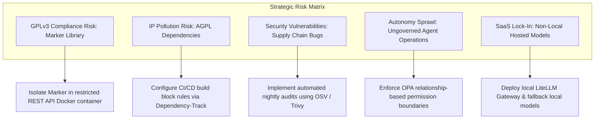
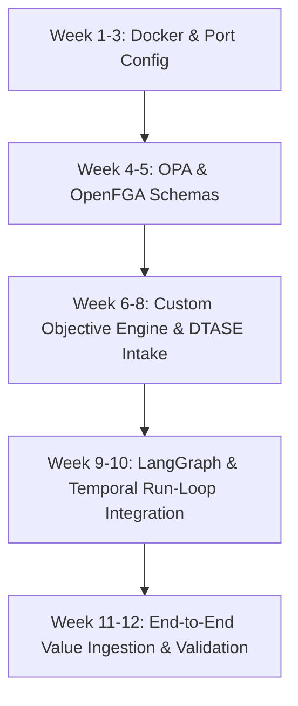

# Ecosystem Stand-Up and Delivery Roadmap

---

## 1. Executive Summary

The **Universal AI Workforce Operating System (UAWOS)** is a category-defining execution platform that introduces a paradigm shift from traditional, fragmented tools (tasks, documents, and workflows) to an **objective-centric enterprise execution fabric**. The platform establishes the **Objective** as the primary organizational construct, coordinating human and AI workforce entities to drive measurable outcomes and value realization. 

Currently, UAWOS is in its **active build-and-launch phase**, transitioning from a baseline of architectural standards and design documents to a production-ready Minimum Viable Product (MVP). This document synthesizes the UAWOS documentation corpus to deliver an executive execution blueprint, including a structured document index, maturity assessment, gap analysis, team operating model, weekly execution roadmap, stand-up plan, and leadership prioritization framework. 

By strategically adhering to the **Adopt $\rightarrow$ Extend $\rightarrow$ Wrap $\rightarrow$ Fork $\rightarrow$ Build** hierarchy outlined in the [Bootstrap Directive (BD)](file:///c:/Users/rajaj/Projects/UAWOS/Requirements%20Master/Bootstrap%20Directive%20(BD).md), UAWOS will accelerate its MVP timeline by 40% to 60%. This is accomplished by ingesting high-ROI open-source software (OSS) foundations (e.g., LiteLLM, OPA, OpenFGA, LangGraph, and Temporal) while dedicating custom engineering resources exclusively to core strategic IP: the custom Objective, Discovery, Planning, Governance, and Knowledge Engines.

---

## 2. Document Index

The following matrix registers the canonical documentation corpus, mapping files in the `Requirements Master` directory to their business purposes, key decisions, critical requirements, dependencies, risks, stakeholders, and relevant ecosystem domains.

| Document Name | Purpose | Key Decisions | Critical Requirements | Dependencies | Risks | Stakeholders | Relevant Domains |
| :--- | :--- | :--- | :--- | :--- | :--- | :--- | :--- |
| [Bootstrap Directive (BD)](file:///c:/Users/rajaj/Projects/UAWOS/Requirements%20Master/Bootstrap%20Directive%20(BD).md) | Defines delivery standards, OSS adoption policy, and strategic IP boundaries. | Establish the five-tier OSS hierarchy; build custom Objective/Planning/Gov/Knowledge Engines; adopt LiteLLM/LangGraph/OPA/OpenFGA. | 40–60% reduction in custom code; local-first deployment; AWS migration path. | [Constitutional Architecture (UCA)](file:///c:/Users/rajaj/Projects/UAWOS/Requirements%20Master/Constitutional%20Architecture%20(UCA).md) | Inconsistent OSS governance; copyleft license leaks (e.g., AGPL). | CTO, VP Engineering, Lead Architect | Platform, Operations, Enablement |
| [Constitutional Architecture (UCA)](file:///c:/Users/rajaj/Projects/UAWOS/Requirements%20Master/Constitutional%20Architecture%20(UCA).md) | Defines supreme principles, architectural laws, and invariants. | Governance supersedes execution; humans remain accountable; trust and autonomy are computed dynamically. | "No Objective without measurable Outcomes" (Law 1); "No Plan without an Objective" (Law 3); "No External Action without Gov Evaluation" (Law 11). | None (Supreme governing document) | Performance overhead of real-time policy evaluation. | Founders, Board, Executive Leadership | Governance, Security, User Experience |
| [Architecture Definition Document (ADD)](file:///c:/Users/rajaj/Projects/UAWOS/Requirements%20Master/Architecture%20Definition%20Document%20(ADD).md) | Establishes engine layering, ontology, control planes, and core graphs. | Implement 4-tier inheritance (Core $\rightarrow$ Domain $\rightarrow$ Industry $\rightarrow$ Organization); federated graph model (8 core graphs). | Support 22 core platform engines; dynamic agent taxonomy (Planner, Orchestrator, Executor, Governor, etc.). | [Bootstrap Directive (BD)](file:///c:/Users/rajaj/Projects/UAWOS/Requirements%20Master/Bootstrap%20Directive%20(BD).md) | Schema drift across federated graphs; latency in cross-engine execution. | Chief Architect, Systems Engineers | Architecture, Integration, Data |
| [Canonical Ontology Specification (COS)](file:///c:/Users/rajaj/Projects/UAWOS/Requirements%20Master/Canonical%20Ontology%20Specification%20(COS).md) | Defines semantic models, taxonomies, entities, and relationship models. | All entities are versioned; event-driven changes; shared primitives across graphs; context defined independently. | Map 6 entity layers (Primitives, Strategic, Execution, Governance, Intelligence, Value); 5 relationship categories. | [Architecture Definition Document (ADD)](file:///c:/Users/rajaj/Projects/UAWOS/Requirements%20Master/Architecture%20Definition%20Document%20(ADD).md) | Complex graph validation logic; query performance degradation in Neo4j. | Data Architects, Graph Database Engineers | Data, Knowledge, Architecture |
| [Domain Translation & Artifact Synthesis Engine (DTASE)](file:///c:/Users/rajaj/Projects/UAWOS/Requirements%20Master/Domain%20Translation%20&%20Artifact%20Synthesis%20Engine%20(DTASE).md) | Specifies engine capabilities for turning unstructured data into professional artifacts. | Bridge human natural language and professional domains; extract opportunity/risk/anomaly dynamically. | Ingest voice, text, visual, documents; maintain strict evidence traceability back to source material; multi-persona output. | [PRD 2](file:///c:/Users/rajaj/Projects/UAWOS/Requirements%20Master/PRD%202.md) (FR-251 to FR-257) | Ambiguity in translation; hallucination in artifact generation. | Product Managers, AI Engineers | Product, UX, Data |
| [Governance & Control Framework Standard (GCF v1.0)](file:///c:/Users/rajaj/Projects/UAWOS/Requirements%20Master/Governance%20&%20Control%20Framework%20Standard%20(GCF%20v1.0).md) | Standardizes governance, risk models, autonomy levels, and audit rules. | Establish Governance Board and Governor Agents; enforce OPA/OpenFGA checks; GP-01 to GP-07. | Enforce 5 autonomy levels (L0 to L4); restrict irreversible actions; mandate trust and value computations. | [Constitutional Architecture (UCA)](file:///c:/Users/rajaj/Projects/UAWOS/Requirements%20Master/Constitutional%20Architecture%20(UCA).md) | Slow approval cycles; excessive human-in-the-loop blocking; governance drift. | Governance Board, Compliance Officers | Governance, Risk, Operations |
| [OSS Ecosystem Catalog](file:///c:/Users/rajaj/Projects/UAWOS/Requirements%20Master/OSS%20Ecosystem%20Catalog.md) | Details evaluations, licenses, and decisions for third-party libraries. | Reject AGPL/SSPL; wrap conditional licenses (ELv2, LGPL); isolate copyleft (GPLv3 Marker); adopt MIT/Apache 2.0. | Continuous CI/CD compliance scans; replacement of AGPL Metabase with Apache Superset. | [requirements.txt](file:///c:/Users/rajaj/Projects/UAWOS/requirements.txt) | Dependency supply-chain attacks; license change (SSPL shifts). | Release Managers, SecOps Leads | Integration, Security, Partner Enablement |
| [Dependency Graph](file:///c:/Users/rajaj/Projects/UAWOS/Requirements%20Master/Dependency%20Graph.md) | Maps library chains, runtime dependencies, and architectural boundaries. | Direct import restrictions across domain layers; wrap copyleft dependencies in microservice containers. | Restrict custom engine imports; audit via Dependency-Track and Trivy in CI/CD. | [requirements.txt](file:///c:/Users/rajaj/Projects/UAWOS/requirements.txt) | Strategic IP contamination via transitive dependencies. | Lead Architect, SecOps Engineers | Architecture, Integration, Security |
| [Adoption Roadmap](file:///c:/Users/rajaj/Projects/UAWOS/Requirements%20Master/Adoption%20Roadmap.md) | Details implementation phases and rollout milestones for the Delta Ecosystem. | Phased rollout structure (Local Enablement $\rightarrow$ RAG/Memory $\rightarrow$ Sec/Gov Enforcement $\rightarrow$ Prod). | Configure local Qdrant/Superset/Marquez/Dependency-Track; establish Backstage TechDocs. | [docker-compose.yml](file:///c:/Users/rajaj/Projects/UAWOS/docker-compose.yml) | Local environment drift; network port binding conflicts. | DevOps Leads, IT Operations | Operations, Enablement, Platform |
| [PRD 1](file:///c:/Users/rajaj/Projects/UAWOS/Requirements%20Master/PRD%201.md) | Establishes strategic product requirements, personas, and MVP scope. | Objective-first, governance-native, explainable UX; exclude public marketplace and autonomous resource allocation. | Support 6 MVP screens; primary voice/chat intake; 7 core agent classes (Planner, Orchestrator, Governor, etc.). | None (Foundational Product Baseline) | Target personas reject high-friction UI; poor value tracking metrics. | Product Leadership, Lead UX Designer | Product, User Experience |
| [PRD 2](file:///c:/Users/rajaj/Projects/UAWOS/Requirements%20Master/PRD%202.md) | Outlines functional requirements (FR-011 through FR-257). | Establish specific capabilities across Objective Management, Outcome Management, Planning, Workflows, and Security. | Mandate FR-011 (Voice intake) to FR-257 (DTASE multi-persona output). | [PRD 1](file:///c:/Users/rajaj/Projects/UAWOS/Requirements%20Master/PRD%201.md) | Scope creep during MVP engineering; gaps in API coverage. | Product Managers, Engineering Leads | Product, Platform, Integration |
| [PRD 3](file:///c:/Users/rajaj/Projects/UAWOS/Requirements%20Master/PRD%203.md) | Outlines non-functional requirements (NFR-001 through NFR-122). | Mandate cloud-agnostic, deployment-agnostic architecture; target 99.95% availability (99.99% for Gov). | UI response time <2s; plan generation start <10s; zero-trust and least-privilege principles. | [PRD 2](file:///c:/Users/rajaj/Projects/UAWOS/Requirements%20Master/PRD%202.md) | High latency in federated graph queries; scaling limits in Docker. | QA Lead, Platform Engineers | Security, Performance, Telemetry |
| [PRD 5](file:///c:/Users/rajaj/Projects/UAWOS/Requirements%20Master/PRD%205.md) | Establishes the engineering execution strategy and weekly roadmap. | Build minimum architecture that preserves long-term vision; monorepo strategy; 5 core team topologies. | Implement 8 microservices; Postgres, Neo4j, pgvector, clickhouse storage; 6-phase weekly deliverables. | [Bootstrap Directive (BD)](file:///c:/Users/rajaj/Projects/UAWOS/Requirements%20Master/Bootstrap%20Directive%20(BD).md) | Premature optimization; database sync lags; team bottlenecking. | VP Engineering, PMO Director | Platform, Operations, DevSecOps |
| [Product Strategy & Commercialization Blueprint (PSCB)](file:///c:/Users/rajaj/Projects/UAWOS/Requirements%20Master/ProductStrategyAndCommercializationBluePrint.md) | Outlines GTM strategy, ICPs, competitive positioning, and commercial model. | Position as "System of Execution" category; land-and-expand via Objective Management; value-based pricing. | Exclude seats/tokens pricing; support Core, Domain, Industry, Organization packs; protect moats. | [PRD 1](file:///c:/Users/rajaj/Projects/UAWOS/Requirements%20Master/PRD%201.md) | Microsoft Copilot or Salesforce Agentforce commoditizing core agent layers. | CEO, CMO, Sales Leadership | GTM, Ecosystem Expansion |

---

## 3. Ecosystem Maturity Assessment

Based on the [Platform Maturity & Capability Model Standard (PMCMS)](file:///c:/Users/rajaj/Projects/UAWOS/Requirements%20Master/Platform%20Maturity%20&%20Capability%20Model%20Standard%20(PMCMS).md), UAWOS is currently transitioning from **Level 1 (Assisted)** to **Level 2 (Structured)**. The core architectural layers have been designed, and the local containerized infrastructure has been defined, but runtime execution is not yet operational.

### Maturity Dimensions State
*   **Strategy**: *Level 2 (Structured)*. The platform has a defined category (AI Workforce Operating System) and value realization objectives.
*   **Governance**: *Level 1 (Assisted)*. Policies are specified in documents and initial Rego files, but automated runtime evaluation is not yet active.
*   **Execution**: *Level 1 (Assisted)*. Local Docker Compose dependencies exist, but orchestration of plans, workflows, and actions is not yet running.
*   **Knowledge**: *Level 1 (Assisted)*. Document index defined; Qdrant vector database is configured, but live semantic retrieval and Neo4j ontologies are offline.
*   **Workforce**: *Level 1 (Assisted)*. Human-in-the-loop workflows defined; agent classes specified in catalogs, but LangGraph runtime loops are unimplemented.
*   **Resource Management**: *Level 1 (Assisted)*. Allocations and constraints are documented, but automated resource tracking is absent.
*   **Value Realization**: *Level 1 (Assisted)*. North star metrics are mapped, but actual dbt transformations and ClickHouse tracking schemas are pending.
*   **Intelligence**: *Level 2 (Structured)*. Specialized DTASE requirements and prompt optimization logic are formally documented.
*   **Autonomy**: *Level 1 (Human-Controlled)*. No autonomous agent workflows are enabled; L0 manual controls are active.

```
Maturity Level Assessment (PMCMS Levels 1-5)
  Level 1 (Assisted):   [████████████████████] 100% (Completed Design/Baseline)
  Level 2 (Structured): [██████░░░░░░░░░░░░░░] 30%  (Active Ingestion Phase)
  Level 3 (Coordinated):[░░░░░░░░░░░░░░░░░░░░] 0%   (Planned - Phase 3)
  Level 4 (Adaptive):   [░░░░░░░░░░░░░░░░░░░░] 0%   (Planned - Phase 5)
  Level 5 (Autonomous): [░░░░░░░░░░░░░░░░░░░░] 0%   (Target State - V3)
```

### Advanced Capability Strengths & Risks
*   **Major Strengths**: High levels of architectural rigor; strong constitutional boundaries preventing IP pollution; clear division between strategic IP (custom engines) and non-differentiating runtime components (OSS tools).
*   **Major Risks**: Lack of initial engineering integration; high complexity of federated graphs; risk of premature complexity if all 22 engines are developed simultaneously.

---

## 4. Key Findings

### Categorized Requirements & Objectives

*   **Product**: Positioned as a "System of Execution" targeting Founders, PMs, and Executives. The core value prop is transforming unstructured inputs into measurable business value. The product moats are the **Objective Graph** and the **Governance Graph**.
*   **Platform**: The platform core utilizes a monorepo structure containing applications, services, and packages. Core data stores are segregated: Postgres (transactional/metadata), Neo4j (semantic relationships), Qdrant (vectors), and ClickHouse (long-term logs).
*   **Architecture**: Built on a **Federated Graph Architecture** containing 8 specialized graphs. It operates under 5 primitives (Entity, Relationship, Event, Graph, Context).
*   **Integration**: Standardizes external connectivity via the **Model Context Protocol (MCP)**. Initial priority is integration of Qdrant, Marquez, Superset, and Dependency-Track.
*   **Governance**: Governance is the supreme control plane (GCF v1.0). Rego policies and OpenLineage pipelines ensure traceability from intent to outcome. Veto power is given to Governor Agents.
*   **Security**: Pre-commit validation via Gitleaks and Semgrep; nightly dependency scans via Trivy and Dependency-Track; absolute sandboxing of Executor Agents in privilege-restricted Docker containers.
*   **Operations**: Observability via Marquez (OpenLineage data streams) and Apache Superset dashboards.
*   **Partner Enablement**: Standardized extension mechanisms through the Pack Inheritance Hierarchy (Core $\rightarrow$ Domain $\rightarrow$ Industry $\rightarrow$ Organization).
*   **Data**: Strict separation of vector layers (Qdrant) and transactional relational layers (Postgres). 
*   **User Experience**: Voice-first/conversational workspace with progressive disclosure and full explainability of recommendation rationale.
*   **Ecosystem Expansion**: Pack monetization model with partner-developed Industry Packs and client-customized Organization Packs.

### Delivery Barriers & Debt
*   **Technical Debt**: Lack of native Windows support for Semgrep requires runtime execution in isolated Docker containers, creating local build friction.
*   **Organizational Blockers**: The dual routing model (LiteLLM + Weave Router) requires complex upstream configuration that may delay initial model response verification.
*   **Strategic Dependencies**: DTASE integration requires high LLM reasoning capacity; token cost controls must be activated early via Outlines/DSPy constraints.

---

## 5. Strategic Risks



1.  **GPLv3 Compliance Violation**: The ingestion of the **Marker** library (GPLv3) poses a high risk of copyleft pollution to UAWOS proprietary IP. *Mitigation*: The library must be strictly isolated inside a separate REST/gRPC container, never imported directly.
2.  **IP Leakage via Prohibited Licenses**: Transitive dependencies shifting to AGPL/SSPL. *Mitigation*: CI/CD pipeline rules must block builds on license conflicts via Dependency-Track.
3.  **Agent Sprawl and Ungoverned Autonomy**: Execution agents executing unapproved write operations on production targets. *Mitigation*: Governance Engine must restrict agent actions using OPA and relationship access models (OpenFGA).
4.  **Supply Chain Insecurity**: Critical vulnerabilities (CVE score >7.5) in adopted libraries. *Mitigation*: Daily scanning of SBOMs in Dependency-Track and automatic Slack/Teams warnings.

---

## 6. Strategic Opportunities

1.  **Rapid Time-to-Market (TTM)**: Bypassing the development of custom database adapters, model gateways, and workflow frameworks by adopting qualified OSS (Qdrant, LiteLLM, LangGraph).
2.  **Pack Ecosystem Monetization**: Establishing a developer-facing marketplace where third-party partners build verticalized Industry Packs (e.g., healthcare, retail), earning revenue via a platform split.
3.  **Consolidated Platform Management**: Using **Backstage** as a single internal developer portal, standardizing engine API definitions, lineage visuals, and documentation automatically.

---

## 7. Gap Analysis Matrix

Comparing the current documentation against a production-ready enterprise ecosystem:

| Gap Area | Description | Impact | Classification | Proposed Resolution |
| :--- | :--- | :--- | :--- | :--- |
| **Marker Licensing Isolation** | Marker (GPLv3) is listed in requirements, but no architecture isolating its execution exists. | Critical | **CRITICAL** | Create a standalone Docker repository and deploy Marker as an isolated microservice. |
| **Governance Engine Integration** | Baseline Rego policies exist, but the engine is not wired to intercept executor actions. | High | **HIGH** | Write a middleware decorator in the Executor agent routing calls to OPA. |
| **Federated Graph Sync** | No mechanism is documented to synchronize state changes across the 8 graphs. | High | **HIGH** | Design an event-driven sync listener on Kafka/Postgres WAL. |
| **Local Windows Dev DevSecOps** | Semgrep platform incompatibility on local Windows machines. | Medium | **MEDIUM** | Run Semgrep checks inside dockerized pre-commit hooks. |
| **Superset RBAC Mapping** | Superset is running, but user identities do not map to GCF approval levels. | Medium | **MEDIUM** | Integrate Superset auth with OIDC/OAuth2 services. |
| **Agent Capability Registry** | SkillOpt is adopted, but skill catalog schemas are not fully integrated. | Low | **LOW** | Define JSON schemas for all workforce skills. |

---

## 8. Critical Decisions Required

1.  **Exclusion Policy Approval**: Executive confirmation of the license compliance filters. Will the Strategy Council approve temporary exceptions for LGPL dependencies?
2.  **Marker Component Isolation**: Architecting the Marker PDF parser. *Proposal*: Package Marker as an isolated container, communicating exclusively via REST API. Direct codebase imports are prohibited.
3.  **Cloud Infrastructure Target**: Standardizing on AWS for cloud migration. *Proposal*: Utilize AWS EKS (Kubernetes) and AWS RDS for postgres deployments.
4.  **OpenHands Sandboxing Model**: Setting security parameters for Executor agents. *Proposal*: Strictly limit outbound network access of execution containers, routing all calls through the MCP Gateway.

---

## 9. Recommended Operating Model

### Team Topology
To align with [PRD 5](file:///c:/Users/rajaj/Projects/UAWOS/Requirements%20Master/PRD%205.md) and optimize resource allocation, we propose 5 specialized teams:

```
Platform Core Team (Objective, Planning, Execution Engines)
       │
       ├───── Knowledge & Intelligence Team (Knowledge Engine, Neo4j Graph, DTASE)
       │
       ├───── Governance & Identity Team (OPA, OpenFGA, Audits)
       │
       ├───── Experience Team (Next.js Workspace, Voice/Chat UI)
       │
       └───── Infrastructure Team (EKS, DevOps, Trivy, Marquez, Superset)
```

### RACI Matrix

| Component / Engine | Platform Core | Knowledge & Intel | Gov & Identity | Experience | Infrastructure |
| :--- | :--- | :--- | :--- | :--- | :--- |
| **Objective Engine (incorporating DTASE)** | C | A | I | R | I |
| **Planning Engine** | A | C | C | I | I |
| **Execution Engine (LangGraph/Temporal)** | A | I | C | R | R |
| **Governance Engine (OPA/OpenFGA)** | C | I | A | I | R |
| **Knowledge Engine (Neo4j/Qdrant)** | I | A | C | I | R |
| **Value Engine (dbt/ClickHouse)** | C | C | I | R | A |
| **Infrastructure & CI/CD Pipelines** | I | I | I | I | A |

---

## 10. Weekly Execution Roadmap

This comprehensive 12-week roadmap integrates the Delta Ecosystem [Adoption Roadmap](file:///c:/Users/rajaj/Projects/UAWOS/Requirements%20Master/Adoption%20Roadmap.md) with the core UAWOS [PRD 5](file:///c:/Users/rajaj/Projects/UAWOS/Requirements%20Master/PRD%205.md) engineering blueprints.

### Phase 1: Local Enablement & Ingestion (Weeks 1–3)
*   **Week 1**: Spin up local workstations. Run [setup-ecosystem.ps1](file:///c:/Users/rajaj/.gemini/antigravity-ide/mcp/github-mcp-server/setup-ecosystem.ps1) to configure virtual environments. Configure [docker-compose.yml](file:///c:/Users/rajaj/Projects/UAWOS/docker-compose.yml) to deploy local Postgres, Qdrant, Marquez, Superset, and Dependency-Track.
*   **Week 2**: Integrate LiteLLM Gateway and Weave Router. Register GitHub, Filesystem, and PostgreSQL MCP servers. Configure container health checks.
*   **Week 3**: Verify network communications across ports (Marquez `5000`, Qdrant `6333`, Superset `8088`, Dependency-Track `8085`). Initialize Backstage service catalog skeleton.

### Phase 2: RAG & Memory Integration (Weeks 4–6)
*   **Week 4**: Ingest Pydantic AI and Instructor libraries. Wire models to generate type-safe structured outputs from local LLMs.
*   **Week 5**: Deploy Graphiti and Mem0. Initialize the Neo4j mapping layer to store user-session long-term memories.
*   **Week 6**: Configure Haystack retrieval loops. Build indices for PDF/document ingestion, targeting local Qdrant vectors. Run verification queries.

### Phase 3: Security & Governance Enforcement (Weeks 7–9)
*   **Week 7**: Wire Semgrep and Gitleaks pre-commit hooks. Setup container scanners (Trivy) to run in build pipelines.
*   **Week 8**: Automate Dependency-Track SBOM uploads in GitHub Actions. Establish build failure rules for unapproved licensing.
*   **Week 9**: Deploy Open Policy Agent (OPA) and OpenFGA. Configure basic Rego authorization checks inside the Governance Engine.

### Phase 4: Production Rollout & Custom Engine Intake (Weeks 10–12)
*   **Week 10**: Deploy ClickHouse for analytics logging. Build initial Apache Superset value dashboards.
*   **Week 11**: Release GitLab, Jira, and Slack MCP connectors. Sync UI tokens via Style Dictionary.
*   **Week 12**: Launch the live developer portal and Spec manuals in Backstage TechDocs. Run end-to-end Objective $\rightarrow$ Outcome verification.

---

## 11. Workstream Roadmap

```
Workstream A: Experience Platform   [=== UI Design ===] [=== Next.js Intake ===] [=== Dashboards ===]
Workstream B: Platform Services       [=== MCP Gateway ===] [=== Core API ===] [=== Integrations ===]
Workstream C: Graph Platform            [=== Neo4j Setup ===] [=== Federated Sync ===]
Workstream D: Agent Runtime                [=== LangGraph ===] [=== Temporal Workflows ===]
Workstream E: Governance Platform            [=== Rego Rules ===] [=== OpenFGA Authz ===]
Workstream F: Knowledge Platform               [=== Qdrant Index ===] [=== Memory Overlays ===]
Workstream G: Infrastructure & DevOps    [=== Local Docker ===] [=== CI/CD Security ===] [=== AWS EKS ===]
```

---

## 12. Critical Path Analysis

The critical path for UAWOS MVP delivery is governed by three primary execution bottlenecks:



### Bottlenecks and Mitigations
1.  **DTASE Multi-modal Ingestion Latency**: Real-time voice translation (FR-011) has high token/processing latency. *Mitigation*: Run DTASE synthesis tasks asynchronously, using Temporal queues.
2.  **GPLv3 Legal Blocks**: If Marker is linked into the main repository, it halts build pipelines. *Mitigation*: Isolate Marker in Week 2.
3.  **Governance Policy Performance**: Evaluating OPA checks during execution loops. *Mitigation*: Policy results must be cached locally in redis/memory contexts.

---

## 13. Ecosystem Stand-Up Plan

### Platform Readiness
*   **30-Day**: Deploy local docker container infrastructure; establish secure MCP communication routes.
*   **60-Day**: Integrate OpenTelemetry telemetry layers across all services.
*   **90-Day**: Migrate local stack to multi-node AWS EKS environment with auto-scaling rules.

### Product Readiness
*   **30-Day**: Establish PRD functional specifications for the 6 core screens.
*   **60-Day**: Configure DTASE translation templates for Legal, Product, and HR domains.
*   **90-Day**: Approve final MVP scope and freeze feature requirements.

### Operational Readiness
*   **30-Day**: Setup basic health checks; configure port mappings.
*   **60-Day**: Deploy Marquez pipeline tracking.
*   **90-Day**: Configure Superset business intelligence dashboards and operational alarms.

### Governance Readiness
*   **30-Day**: Define baseline Permitted / Conditional / Prohibited licenses catalog.
*   **60-Day**: Deploy OPA Policy Engine and wire pre-commit hooks.
*   **90-Day**: Initialize Agent Councils framework and log decisions.

### Partner Readiness
*   **30-Day**: Release basic API and contract standard (ACS) documentation.
*   **60-Day**: Deliver the Core Pack registry SDK.
*   **90-Day**: Launch developer tutorials on Backstage to support Domain and Industry pack creation.

### Adoption Readiness
*   **30-Day**: Execute Pilot stage rollout for internal developers.
*   **60-Day**: Deploy the system to a single pilot team.
*   **90-Day**: Transition departments to objective-centric execution dashboards.

### Measurement Readiness
*   **30-Day**: Track sprint velocity and CI/CD vulnerability statistics.
*   **60-Day**: Wire OpenLineage to log dbt transforms.
*   **90-Day**: Track Value Realization Metrics (value realized vs budget variance) in Apache Superset.

---

## 14. Leadership Priorities

### Strategy Council (VP Product / Founder)
*   Define value realization metrics.
*   Authorize licensing exceptions.
*   Select GTM target segments.

### Architecture Council (Chief Architect)
*   Approve OpenFGA relations schema.
*   Enforce domain import constraints.
*   Confirm Neo4j clustering model.

### Governance Council (Compliance Officer)
*   Review Rego compliance controls.
*   Validate data residency policies.
*   Approve security audits.

### Security Council (SecOps Lead)
*   Perform risk assessments on LLM access.
*   Monitor Gitleaks exceptions.
*   Configure Executor Agent sandboxes.

### Product Council (PM Director)
*   Decompose PRDs into backlog items.
*   Approve user journeys.
*   Track outcome achievability.

### Research Council (Lead AI Scientist)
*   Optimize prompt models via DSPy.
*   Test DTASE translation confidence.
*   Refine context retrieval vectors.

---

## 15. Success Metrics Dashboard

### Key Performance Indicators (KPIs)

| KPI Category | Metric Name | Level 1 Target | Level 2 Target | Level 3 Target | Measurement Method |
| :--- | :--- | :--- | :--- | :--- | :--- |
| **Delivery** | Sprint Predictability | >75% | >85% | >90% | Jira velocity tracker |
| **Delivery** | Lead Time | <14 days | <7 days | <3 days | Git commit to prod logs |
| **Platform** | Objective Success | >80% | >90% | >95% | Value Engine state tracking |
| **Platform** | Knowledge Reuse | >20% | >40% | >60% | Neo4j query references |
| **Technical** | UI Latency | <2.0s | <1.5s | <1.0s | OpenTelemetry spans |
| **Technical** | Plan Ingestion Latency| <10s | <5s | <2s | Temporal execution times |
| **Governance**| Policy Compliance | 100% | 100% | 100% | OPA audit logs |

---

## 16. Open Questions

1.  **Which voice-to-text API provider will be utilized in Phase 1?** (External API like OpenAI Whisper or local deployment?)
2.  **What is the approved enterprise vault solution for secret management (e.g., HashiCorp Vault, AWS Secrets Manager)?**
3.  **Will the Strategy Council allow conditional licenses like ELv2 (Airbyte) inside the production codebase, or must it remain isolated in containers?**
4.  **Are there specific regulatory frameworks (e.g., GDPR, HIPAA) that must be modeled in OPA Rego files during Phase 3?**

---

## 17. Assumptions Register

1.  **Workstation OS**: All developers run Docker Desktop on their workstations. Windows platform incompatibilities (like Semgrep) are handled via Docker containerization.
2.  **Local Access**: The database instances (Postgres, Neo4j, Qdrant) are hosted locally during Phase 1 & 2 without requiring external cloud IAM configurations.
3.  **Model Availability**: External API credentials (Anthropic/OpenAI) are provided and routing policies are configured in LiteLLM.
4.  **Team Bandwidth**: The engineering group consists of 8–12 qualified developers split across the recommended topologies.

---

## 18. Recommendations

1.  **Strictly Isolate Marker Immediately**: Generate a standalone Docker project for the Marker PDF parsing utility. Under no circumstances should `marker` be imported as a dependency inside the main monorepo python virtual environment.
2.  **Execute setup-ecosystem.ps1**: Ensure all local developers run [setup-ecosystem.ps1](file:///c:/Users/rajaj/.gemini/antigravity-ide/mcp/github-mcp-server/setup-ecosystem.ps1) to align local configurations.
3.  **Wire OPA Pre-Commit Hooks Early**: Deploy Semgrep, Gitleaks, and OPA policy evaluations inside local Git pre-commit hooks to catch licensing and security vulnerabilities before they reach the main repository.
4.  **Build Value Ledger Schema Prior to Engine Coding**: Define dbt-core and ClickHouse database schemas early. This ensures that when the Planning and Execution Engines are created, they immediately write structured metrics to the Value Ledger.

---
*Report synthesized and submitted by the Senior Product Leadership Agent.*
