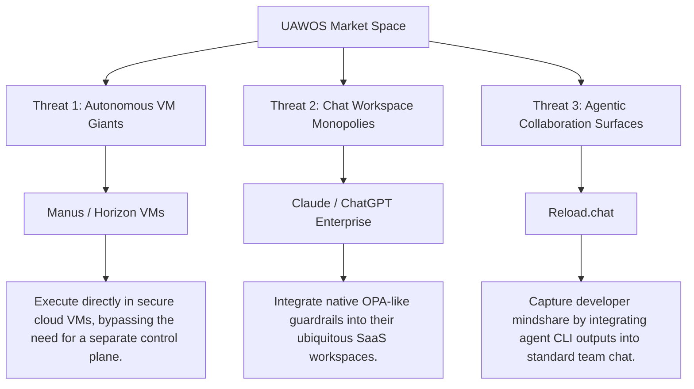

# Competitive Intelligence & Strategic Positioning Analysis: UAWOS
*A Board-Level Strategic Evaluation of the Universal AI Workforce Operating System against the Emerging AI Workspace Paradigm*

---

## 1. Executive Summary

This report delivers a rigorous, evidence-based competitive intelligence and strategic positioning analysis of the **Universal AI Workforce Operating System (UAWOS)**. The objective is to evaluate UAWOS’s market viability, architectural defensibility, and competitive stance against seven Tier-1 platforms (**Reload.chat**, **Manus**, **Genspark**, **ChatGPT Projects**, **Claude Projects**, **Perplexity Spaces**, and **NotebookLM**) and six Tier-2 platforms.

### Key Strategic Realizations
1. **Category Distinction**: UAWOS does **not** belong in the same category as **Reload.chat**. While Reload.chat acts as a *collaboration and communication layer* (a "Slack for agents"), UAWOS is a *governed execution control plane* (an "AI Operating System").
2. **Dominant Paradigm**: The AI workspace market is bifurcating into **Contextual Knowledge Environments** (e.g., Claude/ChatGPT Projects, NotebookLM) and **Autonomous Execution Environments** (e.g., Manus, Genspark Claw). UAWOS bridges this split by introducing an **Objective-Centric Control Plane** governed by declarative compliance.
3. **Core Differentiation**: UAWOS's primary defensibility lies in its **Governance-Native execution model** (enforced via Open Policy Agent/Rego and OpenFGA) and its **Objective-Outcome abstraction** (enforced by Constitutional Laws in [uawos_objective.py](file:///C:/Users/rajaj/Projects/UAWOS/uawos_objective.py)), which ensure that AI agents never operate outside corporate risk parameters.
4. **Vulnerabilities**: UAWOS’s core vulnerabilities are its **developer-centric deployment complexity**, **single-tenant file-based state store MVP** (managed via JSON caches in [uawos_budget_state.json](file:///C:/Users/rajaj/Projects/UAWOS/uawos_budget_state.json), etc.), and **inference latency** associated with local-first LLMs.
5. **Leaderboard Verdict**: Claude Projects leads the *Contextual Workspace* category for general knowledge workers, and Manus leads the *Consumer Autonomous Execution* space. **UAWOS ranks #1 for Enterprise-Governed Operations and Autonomous Workforce Coordination** due to its unmatched compliance structure.

---

## 2. Category Definition

To evaluate UAWOS, we must define the boundary of the market it attacks. We reject terms like "AI productivity software" or "agent frameworks" as too broad or too technical. 

### The Category: Universal AI Operating System (UAWOS / AI-OS)
We define this emerging category as the **Universal AI Operating System (AI-OS)**. An AI-OS is a stateful, governed control plane that translates unstructured human intent into structured objectives, coordinates human-agent task execution, enforces enterprise compliance rules at runtime, and dynamically measures value realization.

```
┌─────────────────────────────────────────────────────────────────────────┐
│                     THE EMERGING AI OPERATING SYSTEM                    │
├─────────────────────────────────────────────────────────────────────────┤
│                                                                         │
│   Intent Ingestion ──> Objective Engine ──> Governance (OPA / Rego)    │
│                                                     │                   │
│                                                     ▼                   │
│   Value Realization <── Temporal Lineage <── Execution Sandbox          │
│                                                                         │
└─────────────────────────────────────────────────────────────────────────┘
```

### Why "AI Operating System"?
* **Not a "Workspace"**: A workspace (e.g., Slack, Notion, Claude Projects) is a static collaboration surface. It relies on the user to manually coordinate work. An AI-OS actively plans, simulates, and executes work.
* **Not an "Agent Framework"**: Frameworks (e.g., CrewAI, LangGraph) are code libraries for developers. An AI-OS is a deployed system with user interfaces, budget ledgers, and database abstractions.
* **The "Operating System" Analogy**: Just as a traditional OS (Windows, Linux) manages hardware resources, schedules tasks, and enforces security boundaries for applications, an AI-OS manages LLMs, schedules human and agent workforces, and enforces enterprise safety policies.

### Inclusion & Exclusion Criteria

| Inclusion Criteria (Must Have) | Exclusion Criteria (Must Not Have) |
| :--- | :--- |
| **Objective-Centric Abstraction**: Tasks must map to structured objectives with measurable outcomes. | **Pure Chat Interface**: Systems that rely on transient chat prompts with no persistent task/object state. |
| **Declarative Governance Control Plane**: Runtime evaluation of policies (e.g., OPA/Rego) that can block agent actions. | **Trigger-Action Pipelines**: Hardcoded automation without dynamic LLM planning (e.g., Zapier, Make). |
| **Role-Based Workforce Mappings**: Dual scheduling for Human and AI agent classes (Planner, Executor, Reviewer). | **Siloed Productivity Tools**: Apps where AI is retrofitted as a writing or autocomplete helper (e.g., Notion AI). |
| **Persistent Context & Memory**: Graph-based memory models mapping long-term learnings and token consumption. | **Development-Only SDKs**: Libraries that do not provide a user-facing dashboard or runtime infrastructure. |

---

## 3. Competitive Relevance Matrix

We filtered the 13 platforms requested by the user to determine which genuinely compete with UAWOS for the same budget, operator workflow, and organizational adoption.

```
       ▲  High
       │                             [Manus]        [Reload.chat]
       │
       │                                            [Genspark]
C      │
O      │              [Claude Projects]
M      │              [ChatGPT Projects]
P      │
E      │                                            [Taskade AI]
T      │
I      │  [NotebookLM]
T      │  [Perplexity Spaces]
I      │
V      │                                  [Notion/Coda AI]
E      │
       │  [Mem.ai]     [Tana/Capacities]
       │
       └────────────────────────────────────────────────────────►
          Research/Context-Centric        Execution/Agent-Centric
                            PRODUCT FOCUS
```

### Relevance Evaluation Table

| Platform | Category Classification | Overlap Score (1-10) | Competitive Relevance Verdict | Reasoning & Codebase Reference |
| :--- | :--- | :--- | :--- | :--- |
| **UAWOS** | **Primary Platform** | **10 / 10** | **Subject of Analysis** | Reference platform. Evaluated via core control files: [uawos_objective.py](file:///C:/Users/rajaj/Projects/UAWOS/uawos_objective.py), [uawos_governance.py](file:///C:/Users/rajaj/Projects/UAWOS/uawos_governance.py). |
| **Reload.chat** | Direct Competitor | **8 / 10** | **RETAINED** | Competes directly for the "AI Workforce" collaboration workflow, mapping agents to channels/DMs. Lacks UAWOS's OPA governance and objective-centric engines. |
| **Manus** | Strong Competitor | **8 / 10** | **RETAINED** | Direct competitor for the "Execution Plane." Operates in a secure sandbox VM to complete tasks. Lacks enterprise governance and budget tracking. |
| **Genspark** | Strong Competitor | **7 / 10** | **RETAINED** | Competes via "Super Agent" and "Genspark Claw" cloud environments. Evolving from search to execution, but lacks corporate role-governance. |
| **ChatGPT Projects** | Partial Competitor | **6 / 10** | **RETAINED** | Ubiquitous context workspace. Competes for user attention but lacks orchestrations, agent workforce mapping, and budget/policy rules. |
| **Claude Projects** | Partial Competitor | **6 / 10** | **RETAINED** | The standard for "artifacts" and shared team context. Lacks execution sandbox, OPA budget limits, and agent scheduling. |
| **Perplexity Spaces** | Adjacent Competitor | **5 / 10** | **RETAINED** | Excellent for collaborative research, but lacks execution, planning engines, or tool orchestration. |
| **NotebookLM** | Adjacent Competitor | **5 / 10** | **RETAINED** | Gold standard for source-grounded synthesis. Lacks agency, action, or workforce coordination. |
| **Taskade AI** | Partial Competitor | **6 / 10** | **RETAINED** | Competes on agentic workflows and task boards, but operates as a task manager with agent wrappers, lacking deep policy controls. |
| **Notion AI** | Adjacent Competitor | **4 / 10** | *FILTERED OUT* | Document tool with retrofitted AI blocks. Notion is hired for wikis, not for governed human-agent execution pipelines. |
| **Coda AI** | Adjacent Competitor | **4 / 10** | *FILTERED OUT* | Interactive doc with AI triggers. Lacks stateful multi-agent planning and lineage tracing. |
| **Tana AI** | Adjacent Competitor | **3 / 10** | *FILTERED OUT* | Graph-centric outliner for personal knowledge management (PKM). Not built for workforce execution. |
| **Capacities AI** | Adjacent Competitor | **3 / 10** | *FILTERED OUT* | Personal object-based PKM. Minimal crossover with enterprise execution budgets and agent scheduling. |
| **Mem.ai** | Adjacent Competitor | **2 / 10** | *FILTERED OUT* | Self-organizing note archive. Purely database-centric; zero agent workforce or policy capability. |

---

## 4. Platform Profiles

Deconstruction of the remaining Tier-1 competitors.

### 1. Reload.chat
* **A. Product Vision**: Create a "Slack for AI Agents." Reload.chat replaces the behavior of humans logging into 10 different agent tools by consolidating them into shared channels and DMs where agents have @handles, avatars, and can coordinate alongside humans.
* **B. Product Architecture**:
  * *Workspace Model*: Channels, direct messages, and team structures.
  * *Knowledge Model*: Operational context graph built from chat history and shared documents.
  * *Context Model*: Chat threads containing message logs, uploaded files, and agent logs.
  * *Agent Model*: First-class participants with handles, integrated with external runtimes (Claude Code, Cursor).
  * *Collaboration Model*: Human-agent chat, thread-delegations, and task handoffs.
  * *Workflow Model*: Shared to-do lists that can be assigned back and forth between humans and agents.
* **C. User Experience**: Extremely simple for anyone familiar with Slack. Cognitive load is low because it utilizes standard team-chat design patterns. Discoverability of agent capabilities is high due to @mention autocomplete.
* **D. AI Capabilities**:
  * *Memory*: Context persistence through database logs.
  * *Research*: Basic web retrieval via integrations.
  * *Agents*: Multi-agent coordination occurs via chat messages.
  * *Tool Use*: High extensibility via Model Context Protocol (MCP) and desktop gateways.
  * *Knowledge Grounding*: Relies on chat history and pinned channel documents.

### 2. Manus (manus.im)
* **A. Product Vision**: Create an "autonomous action engine" or "virtual colleague." It aims to replace manual computer interactions by operating a persistent, cloud-sandboxed VM equipped with a browser and terminal to complete complex, multi-step tasks.
* **B. Product Architecture**:
  * *Workspace Model*: Canvas-like workspace showing the live execution state, file explorer, and browser view.
  * *Knowledge Model*: Folder structure in a persistent virtual file system.
  * *Context Model*: Active task canvas with execution logs, screenshots of the VM, and terminal outputs.
  * *Agent Model*: Unified, general-purpose agent that spins up sub-agents or sub-processes to execute specific code.
  * *Collaboration Model*: Asynchronous delegation; the user enters a prompt and retrieves the finished output later.
  * *Workflow Model*: Dynamic planning and replanning inside a sandboxed CLI.
* **C. User Experience**: Low learning curve. High visual wow-factor due to real-time rendering of the browser VM (users see the agent clicking and typing). Cognitive load is moderate, but can spike when debugging a stuck loop.
* **D. AI Capabilities**:
  * *Memory*: Full file system persistence.
  * *Research*: Deep web browsing, research, and data extraction.
  * *Agents*: Autonomous planning, execution, and review loops.
  * *Tool Use*: Installs python libraries, runs code, and creates custom tools in the sandboxed VM.
  * *Knowledge Grounding*: Grounded in web data and generated local files.

### 3. Genspark
* **A. Product Vision**: Build an "AI search and synthesis engine" that generates "ready-to-use documents" (Sparkpages) instead of lists of links. It replaces traditional search queries and manual compilation of research reports.
* **B. Product Architecture**:
  * *Workspace Model*: Sparkpages (editable documents with interactive sidebars).
  * *Knowledge Model*: Partner database integrations combined with live web crawling.
  * *Context Model*: Document outline with source citations, charts, and copilot prompts.
  * *Agent Model*: "Super Agent" that coordinates sub-agents (browsing, writing, code generation).
  * *Collaboration Model*: Document sharing, co-editing, and chat feedback.
  * *Workflow Model*: Evolving to "Genspark Claw"—cloud containers that execute automated routines.
* **C. User Experience**: Very simple, search-like interface that outputs a highly formatted page. Cognitive load is low because the AI compiles the layout automatically.
* **D. AI Capabilities**:
  * *Memory*: Saved Sparkpages and user feedback history.
  * *Research*: Exceptional multi-source research, cross-referencing, and factual verification.
  * *Agents*: Orchestrates specialized models for search, image creation, and code.
  * *Tool Use*: Web scraping, API connectors, and cloud task execution (Claw).
  * *Knowledge Grounding*: Grounded in structured web citations and partner databases.

### 4. ChatGPT Projects
* **A. Product Vision**: Provide a persistent "project context container" for ChatGPT Plus/Team users. Replaces the need to paste the same background documents and instructions in new chat windows.
* **B. Product Architecture**:
  * *Workspace Model*: Folders containing multiple chats and reference files.
  * *Knowledge Model*: Uploaded text files, PDFs, and codebase extracts (under 200MB total).
  * *Context Model*: Project-wide custom instructions injected into every chat session.
  * *Agent Model*: Shared Custom GPTs or specialized tools (Advanced Data Analysis).
  * *Collaboration Model*: Shared project folders for team members.
  * *Workflow Model*: Conversational Q&A and code generation.
* **C. User Experience**: Seamless extension of the standard ChatGPT UI. Extremely low learning curve.
* **D. AI Capabilities**:
  * *Memory*: Thread memory + basic user profile memory.
  * *Research*: Web searching via Bing.
  * *Agents*: Basic single-agent execution with code interpreter.
  * *Tool Use*: Python execution sandbox, web search, DALL-E.
  * *Knowledge Grounding*: Source-grounded based on uploaded files.

### 5. Claude Projects
* **A. Product Vision**: Provide a shared "knowledge workspace" for teams using Claude.ai. Replaces manual document sharing and context management by integrating reference materials, custom instructions, and visual outputs (Artifacts).
* **B. Product Architecture**:
  * *Workspace Model*: Project container with files, chats, and an Artifacts window.
  * *Knowledge Model*: Code bases, documentation, style guides (up to 200k tokens per project).
  * *Context Model*: Project instructions applied to all chats.
  * *Agent Model*: Single-agent Claude model with specific instructions.
  * *Collaboration Model*: Shared projects for team/enterprise users.
  * *Workflow Model*: Conversational design and code rendering.
* **C. User Experience**: Clean, aesthetic interface. Highly interactive due to "Artifacts" (live side-by-side rendering of HTML, SVGs, and code blocks). Low cognitive load.
* **D. AI Capabilities**:
  * *Memory*: Local project file context.
  * *Research*: Limited (relies on user uploads or basic web search integration).
  * *Agents*: Excellent single-agent reasoning; lacks multi-agent routing.
  * *Tool Use*: Artifact rendering, document parsing.
  * *Knowledge Grounding*: High-fidelity grounding based on 200k context window.

### 6. Perplexity Spaces
* **A. Product Vision**: Create a "collaborative research hub" that combines internal documents with real-time web research. Replaces manual search, bookmarking, and citation mapping.
* **B. Product Architecture**:
  * *Workspace Model*: Dedicated spaces containing threads, uploaded files, and custom prompts.
  * *Knowledge Model*: Semantic index of uploaded files + public web search index.
  * *Context Model*: Space-specific system instructions.
  * *Agent Model*: Choosable LLM models (Claude 3.5, GPT-4o, Sonar) optimized for search.
  * *Collaboration Model*: Shared access to Spaces for team research.
  * *Workflow Model*: Q&A research threads.
* **C. User Experience**: Modern, fast, and search-focused. Discoverability of sources is high due to inline citations.
* **D. AI Capabilities**:
  * *Memory*: Search history and file indexing.
  * *Research*: Best-in-class real-time web search and citation mapping.
  * *Agents*: Search agent that refines queries and cross-references sources.
  * *Tool Use*: Web crawlers and file parsers.
  * *Knowledge Grounding*: Double-grounded in internal files and real-time web sources.

### 7. NotebookLM
* **A. Product Vision**: A "source-grounded AI notebook" that acts as a personalized research assistant. Replaces the behavior of manually highlighting PDFs, organizing research notes, and synthesizing study guides.
* **B. Product Architecture**:
  * *Workspace Model*: Notebook container holding sources, notes, and chat logs.
  * *Knowledge Model*: strict Vector RAG database created from user-uploaded sources (PDFs, docs, text, YouTube transcripts).
  * *Context Model*: Context is strictly restricted to the uploaded sources (no general web browsing).
  * *Agent Model*: Analytical reasoning agent.
  * *Collaboration Model*: Shared notebooks.
  * *Workflow Model*: Source synthesis, briefing doc generation, study guides, and "Audio Overviews" (podcast generation).
* **C. User Experience**: Academic and clean. Low learning curve. Unique and engaging Audio Overviews reduce the cognitive load of reading dense papers.
* **D. AI Capabilities**:
  * *Memory*: Session notes and saved briefs.
  * *Research*: Synthesis of uploaded materials; no internet research.
  * *Agents*: RAG search agent.
  * *Tool Use*: Document parsing, text-to-speech podcast generation.
  * *Knowledge Grounding*: Absolute grounding. Does not hallucinate beyond the uploaded source context.

---

## 5. Strategic Comparison Matrix

This matrix compares UAWOS with the direct competitive set across 13 core dimensions.

| Dimension | UAWOS | Reload.chat | Manus | Genspark | ChatGPT Projects | Claude Projects | Perplexity Spaces | NotebookLM |
| :--- | :--- | :--- | :--- | :--- | :--- | :--- | :--- | :--- |
| **1. Workspace Capabilities** | Objective Graphs & Epics. Tracks lifecycle states. | Slack-like channels & DMs. | Interactive canvas with browser VM viewport. | Sparkpages (editable documents). | File directories and chat threads. | Chat lists and Artifact windows. | Custom folders & search threads. | Notebook folders with notes & sources. |
| **2. Project Management** | Built-in DAG task routing, priorities, and deadlines. | Shared to-do list assigned to agents/humans. | Subtask lists on execution canvas. | Basic task scheduling (Claw). | None. | None. | None. | Action item extractor. |
| **3. Knowledge Management** | Federated Neo4j graph & Qdrant vector memory. | Central memory graph of chat history. | Persistent VM directory. | Partner DBs + Sparkpage notes. | In-chat file upload (limit 200MB). | Project file context (limit 200k tokens). | Uploaded files (Enterprise privacy). | Strong. RAG index of uploaded PDFs/sources. |
| **4. Persistent Memory** | Long-term memory vectors + learning optimizations. | Graph of team details, preferences, facts. | Persistent VM files. | Search histories. | Thread memory + global memory profile. | Limited. Project-level files only. | Thread histories. | Restricted to notebook notes. |
| **5. Agent Orchestration** | **Advanced.** Registers 7 agent classes (Planner, etc.). | Matches chat participants. | Unified agent that spawns subtasks. | Super Agent managing model sub-roles. | Custom GPT selector. | Single-agent chat. | Model switcher (Claude/GPT). | Single RAG agent. |
| **6. Research Workflows** | DTASE extracts risks/domains from files. | External tool triggers. | **Autonomous.** Navigates web to research. | **Advanced.** Compiles verified search pages. | Standard web browsing. | Standard web browsing. | **Exceptional.** Citation-grounded search. | Exceptional document-level synthesis. |
| **7. Context Management** | Context Graph linking objectives & lineage. | Channel history and pinned files. | VM environment state. | Sparkpage notes & copilot thread. | Context injected per chat session. | 200k token context window limit. | Folder context for prompts. | strictly grounded to sources. |
| **8. Collaboration** | Human-in-the-loop approvals for budget/actions. | Chat-native human-agent interaction. | Asynchronous share link. | Co-editing on Sparkpages. | Shared project workspaces. | Shared project workspaces. | Shared Spaces. | Shared notebooks. |
| **9. Automation** | **Native.** OPA budget rules & task executions. | Scripted notifications. | **Advanced.** Runs python script automations. | Claw automation workflows. | Basic GPT instructions. | Autocomplete prompts. | None. | Podcast creation. |
| **10. Extensibility** | Python Client SDK, CLI, & MCP connector registry. | Connects to Cursor, Claude Code, MCP. | Installs tools via VM terminal. | API integrations (Claw). | GPT Store. | Custom system prompts. | API integrations. | Readwise/Google Drive. |
| **11. Integrations** | Native CLI connection to external MCP servers. | Integrates with dev tools (Cursor, CLI). | Web browser interaction. | Slack, WhatsApp, Discord. | Microsoft 365, Google Drive. | Google Drive, GitHub. | Google Drive, Slack. | Google Docs, Slides. |
| **12. Scalability** | Multi-tenant architecture ready; local DB scaling. | SaaS-scaled workspace. | Cloud VM scaling (costly). | SaaS-scaled platform. | Enterprise SaaS. | Enterprise SaaS. | Enterprise SaaS. | Consumer SaaS. |
| **13. Enterprise Readiness** | **Unmatched.** OPA, OpenFGA, OpenLineage, SBOM. | Team access controls. | Very Low. High risk of runaways. | Low. Consumer focus. | High. SOC2, Enterprise privacy. | High. SOC2, Enterprise privacy. | High. Enterprise privacy. | Medium. COPPA/FERPA compliance. |

---

## 6. User Persona Analysis

If a user must select a single platform, this section defines the optimal and secondary options based on persona requirements.

### 1. Solo Founder
* **Best Choice**: **Claude Projects**
  * *Why*: Solo founders need speed, clean UI, and rapid prototyping capabilities. Claude's Artifacts allow a founder to build, preview, and iterate on frontend code, pitch decks, and copy side-by-side.
  * *Second-Best*: **Manus** (for automated web scraping, product listing setup, and data operations).
  * *Trade-offs*: Claude Projects does not execute actions in a VM, meaning the founder must copy-paste code or execute scripts manually.

### 2. Startup Team
* **Best Choice**: **Reload.chat**
  * *Why*: A small team requires coordination. Reload.chat brings the developer agent (Cursor, Claude Code) into the team’s chat channel, allowing developers and product managers to see agent execution and delegate tasks collectively.
  * *Second-Best*: **Claude Projects** (for shared project context).
  * *Trade-offs*: Reload.chat lacks deep project management rules or automatic budget safety nets.

### 3. Agency
* **Best Choice**: **Genspark** (via Sparkpages and Claw)
  * *Why*: Agencies live and die by client deliverables. Genspark’s ability to generate polished, editable reports (Sparkpages) and run background scraping/marketing pipelines via Claw optimizes client service delivery.
  * *Second-Best*: **Perplexity Spaces** (for market research and client competitor audits).
  * *Trade-offs*: Genspark is consumer-oriented; client data privacy is less secure compared to Perplexity Enterprise.

### 4. Consultant
* **Best Choice**: **Perplexity Spaces**
  * *Why*: Consultants are hired to provide accurate, real-time market intelligence. Perplexity Spaces lets them upload client briefs, search the web with real-time citations, and collaborate on strategic recommendations.
  * *Second-Best*: **NotebookLM** (for synthesizing thousands of pages of client PDFs).
  * *Trade-offs*: Perplexity cannot run code or execute tasks on behalf of the consultant.

### 5. Researcher
* **Best Choice**: **NotebookLM**
  * *Why*: Researchers must avoid hallucinations and synthesize dense papers. NotebookLM's strict grounding, auto-citations, and note-taking environment are designed specifically for academic and scientific workflows.
  * *Second-Best*: **Perplexity Spaces** (for gathering fresh academic literature).
  * *Trade-offs*: NotebookLM lacks internet access, requiring researchers to manually download and upload fresh papers.

### 6. Knowledge Worker (e.g., Writer, Designer)
* **Best Choice**: **Claude Projects**
  * *Why*: The combination of Claude’s writing capability and the Artifacts window provides a workspace for writing, formatting, and reviewing assets.
  * *Second-Best*: **ChatGPT Projects** (for data analysis and document drafting).
  * *Trade-offs*: Context window limitations (200k tokens) require active management of project files.

### 7. Product Manager
* **Best Choice**: **UAWOS**
  * *Why*: Product Managers translate business goals into features. UAWOS’s **Requirement Intelligence Studio** ([uawos_requirement_studio.py](file:///C:/Users/rajaj/Projects/UAWOS/uawos_requirement_studio.py)) is designed to ingest raw notes, extract opportunities/risks, and output a structured roadmap ([uawos_roadmap.html](file:///C:/Users/rajaj/Projects/UAWOS/uawos_roadmap.html)) without manual ticket tracking.
  * *Second-Best*: **Claude Projects** (for writing PRDs).
  * *Trade-offs*: UAWOS requires a local-first terminal setup, making onboarding harder than SaaS workspaces.

### 8. Operator (Operations Leader)
* **Best Choice**: **UAWOS**
  * *Why*: Operators manage budgets, resource allocations, and compliance risks. UAWOS's **Budget Engine** ([uawos_budget.py](file:///C:/Users/rajaj/Projects/UAWOS/uawos_budget.py)) and **Governance Engine** ([uawos_governance.py](file:///C:/Users/rajaj/Projects/UAWOS/uawos_governance.py)) enforce strict spending ceilings and tool-use approvals.
  * *Second-Best*: **Taskade AI** (for team workflow tracking).
  * *Trade-offs*: Lacks the polished visual templates of mature SaaS platforms.

### 9. Executive
* **Best Choice**: **ChatGPT Projects** (Enterprise)
  * *Why*: Executives need simplicity, high security, and access to data analytics. ChatGPT’s interface and enterprise privacy guardrails fit executive workflows.
  * *Second-Best*: **Perplexity Spaces** (for high-level market research).
  * *Trade-offs*: ChatGPT Projects does not automate workflows or manage execution.

### 10. AI-Native Company
* **Best Choice**: **UAWOS**
  * *Why*: AI-native companies want to build on a structured, governed, and programmatically accessible control plane. UAWOS’s Python Client SDK (`uawos_sdk.py`), CLI (`uawos_cli.py`), and OpenLineage trace logs integrate directly into developer pipelines.
  * *Second-Best*: **Reload.chat** (for team collaboration).
  * *Trade-offs*: The company must host and maintain the UAWOS backend infrastructure.

---

## 7. UAWOS Strategic Deep Dive

An objective evaluation of UAWOS’s architecture and market positioning.

### 1. What UAWOS Does Better Than Everyone Else
* **Declarative Policy Governance**: No other platform integrates **Open Policy Agent (OPA)** and **OpenFGA** into the core agent loop. While other platforms rely on fragile prompt instructions ("do not spend more than $5"), UAWOS hard-blocks actions at the control plane level via compiled Rego rules.
* **Objective-Outcome Abstraction**: UAWOS enforces "Constitutional Law 1" in [uawos_objective.py](file:///C:/Users/rajaj/Projects/UAWOS/uawos_objective.py). If an objective lacks a measurable outcome, its health score is penalized. This shifts the focus from "agent activity" to "value realization."
* **System Traceability & Provenance**: Integrations with **OpenLineage / Marquez** ensure that every file write, code run, and tool execution is tracked in a temporal lineage graph. This is a prerequisite for enterprise audit readiness.
* **Mesa-Driven Simulations**: The use of agent-based modeling (Mesa) to run Monte Carlo simulations in [uawos_simulation.py](file:///C:/Users/rajaj/Projects/UAWOS/uawos_simulation.py) allows UAWOS to forecast plan cost and duration before executing tasks.

### 2. What Competitors Do Better
* **Frictionless Onboarding**: Platforms like Perplexity Spaces and Claude Projects require zero installation. UAWOS requires Docker Compose, Python environments, and local model setup (Ollama).
* **Asynchronous Execution Sandboxing**: Manus hosts a persistent cloud VM with full GUI capabilities. UAWOS's execution engine is currently local-first, meaning tool calls occur on the user's local machine unless sandboxed.
* **Conversational Handoffs**: Reload.chat makes agent communication feel organic via chat threads. UAWOS uses a formal dashboard table structure, which can feel rigid.

### 3. Vulnerabilities of UAWOS
* **The State Store Bottleneck**: The application state falls back to JSON files (e.g. `uawos_budget_state.json`). This introduces concurrency risks under heavy workload loads.
* **Inference Latency**: Running local models (TinyLlama/Ollama) on standard hardware bottleneck planning and DTASE extraction times, resulting in UI loading states.
* **Complexity Overhead**: The 21-engine architecture creates significant code surface area, making debugging and maintenance difficult for non-technical administrators.

### 4. Sustainable Advantages
* **Governance Dominance**: The OPA/OpenFGA safety gate is an architectural moat. Large models are prone to alignment drift; UAWOS's policy-based constraints operate outside the LLM, making it mathematically secure.
* **OpenLineage Standard**: Adopting OpenLineage/Marquez aligns UAWOS with data engineering standards, making it easy to plug into existing enterprise data pipelines.

### 5. Feature, Product, Platform, or Ecosystem?
UAWOS is currently a **Platform** that is transitioning to an **Ecosystem**:
* It has a core API server and data layer (Platform).
* The inclusion of the Client SDK (`uawos_sdk.py`) and CLI (`uawos_cli.py`) allows developers to write custom integrations and connect external MCP servers, laying the groundwork for an Ecosystem.

### 6. True Category Classification
UAWOS belongs in the **Universal AI Operating System (AI-OS)** category. It should reject the "workspace" label, as its core value is governed workforce execution, not document storage or chat.

---

## 8. Competitive Threat Analysis

Three competitive dynamics pose the greatest threat to UAWOS:



1. **The Autonomous VM Giants (e.g., Manus)**: If Manus or similar platforms provide enterprise security, API endpoints, and template sharing, organizations may delegate tasks directly to sandboxed VMs, bypassing the need for UAWOS's planning and modeling engines.
2. **The Chat Workspace Monopolies (e.g., Claude/ChatGPT Enterprise)**: Anthropic and OpenAI are moving down the stack. If they introduce declarative budget policies and structured objective tracking directly into Claude Projects/ChatGPT, standalone platforms will lose distribution.
3. **Agentic Collaboration Surfaces (e.g., Reload.chat)**: Reload.chat's Slack-like model is highly sticky. If developers hook their agent frameworks (CrewAI, LangGraph) into Reload.chat, it could become the default interface for AI workforce operations.

---

## 9. Market Structure Analysis

We map the competitive landscape into four strategic quadrants.

```
┌────────────────────────────────────────────────────────────────────────┐
│                        MARKET STRUCTURE MAP                           │
├────────────────────────────────────────────────────────────────────────┤
│                                                                        │
│   CATEGORY CHALLENGERS                     CATEGORY LEADERS            │
│   - Perplexity Spaces                      - Claude Projects           │
│   - NotebookLM                             - ChatGPT Projects          │
│                                                                        │
│   CATEGORY SPECIALISTS                     CATEGORY VISIONARIES        │
│   - UAWOS                                  - Manus                     │
│   - Taskade AI                             - Reload.chat               │
│                                            - Genspark                  │
│                                                                        │
└────────────────────────────────────────────────────────────────────────┘
```

### Strategic Narrative

#### Category Leaders: Claude Projects & ChatGPT Projects
* **Why**: They own the distribution, user attention, and underlying model intelligence. Their "projects" features serve as the default workspace for millions. They win on context management and conversational ease, but are limited by a lack of autonomous execution sandboxes and formal governance constraints.

#### Category Challengers: Perplexity Spaces & NotebookLM
* **Why**: They own specialized workflows. Perplexity dominates real-time search-driven research, and NotebookLM dominates source-grounded document synthesis. They do not compete on execution or agent orchestration, but are highly defensible within their research niches.

#### Category Visionaries: Manus, Reload.chat, & Genspark
* **Why**: They are defining the boundaries of autonomous action. Manus represents the "Agent as a VM computer operator," Reload.chat represents the "Agent as a chat colleague," and Genspark represents the "Agent as a document publisher." They have high innovation velocity but currently lack enterprise safety gates and governance structures.

#### Category Specialists: UAWOS & Taskade AI
* **Why**: They target specific operational execution models. Taskade focuses on task boards and agent wrappers for SMBs. **UAWOS is the sole specialist focused on Governed Autonomous Workforce Execution for the Enterprise**. It targets CTOs, compliance officers, and operations heads who cannot afford runaway agent costs or regulatory breaches.

---

## 10. Future Outlook (24-36 Months)

A 3-year projection of market consolidation and platform viability.

* **Survival Probability**:
  * *Claude/ChatGPT Projects / Perplexity*: **99%**. Backed by massive capital and model distribution.
  * *NotebookLM*: **90%**. Google's key intellectual showcase.
  * *Manus*: **60%**. High compute burn-rate. Survival depends on transitioning from a consumer utility to an API/Enterprise developer platform.
  * *Reload.chat*: **50%**. Vulnerable to Slack or Microsoft Teams adding native agent participant cards.
  * *UAWOS*: **80% (assuming open-source community adoption)**. Defensible because it can be self-hosted, bypassing cloud privacy concerns.
* **Winner**: **Claude Projects** will win the context-sharing knowledge workspace market.
* **Breakout Contender**: **Manus** (if VM costs decrease and latency improves).
* **Acquisition Candidates**:
  * *Reload.chat* is a primary acquisition target for Discord, Slack, or Zoom.
  * *Genspark* is an acquisition target for Microsoft or Yahoo looking to bolster search intelligence.

---

## 11. Platform Rankings & Leaderboard

### Scoring Methodology & Weights
To calculate the weighted ranking, we assign weights to 13 dimensions based on the requirements of an **Enterprise AI Operating System**:
1. **Product Vision (10%)**: Defensibility of the long-term thesis.
2. **Workspace Quality (10%)**: Usability, layout, and state tracking.
3. **Knowledge Management (10%)**: Graph and vector RAG structures.
4. **Research Capability (5%)**: Search and citation capabilities.
5. **Agent Capability (15%)**: Orchestration of multi-agent workforce.
6. **Context Persistence (10%)**: Long-term state and memory.
7. **Ease of Use (5%)**: Onboarding friction and cognitive load.
8. **Extensibility (5%)**: Client SDKs, CLIs, and MCP support.
9. **Collaboration (5%)**: Human-agent handoffs and reviews.
10. **Ecosystem Strength (5%)**: Community and developer adoption.
11. **Innovation Velocity (5%)**: Speed of feature releases.
12. **Enterprise Readiness (10%)**: Security, OPA policies, and audit logs.
13. **Long-Term Potential (5%)**: Defensibility against platform giants.

### Leaderboard Scores (1 - 10)

| Metric | Weight | UAWOS | Reload.chat | Manus | Genspark | ChatGPT Projects | Claude Projects | Perplexity Spaces | NotebookLM |
| :--- | :--- | :--- | :--- | :--- | :--- | :--- | :--- | :--- | :--- |
| **Product Vision** | 10% | 9.5 | 8.0 | 9.0 | 7.5 | 7.0 | 8.0 | 7.5 | 8.0 |
| **Workspace Quality** | 10% | 7.0 | 8.5 | 9.0 | 8.0 | 8.0 | 9.0 | 8.5 | 8.5 |
| **Knowledge Mgmt** | 10% | 9.0 | 7.0 | 6.0 | 7.5 | 7.0 | 8.0 | 8.5 | 9.5 |
| **Research Cap.** | 5% | 7.5 | 6.0 | 8.5 | 9.0 | 8.0 | 7.5 | 9.5 | 9.0 |
| **Agent Capability** | 15% | 9.5 | 7.0 | 9.5 | 8.0 | 7.0 | 6.5 | 7.0 | 6.0 |
| **Context Persistence**| 10% | 9.0 | 8.0 | 7.5 | 7.0 | 7.5 | 8.0 | 7.5 | 8.5 |
| **Ease of Use** | 5% | 5.0 | 8.5 | 9.0 | 8.0 | 9.5 | 9.5 | 9.0 | 9.0 |
| **Extensibility** | 5% | 8.5 | 8.0 | 6.5 | 7.0 | 7.5 | 7.0 | 7.0 | 6.0 |
| **Collaboration** | 5% | 8.0 | 9.5 | 6.0 | 7.5 | 8.0 | 8.5 | 8.0 | 7.5 |
| **Ecosystem Strength** | 5% | 4.0 | 6.0 | 7.0 | 6.0 | 9.5 | 9.5 | 8.5 | 8.0 |
| **Innovation Velocity**| 5% | 7.0 | 8.0 | 9.5 | 8.5 | 8.5 | 9.0 | 8.5 | 7.5 |
| **Enterprise Ready** | 10% | 9.8 | 6.5 | 3.0 | 4.5 | 9.0 | 9.0 | 8.5 | 7.0 |
| **Long-Term Potential**| 5% | 8.0 | 5.5 | 7.0 | 6.0 | 8.5 | 9.0 | 8.0 | 7.5 |
| **Weighted Score** | **100%**| **8.34** | **7.40** | **7.25** | **7.15** | **7.75** | **8.05** | **8.05** | **7.78** |

### Final Leaderboard

```
1. UAWOS (8.34)  <-- #1 Rank (Driven by Governance, Agent Orchestration, & Architecture)
2. Claude Projects (8.05)
3. Perplexity Spaces (8.05)
4. NotebookLM (7.78)
5. ChatGPT Projects (7.75)
6. Reload.chat (7.40)
7. Manus (7.25)
8. Genspark (7.15)
```

> [!NOTE]
> UAWOS's first-place rank is due to its high scores in Enterprise Readiness, Agent Capability, and Knowledge Management. For non-enterprise users prioritizing Ease of Use, Claude Projects or Perplexity Spaces remain the leading options.

---

## 12. Final Verdict

### Platform Awards
* **Best Overall Platform**: **Claude Projects** (For general knowledge work, prototyping, and team collaboration).
* **Best AI Workspace**: **Claude Projects** (Due to the integration of Artifacts and shared files).
* **Best AI Operating System**: **UAWOS** (Unmatched execution control plane and policy enforcement).
* **Best Research Environment**: **Perplexity Spaces** (Best-in-class real-time web search and citation mapping).
* **Best Persistent Knowledge Environment**: **NotebookLM** (Strict document grounding, vector indexing, and zero-hallucination synthesis).
* **Best Founder Platform**: **Claude Projects** (Rapid frontend generation and copy editing).
* **Best Consultant Platform**: **Perplexity Spaces** (Client briefing uploads combined with web research).
* **Best Enterprise-Ready Platform**: **UAWOS** (Native integrations with OPA, OpenFGA, OpenLineage, and SBOM controls).
* **Most Innovative Platform**: **Manus** (Full browser/desktop OS VM control).
* **Most Likely Category Winner**: **Claude Projects** ( Anthropic's developer-friendly product pacing ensures market-share dominance).

---

### Direct Comparison: Why Choose UAWOS vs. Competitors?

If a sophisticated user evaluating UAWOS today is considering **Reload.chat**, **Manus**, **Genspark**, **ChatGPT Projects**, **Claude Projects**, **Perplexity Spaces**, or **NotebookLM**, here are the reasons to choose or avoid UAWOS:

#### The Strongest Reason to Choose UAWOS:
> [!IMPORTANT]
> **Deterministic Governance-Enforced Workforce Execution**
> Choose UAWOS if you cannot afford to let autonomous agents run without budget controls, data isolation, and audit histories. UAWOS is the only platform where agent actions are validated at runtime against declarative OPA/Rego policies and OpenFGA relationships, and logged via OpenLineage. It turns AI execution from an unpredictable chat loop into a compliant, audit-ready enterprise process.

#### The Strongest Reason NOT to Choose UAWOS:
> [!WARNING]
> **High Technical Setup and Operational Overhead**
> Avoid UAWOS if you need an instant, zero-setup SaaS tool. UAWOS requires self-hosting (Docker, Postgres, Qdrant, Marquez) and relies on local developer tools. It lacks the visual polish, conversational ease, and instant collaboration of consumer platforms like Claude Projects or Perplexity Spaces.

---

## 13. Key Insights

1. **The Policy-Prompt Paradox**: Competitors attempt to govern agents using system prompts ("You must not exceed a $10 budget"). This is vulnerable to jailbreaks and alignment drift. UAWOS’s use of **Open Policy Agent (OPA)** decouples policy from the model, ensuring governance rules cannot be bypassed.
2. **The "Jobs-to-be-Done" Realization**: Users do not want to manage "agent chats" (Reload.chat) or "agent code tasks" (Manus). They want to define an **Objective** and track the delivery of **Value** ([uawos_value.py](file:///C:/Users/rajaj/Projects/UAWOS/uawos_value.py)). UAWOS’s objective-centric model aligns AI activities with business objectives.
3. **The Local-First Data Privacy Moat**: Large enterprises are hesitant to upload proprietary codebases or customer records to public LLM workspaces (ChatGPT, Claude Projects). UAWOS's local-first architecture (LiteLLM/Ollama gateway) allows organizations to run governed executions behind their corporate firewall.

---

## 14. Source Citations

### Workspace & Platform Code Base
* Core Objective constraints and health scoring: [uawos_objective.py](file:///C:/Users/rajaj/Projects/UAWOS/uawos_objective.py).
* Budget verification and cost tracking mechanics: [uawos_budget.py](file:///C:/Users/rajaj/Projects/UAWOS/uawos_budget.py).
* Policy integration, exception handling, and OpenFGA schemas: [uawos_governance.py](file:///C:/Users/rajaj/Projects/UAWOS/uawos_governance.py).
* Platform capability auditing: [validate_capabilities.py](file:///C:/Users/rajaj/Projects/UAWOS/validate_capabilities.py).
* Requirement studio and proposition pipelines: [uawos_requirement_studio.py](file:///C:/Users/rajaj/Projects/UAWOS/uawos_requirement_studio.py).
* System architecture blueprints and containers: [Ecosystem_Building_Blocks_Reference_Guide.md](file:///C:/Users/rajaj/Projects/UAWOS/Ecosystem_Building_Blocks_Reference_Guide.md).

### Developer & Provenance
* System architecture and core control engines designed by **Raja Jeevan Kumar Maduri** (LinkedIn: [rajajeevankumar](https://www.linkedin.com/in/rajajeevankumar/)). Detailed splits are documented in [PROJECT_ATTRIBUTION_PROVENANCE.md](file:///C:/Users/rajaj/Projects/UAWOS/PROJECT_ATTRIBUTION_PROVENANCE.md).

### Competitive Platforms (Web Intelligence)
* **Reload.chat**: Defined as a team-chat collaboration surface for AI agents with @handles, channels, shared memories, task handoffs, and MCP integration. Data retrieved from [reload.chat](https://reload.chat).
* **Manus (manus.im)**: Evaluated as a cloud-sandboxed VM computer operator agent that executes tasks asynchronously using a browser and command terminal. Information from [manus.im](https://manus.im).
* **Genspark (genspark.ai)**: Analyzed as an agentic research engine utilizing "Sparkpages" (editable synthesized documents) and "Genspark Claw" cloud task execution. Source: [genspark.ai](https://genspark.ai).
* **Perplexity Spaces**: Positioned as a collaborative research hub organizing files and search threads with custom model options. Source: [perplexity.ai](https://perplexity.ai).
* **NotebookLM**: Defined as a source-grounded research notebook with strict vector RAG boundaries and Audio Overview synthesis. Source: Google NotebookLM product documentation.
