# Diagram 1 — System Context (C4-L1)

## Purpose
Defines the system boundary of UAWOS and shows who interacts with it and what upstream/downstream systems connect.

## Questions This Diagram Answers
- Who are the external users of UAWOS?
- What is inside vs. outside the system boundary?
- What upstream/downstream external systems exist?

## Scope
**In scope:** UAWOS system boundary, external users, external systems  
**Out of scope:** Internal services, databases, microservice internals

## Common Mistakes to Avoid
- ❌ Mixing internals (services/DBs) into the context view
- ❌ Missing ownership boundaries between systems
- ❌ Omitting external downstream consumers

## Most Useful For
Product · Design · Architecture · QA · SRE

---

## Diagram

```mermaid
C4Context
    title UAWOS — System Context Diagram (C4-L1)

    Person(founder, "Founder / Executive", "Defines strategic objectives and reviews value realization")
    Person(pm, "Product / Program Manager", "Creates objectives, reviews plans, approves governance actions")
    Person(ops, "Operations Leader", "Monitors execution health, resolves conflicts, manages resources")
    Person(eng, "Engineer / Knowledge Worker", "Executes tasks, reviews artifacts, provides human-in-the-loop approvals")
    Person(compliance, "Governance / Compliance Officer", "Reviews policy evaluations, manages audit logs and exceptions")

    System_Boundary(uawos, "UAWOS — Universal AI Workforce Operating System") {
        System(core, "UAWOS Core Platform", "Governed, objective-centric execution fabric for human and AI workforce orchestration")
    }

    System_Ext(llm_gateway, "LLM Gateway (LiteLLM / Ollama)", "Provides access to local and cloud language models (TinyLlama, DeepSeek, Gemini, Llama3)")
    System_Ext(vector_db, "Vector Store (Qdrant)", "Stores semantic memory vectors and knowledge embeddings")
    System_Ext(graph_db, "Graph Database (Neo4j)", "Stores federated knowledge, objective, and agent graphs")
    System_Ext(relational_db, "Relational DB (PostgreSQL)", "Transactional store for objectives, budgets, policies, and audit records")
    System_Ext(lineage, "Lineage Tracker (Marquez / OpenLineage)", "Tracks execution data flow metadata and provenance")
    System_Ext(policy_engine, "Policy Engine (OPA)", "Evaluates declarative Rego governance rules and compliance checks")
    System_Ext(authz, "Authorization Engine (OpenFGA)", "Provides relationship-based access control")
    System_Ext(enterprise, "Enterprise Tools", "Jira, Slack, GitHub, Salesforce, Calendar — integration targets")
    System_Ext(cloud, "Cloud / Infrastructure", "AWS · Azure · GCP — deployment targets for workloads and databases")
    System_Ext(mcp, "MCP Tool Servers", "Model Context Protocol servers exposing tools to AI agents")

    Rel(founder, core, "Defines objectives, sets priorities, reviews value dashboards")
    Rel(pm, core, "Submits requirements, reviews plans, approves governance actions")
    Rel(ops, core, "Monitors health, resolves conflicts, manages workforce capacity")
    Rel(eng, core, "Executes tasks, provides HITL approvals, reviews artifacts")
    Rel(compliance, core, "Reviews audit logs, manages policy exceptions")

    Rel(core, llm_gateway, "Routes model inference requests")
    Rel(core, vector_db, "Reads/writes semantic memory and knowledge vectors")
    Rel(core, graph_db, "Reads/writes knowledge, objective, and agent graphs")
    Rel(core, relational_db, "Reads/writes transactional data")
    Rel(core, lineage, "Emits execution lineage events")
    Rel(core, policy_engine, "Evaluates governance policies via OPA/Rego")
    Rel(core, authz, "Checks relationship-based authorization via OpenFGA")
    Rel(core, enterprise, "Integrates with external enterprise tools via APIs and MCP")
    Rel(core, mcp, "Dispatches tool calls to MCP servers")
    Rel(core, cloud, "Deploys workloads and manages cloud resources")

    UpdateLayoutConfig($c4ShapeInRow="3", $c4BoundaryInRow="1")
```

---

## Key Ownership Boundaries

| Boundary | Owner | Notes |
|---------|-------|-------|
| UAWOS Core Platform | UAWOS Engineering | Strategic IP — custom build |
| LLM Gateway | Adopted (LiteLLM) | OSS wrapper — not custom IP |
| Policy Engine | Adopted (OPA) | Declarative Rego rules only |
| Authorization | Adopted (OpenFGA) | Relationship graph authz |
| Vector Store | Adopted (Qdrant) | No custom storage logic |
| Graph Database | Adopted (Neo4j) | Custom ontology schema |
| Relational DB | Adopted (PostgreSQL) | Custom schema |

---

*Source: `Requirements Master/file.pdf` · `ADD.md` · `RAS.md`*
