# Diagram 2 — Container Diagram (C4-L2)

## Purpose
Explains the major internal components of UAWOS, their responsibilities, technology choices, and how they communicate.

## Questions This Diagram Answers
- What are the major internal components of the platform?
- Who owns what? Where does data live?
- How do components talk to each other?

## Scope
**In scope:** All major UAWOS internal containers (apps, services, stores)  
**Out of scope:** Code-level detail, external system internals

## Common Mistakes to Avoid
- ❌ Over-granularity (too many boxes that collapse into one service)
- ❌ No clear responsibility labels per container
- ❌ Mixing infrastructure hosting details into container view

## Most Useful For
Architecture · Engineering · QA · SRE · DevOps

---

## Diagram

```mermaid
C4Container
    title UAWOS — Container Diagram (C4-L2)

    Person(user, "Operator / Decision Maker", "Human users: Founders, PMs, Engineers, Compliance")

    System_Boundary(uawos, "UAWOS Core Platform") {

        Container_Boundary(ui_layer, "User Interface Layer") {
            Container(dashboard, "UAWOS Dashboard", "HTML5 / Vanilla JS", "Real-time operational control center — objectives, workforce, budgets, health")
            Container(req_studio, "Requirement Studio", "HTML5 / Vanilla JS", "AI-assisted requirement ingestion, clarification, and DTASE output review")
            Container(arch_view, "Architecture View", "HTML5 / Vanilla JS", "Platform topology, service health, graph visualization")
            Container(delivery, "Delivery Board", "HTML5 / Vanilla JS", "Roadmap, milestones, traceability matrix")
        }

        Container_Boundary(intake_layer, "Objective Intake Layer") {
            Container(dtase, "DTASE Engine", "Python", "Domain Translation & Artifact Synthesis — converts unstructured inputs to structured objectives, artifacts, and evidence")
            Container(discovery, "Discovery Engine", "Python", "Generates assumptions, hypotheses, experiments, and business cases from context")
        }

        Container_Boundary(control_plane, "Governance Control Plane") {
            Container(governance, "Governance Engine", "Python + OPA/Rego", "Policy evaluation, approval management, risk controls, autonomy enforcement, compliance validation")
            Container(policy_reg, "Policy Registry", "PostgreSQL + OPA", "Stores declarative Rego rules, exception register, audit log")
        }

        Container_Boundary(exec_plane, "Execution Plane") {
            Container(planning, "Planning Engine", "Python", "Generates and ranks candidate execution plans with success probability and cost forecasts")
            Container(orchestrator, "Orchestration Engine", "Python + LangGraph", "Coordinates agent workflows — Planner, Executor, Reviewer agent loops")
            Container(workflow_rt, "Workflow Runtime", "Temporal", "Durable task execution with human-in-the-loop checkpoint support")
            Container(action_svc, "Action Service", "Python", "Executes atomic actions — tool calls, API requests, file writes, code commits")
        }

        Container_Boundary(intel_plane, "Intelligence Plane") {
            Container(learning, "Learning Engine", "Python", "Captures execution signals, generates organizational improvements")
            Container(simulation, "Simulation Engine", "Python", "Monte Carlo forecasting, scenario modeling, impact assessment")
            Container(recommendation, "Recommendation Engine", "Python", "Contextual recommendations for planning, resource allocation, and risk mitigation")
            Container(value_eng, "Value Engine", "Python", "Calculates value realization — financial, operational, strategic, risk, and learning dimensions")
            Container(resource_eng, "Resource Engine", "Python", "Capacity planning, resource allocation, optimization, and conflict detection")
        }

        Container_Boundary(graph_layer, "Graph Layer") {
            ContainerDb(obj_graph, "Objective Graph", "Neo4j", "Objectives, outcomes, plans, workflows, dependencies")
            ContainerDb(knowledge_graph, "Knowledge Graph", "Neo4j + Qdrant", "Knowledge assets, evidence, claims, memory vectors")
            ContainerDb(agent_graph, "Agent Graph", "Neo4j", "Agents, teams, capabilities, trust scores, reputation history")
            ContainerDb(policy_graph, "Policy Graph", "Neo4j", "Policies, risks, approvals, compliance records")
            ContainerDb(value_graph, "Value Graph", "Neo4j", "Metrics, outcomes, value realization calculations")
            ContainerDb(resource_graph, "Resource Graph", "Neo4j", "Resources, capacity, allocations, forecasts")
        }

        Container_Boundary(data_layer, "Data Layer") {
            ContainerDb(postgres, "Transactional Store", "PostgreSQL :5435", "Budget ledger, audit log, entity records, state management")
            ContainerDb(qdrant, "Vector Store", "Qdrant :6333", "Semantic memory embeddings, knowledge vector index")
            ContainerDb(state_files, "State Store", "JSON Files (MVP)", "Local file-based state — to be migrated to PostgreSQL")
        }

        Container_Boundary(observability, "Observability Layer") {
            Container(marquez, "Lineage Tracker", "Marquez / OpenLineage :5000", "Execution data flow metadata, provenance tracking")
            Container(superset, "Analytics Dashboard", "Apache Superset :8088", "BI visualizations, SLO dashboards, value metrics")
            Container(dep_track, "Dependency Track", "OWASP Dependency-Track :8081", "SBOM analysis, license compliance, vulnerability scanning")
        }

        Container_Boundary(gateway_layer, "Gateway Layer") {
            Container(http_server, "API Server", "Python HTTPServer :8099", "Core REST API — objective management, governance, budget, traceability")
            Container(litellm, "LLM Gateway", "LiteLLM / Ollama", "Routes inference to TinyLlama, DeepSeek, Gemini, Llama3 models")
            Container(opa_svc, "Policy Engine", "OPA :8181", "Evaluates declarative governance policies via Rego")
            Container(openfga, "AuthZ Engine", "OpenFGA :8083", "Relationship-based access control — fine-grained authorization")
            Container(marker, "Document Parser", "Marker Service (GPLv3 sandboxed)", "PDF/document to markdown transcription — isolated container")
            Container(mock_svc, "Mock Services", "Docker :various", "Stub integrations for Jira, Slack, GitHub during development")
        }
    }

    Rel(user, dashboard, "Uses", "HTTPS")
    Rel(user, req_studio, "Submits requirements", "HTTPS")
    Rel(user, arch_view, "Views topology", "HTTPS")
    Rel(user, delivery, "Tracks delivery", "HTTPS")

    Rel(dashboard, http_server, "API calls", "REST/JSON")
    Rel(req_studio, dtase, "Analyzes input", "REST/JSON")
    Rel(dtase, litellm, "LLM inference", "REST/JSON")
    Rel(dtase, marker, "Parse documents", "REST/JSON")

    Rel(http_server, planning, "Generates plans", "internal")
    Rel(http_server, governance, "Policy checks", "internal")
    Rel(planning, orchestrator, "Dispatches workflows", "internal")
    Rel(orchestrator, workflow_rt, "Durable execution", "gRPC")
    Rel(workflow_rt, action_svc, "Execute actions", "internal")

    Rel(governance, opa_svc, "Rego evaluation", "REST/JSON")
    Rel(governance, openfga, "AuthZ check", "REST/JSON")
    Rel(governance, policy_reg, "Policy lookup", "SQL")

    Rel(action_svc, litellm, "LLM tool calls", "REST/JSON")

    Rel(learning, knowledge_graph, "Writes learnings", "Bolt")
    Rel(simulation, obj_graph, "Reads objectives", "Bolt")
    Rel(value_eng, value_graph, "Writes metrics", "Bolt")
    Rel(resource_eng, resource_graph, "Reads/writes resources", "Bolt")

    Rel(http_server, postgres, "CRUD", "SQL/TCP")
    Rel(learning, qdrant, "Write embeddings", "gRPC")
    Rel(marquez, postgres, "Lineage events", "REST")
    Rel(http_server, marquez, "Emit lineage", "REST")

    UpdateLayoutConfig($c4ShapeInRow="4", $c4BoundaryInRow="2")
```

---

## Component Ownership Matrix

| Container | Owner Team | Build Strategy |
|-----------|-----------|---------------|
| DTASE Engine | Platform Core | **Custom Strategic IP** |
| Discovery Engine | Platform Core | **Custom Strategic IP** |
| Governance Engine | Platform Core | **Custom Strategic IP** |
| Planning Engine | Platform Core | **Custom Strategic IP** |
| Learning Engine | Platform Core | **Custom Strategic IP** |
| Simulation Engine | Platform Core | **Custom Strategic IP** |
| Value Engine | Platform Core | **Custom Strategic IP** |
| LLM Gateway | Infra | Adopted (LiteLLM) |
| Workflow Runtime | Infra | Adopted (Temporal) |
| Orchestration Engine | Platform Core | Adopted + Extended (LangGraph) |
| Policy Engine | Infra | Adopted (OPA) |
| AuthZ Engine | Infra | Adopted (OpenFGA) |
| Document Parser | Infra | Sandboxed GPLv3 (Marker) |
| Analytics Dashboard | Infra | Adopted (Superset) |

---

*Source: `Requirements Master/file.pdf` · `ADD.md` · `RAS.md` · `docker-compose.yml`*
