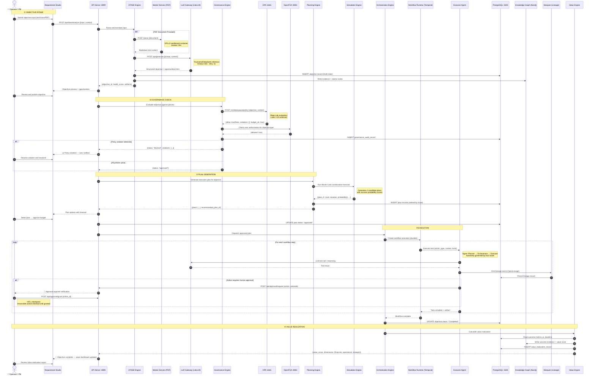

# Diagram 3 — E2E Sequence Diagram (Happy Path)

## Purpose
Makes execution flow explicit across services — from user intent to realized outcome — for the primary "Objective Intake → Execution → Value Realization" happy path.

## Questions This Diagram Answers
- What happens when a user submits an objective?
- Where can latency occur? What breaks if the LLM is slow?
- Where are data writes performed vs. reads only?
- Where do timeout/retry semantics apply?

## Scope
**In scope:** Objective ingestion, governance approval, plan execution, outcome delivery  
**Out of scope:** Error/failure paths, background learning cycles, multi-tenant flows

## Common Mistakes to Avoid
- ❌ Only showing service hops but missing data write events
- ❌ No timeout/retry semantics shown
- ❌ Missing governance checkpoint in the critical path

## Most Useful For
QA · Engineering · SRE · Product

---

## Diagram

---

## Critical Latency Points

| Step | Expected Latency | Timeout | Retry |
|------|-----------------|---------|-------|
| LLM inference (TinyLlama) | 5–30s (CPU) | 60s | 3x |
| PDF parsing (Marker) | 5–15s | 30s | 1x |
| OPA policy evaluation | < 100ms | 5s | 2x |
| Temporal workflow step | Variable | Per-step | Durable |
| PostgreSQL reads/writes | < 50ms | 5s | 3x |

## Human-in-the-Loop Checkpoints

| Checkpoint | Trigger | Required By |
|-----------|---------|------------|
| Objective publish | User reviews DTASE output | Always |
| Budget approval | Plan cost exceeds threshold | AP-05 Human Accountability |
| Irreversible action | Code commit / spend / publish | Constitutional Law |
| Policy override | Governance violation exception | Compliance Officer |

---

*Source: `Requirements Master/file.pdf` · `ADD.md` · `uawos_dashboard_daemon.py` · `uawos_governance.py`*
