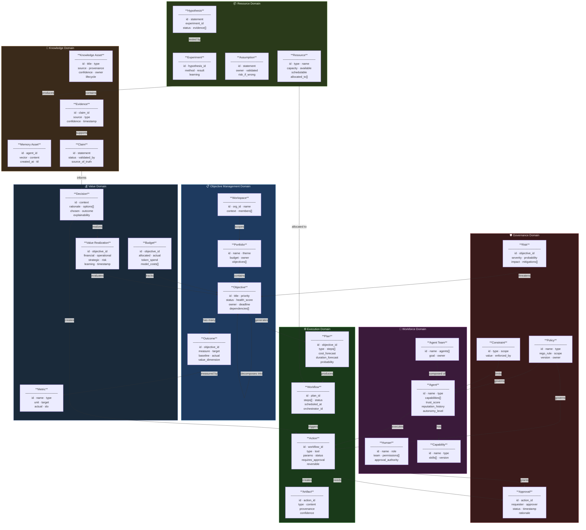

# Diagram 4 — Domain Model (Bounded Context + Entities)

## Purpose
Establishes shared language for business logic, prevents domain mismatch across teams, and defines canonical entity ownership.

## Questions This Diagram Answers
- What is an Objective vs. an Outcome vs. a Plan?
- Who owns which entity? What is the source of truth for each?
- Where are the bounded context boundaries?

## Scope
**In scope:** First-class entities, bounded contexts, key relationships  
**Out of scope:** Database schema details, API payload shapes, UI components

## Common Mistakes to Avoid
- ❌ Turning the domain model into a DB schema (avoid data types/foreign keys)
- ❌ Defining an unbounded "god domain" with no context separation
- ❌ Missing the source-of-truth ownership annotation per entity

## Most Useful For
Product · Engineering · Architecture · QA

---

## Bounded Context Map

---

## Entity Source of Truth

| Entity | Source of Truth | Store | Owner Domain |
|--------|----------------|-------|-------------|
| Objective | UAWOS Core | PostgreSQL + Objective Graph | Objective Management |
| Outcome | UAWOS Core | PostgreSQL + Value Graph | Objective Management |
| Plan | Planning Engine | PostgreSQL | Execution |
| Workflow | Temporal | Temporal DB | Execution |
| Action | Action Service | PostgreSQL | Execution |
| Agent | Agent Registry | Agent Graph (Neo4j) | Workforce |
| Policy | Policy Registry | Policy Graph + OPA | Governance |
| Knowledge Asset | Knowledge Engine | Knowledge Graph + Qdrant | Knowledge |
| Decision | Governance Engine | PostgreSQL + Knowledge Graph | Value |
| Budget | Budget Service | PostgreSQL | Value |
| Value Realization | Value Engine | Value Graph | Value |

---

## Constitutional Laws Affecting Entities

| Law | Entity Affected | Rule |
|-----|----------------|------|
| Law 1 | Objective | Must contain at least one measurable Outcome |
| Law 5 | Action | Irreversible actions require explicit human Approval |
| Law 11 | Agent | All agent actions must be verifiable and auditable |
| Law 14 | Knowledge Asset | Organizational knowledge takes precedence over external |

---

*Source: `Requirements Master/file.pdf` · `ADD.md` · `COS.md` · `uawos_objective.py` · `uawos_traceability.py`*
