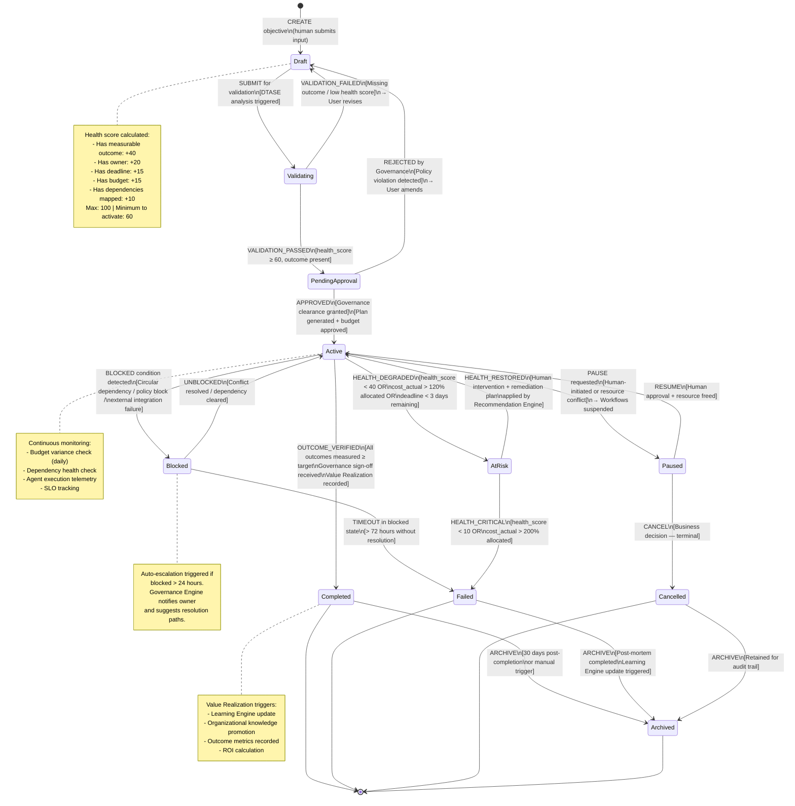

# Diagram 5 — State Machine (Objective Lifecycle)

## Purpose
Defines the canonical lifecycle and all allowable transitions for the **Objective** — the most critical entity in the UAWOS platform. All governance rules, execution logic, and value measurement depend on the correct state of an Objective.

## Questions This Diagram Answers
- What transitions are allowed? Which are forbidden?
- What states cause a stuck objective?
- What can be retried? What is terminal?
- Who can trigger each transition?

## Scope
**In scope:** Objective entity state machine, all valid/invalid transitions, triggers, terminal states  
**Out of scope:** Sub-objective state machines, Plan/Workflow/Action state machines (separate diagrams)

## Common Mistakes to Avoid
- ❌ Skipping edge/failure states (Blocked, At Risk, Failed)
- ❌ Not marking terminal states clearly (Completed, Failed, Cancelled, Archived)
- ❌ Missing the governance gate on state transitions

## Most Useful For
QA · SRE · Product · Engineering

---

## State Machine Diagram

---

## Transition Authority Matrix

| Transition | Who Can Trigger | Automated? | Governance Required? |
|-----------|----------------|-----------|---------------------|
| Draft → Validating | Any authorized user | ✅ Partially | No |
| Validating → PendingApproval | DTASE + Governance Engine | ✅ Automated | No |
| PendingApproval → Active | Governance Engine | ✅ Automated (OPA) | ✅ Yes |
| PendingApproval → Draft | Governance Engine | ✅ Automated | ✅ Yes |
| Active → Paused | PM / Operations Lead | ❌ Human | ✅ Notified |
| Active → AtRisk | Observability Engine | ✅ Automated | ✅ Notified |
| Active → Blocked | Orchestration Engine | ✅ Automated | ✅ Escalated |
| Active → Completed | Governance Engine | ✅ Automated | ✅ Yes |
| Blocked → Failed | System (timeout) | ✅ Automated | ✅ Logged |
| Any → Cancelled | PM / Executive | ❌ Human | ✅ Audit recorded |

---

## Terminal States

| State | Retryable? | Learning Signal? | Audit Required? |
|-------|-----------|-----------------|----------------|
| Completed | ❌ | ✅ Full learning update | ✅ Yes |
| Failed | Via new Objective | ✅ Failure analysis | ✅ Yes |
| Cancelled | Via new Objective | ✅ Partial | ✅ Yes |
| Archived | ❌ | ✅ Read-only | ✅ Yes |

---

## Related State Machines (Future Diagrams)

- **Plan State Machine**: Draft → Simulating → Approved → Executing → Completed / Failed
- **Action State Machine**: Pending → Executing → AwaitingApproval → Completed / Failed / Rolled Back
- **Agent State Machine**: Idle → Assigned → Executing → Reviewing → Complete / Suspended

---

*Source: `Requirements Master/file.pdf` · `ADD.md` · `uawos_objective.py` · `uawos_governance.py`*
