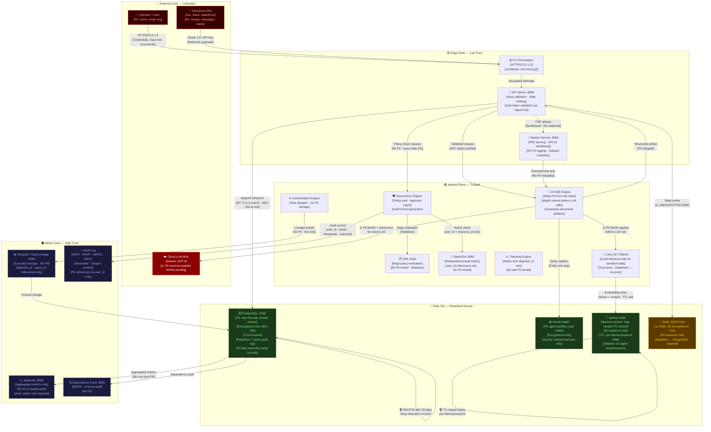

# Diagram 6 — Data Flow Diagram (PII + Trust Boundaries)

## Purpose
Establishes security/compliance truth — where PII data lives, who can access it, where it is encrypted, and how audit logging flows across the system.

## Questions This Diagram Answers
- Where is PII stored in the system?
- Who can access sensitive data?
- Where do we encrypt in-transit vs. at-rest?
- Where are retention/deletion flows defined?
- What are the trust boundaries between components?

## Scope
**In scope:** All data flows carrying PII or sensitive information, encryption points, trust boundary crossings, audit logging paths  
**Out of scope:** Non-sensitive internal data flows (e.g., configuration reads), UI rendering pipelines

## Common Mistakes to Avoid
- ❌ Hand-wavy "data is secure" statements without labeling PII
- ❌ Not labeling retention/deletion flows
- ❌ Missing audit log entries at trust boundary crossings
- ❌ Assuming TLS = "encrypted" without specifying at-rest encryption

## Most Useful For
SRE · DevOps · QA · Architecture · Product

---

## Trust Boundary Definitions

| Zone | Trust Level | Description |
|------|------------|-------------|
| 🔴 External | Untrusted | External users, internet, third-party APIs |
| 🟡 Edge | Low Trust | API Gateway, ingress, Marker service |
| 🟢 Internal | Trusted | Core platform engines, governance plane |
| 🔵 Data Tier | Restricted | Databases, vector stores, graph stores |
| ⚫ Admin | High Trust | Audit systems, compliance dashboards |

---

## Data Flow Diagram

---

## PII Data Inventory

| Data Element | Classification | Stored In | Encrypted At Rest | Retention | Deletion Trigger |
|-------------|---------------|-----------|------------------|-----------|-----------------|
| User name / email | PII | PostgreSQL | ✅ AES-256 | 7 years (audit) | Account deletion |
| Objective content | Business Sensitive | PostgreSQL + Neo4j | ✅ | 7 years | Manual / archived |
| Memory vectors | Potentially PII | Qdrant | ✅ | Per `MemoryAsset.ttl` | Agent decommission |
| Audit log entries | Compliance | PostgreSQL | ✅ | 7 years | Never (immutable) |
| LLM prompts | Sensitive | LiteLLM (local only) | ✅ Local | Session only | End of session |
| State JSON files | Business | Filesystem | ❌ **RISK** | Indefinite | Manual |
| Lineage events | Internal | Marquez + PostgreSQL | ✅ | 90 days | Automated |

---

## Encryption Standards

| Location | In-Transit | At-Rest | Key Management |
|---------|-----------|---------|---------------|
| API Server | TLS 1.3 | N/A | Let's Encrypt |
| PostgreSQL | TLS | AES-256 | PostgreSQL pgcrypto |
| Neo4j | TLS | AES-256 | Native |
| Qdrant | TLS | AES-256 | Native |
| LLM Local | localhost only | OS-level | N/A |
| State JSON | ❌ None | ❌ None | **Requires migration** |

---

*Source: `Requirements Master/file.pdf` · `PRTCS.md` · `CIAS.md` · `uawos_governance.py` · `uawos_db.py`*
