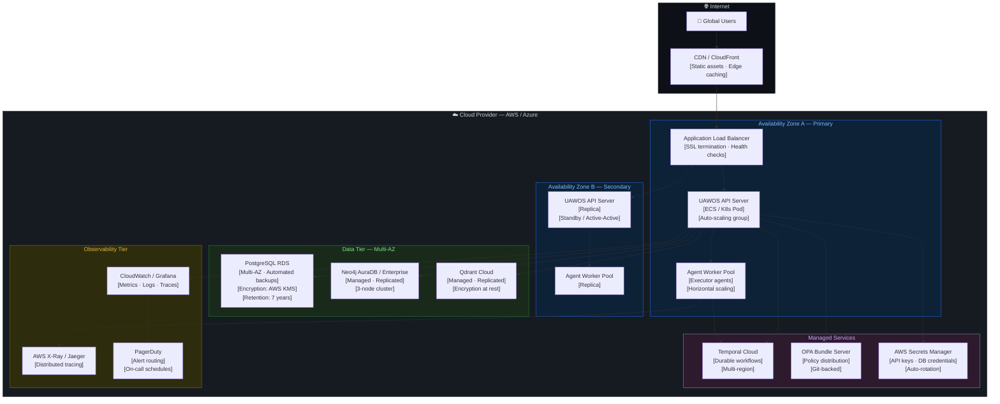

# Diagram 7 — Deployment Architecture

## Purpose
Shows the runtime reality of the UAWOS system — where each service runs, how they are connected, what the HA strategy is, and how releases roll out.

## Questions This Diagram Answers
- Where does UAWOS run? (local vs. cloud)
- What is the blast radius if a service fails?
- How do releases roll out? (Docker Compose → Cloud migration path)
- What is the AZ/region separation strategy?

## Scope
**In scope:** All runtime services, deployment targets, network topology, ingress/LB, compute placement  
**Out of scope:** Code-level details, internal container architecture, CI pipeline steps

## Common Mistakes to Avoid
- ❌ Showing only logical view (same as container diagram) — must show physical placement
- ❌ No AZ or region separation shown
- ❌ Missing ingress/load balancer configuration
- ❌ Not showing blast radius per failure zone

## Most Useful For
DevOps · SRE · Engineering · QA

---

## Current State: Local MVP (Docker Compose)

```mermaid
graph TB
    subgraph HOST["🖥️ Local Host Machine — Windows / Linux"]
        direction TB

        subgraph INGRESS["📡 Ingress Layer"]
            PS["PowerShell Startup Scripts\nstart-dashboard.ps1\nrun-daemon-persistent.ps1"]
            UAWOS_SRV["UAWOS API Server\n:8099 (Python HTTPServer)\nProcess: uawos_dashboard_daemon.py"]
        end

        subgraph DOCKER["🐳 Docker Compose Network — uawos-network"]
            direction LR

            subgraph DATA_SVC["Data Services"]
                PG["PostgreSQL\n:5435\nVolume: postgres_data\nImage: postgres:15"]
                QDRANT["Qdrant\n:6333 (HTTP)\n:6334 (gRPC)\nVolume: qdrant_data\nImage: qdrant/qdrant"]
            end

            subgraph LINEAGE_SVC["Lineage Services"]
                MARQUEZ["Marquez API\n:5000\nImage: marquezproject/marquez"]
                MARQUEZ_WEB["Marquez Web\n:5001\nImage: marquezproject/marquez-web"]
            end

            subgraph POLICY_SVC["Governance Services"]
                OPA["OPA\n:8181\nImage: openpolicyagent/opa\nConfig: /policies/"]
                OPENFGA["OpenFGA\n:8083 (gRPC)\n:8084 (HTTP)\nImage: openfga/openfga"]
            end

            subgraph ANALYTICS_SVC["Analytics Services"]
                SUPERSET["Apache Superset\n:8088\nVolume: superset_data\nImage: apache/superset"]
            end

            subgraph SECURITY_SVC["Security Services"]
                DEP_TRACK["Dependency-Track\n:8081 (API)\n:8082 (Frontend)\nImage: dependencytrack/apiserver"]
            end

            subgraph LLM_SVC["LLM Services"]
                LITELLM["LiteLLM Proxy\n:4000\nModels: TinyLlama, DeepSeek\nOllama backend"]
                OLLAMA["Ollama Runtime\n:11434\nGPU/CPU: Configurable"]
            end

            subgraph MOCK_SVC["Mock / Dev Services"]
                MOCK["Mock Backend\n:8100\nImage: custom mock\nStub: Jira, Slack, GitHub"]
                MARKER["Marker Service\n:8084\n⚠️ GPLv3 Isolated\nImage: custom marker"]
            end
        end

        subgraph FILES["📁 Local File System"]
            STATE["State JSON Files\nuawos_*_state.json\n⚠️ Not encrypted"]
            LOGS["Log Files\nuawos_*.log\nuawos_dashboard_err.log"]
            POLICIES["OPA Policies\n/policies/*.rego"]
        end
    end

    PS -->|"Starts process"| UAWOS_SRV
    UAWOS_SRV -->|"SQL :5435"| PG
    UAWOS_SRV -->|"REST :6333"| QDRANT
    UAWOS_SRV -->|"REST :8181"| OPA
    UAWOS_SRV -->|"gRPC :8083"| OPENFGA
    UAWOS_SRV -->|"REST :4000"| LITELLM
    UAWOS_SRV -->|"REST :5000"| MARQUEZ
    UAWOS_SRV -->|"REST :8084"| MARKER
    LITELLM -->|"REST :11434"| OLLAMA
    MARQUEZ -->|"SQL"| PG
    OPENFGA -->|"SQL"| PG
    UAWOS_SRV -->|"Read/Write"| STATE
    UAWOS_SRV -->|"Write"| LOGS
    OPA -->|"Load rules"| POLICIES

    style HOST fill:#0d1117,color:#c9d1d9,stroke:#30363d
    style DOCKER fill:#161b22,color:#c9d1d9,stroke:#21262d
    style DATA_SVC fill:#0d2137,color:#79c0ff,stroke:#1f6feb
    style LINEAGE_SVC fill:#1a2a1a,color:#7ee787,stroke:#238636
    style POLICY_SVC fill:#2d1a1a,color:#ff7b72,stroke:#da3633
    style ANALYTICS_SVC fill:#2d1a2d,color:#d2a8ff,stroke:#8b949e
    style LLM_SVC fill:#2d2d0d,color:#e3b341,stroke:#9e6a03
    style SECURITY_SVC fill:#1a1a2d,color:#58a6ff,stroke:#388bfd
    style MOCK_SVC fill:#1a1a1a,color:#8b949e,stroke:#30363d
    style FILES fill:#1f2428,color:#8b949e,stroke:#30363d
```

---

## Target State: Cloud Production (Phase 2+)

---

## Port Reference (Current)

| Service | Port | Protocol | Exposed? |
|---------|------|----------|---------|
| UAWOS API | 8099 | HTTP | ✅ Local |
| PostgreSQL | 5435 | TCP/SQL | ❌ Internal only |
| Qdrant HTTP | 6333 | HTTP | ❌ Internal only |
| Qdrant gRPC | 6334 | gRPC | ❌ Internal only |
| OPA | 8181 | HTTP | ❌ Internal only |
| OpenFGA | 8083/8084 | gRPC/HTTP | ❌ Internal only |
| LiteLLM | 4000 | HTTP | ❌ Internal only |
| Ollama | 11434 | HTTP | ❌ Internal only |
| Marquez API | 5000 | HTTP | ❌ Internal only |
| Marquez Web | 5001 | HTTP | ✅ Local |
| Superset | 8088 | HTTP | ✅ Local |
| Dependency-Track | 8081/8082 | HTTP | ✅ Local |
| Marker Service | 8084 | HTTP | ❌ Internal only |
| Mock Backend | 8100 | HTTP | ❌ Internal only |

---

## Blast Radius Analysis

| Failure | Impact | Degraded Gracefully? | Mitigation |
|---------|--------|---------------------|-----------|
| PostgreSQL down | Full write stop | ❌ Critical | RDS Multi-AZ in prod |
| OPA down | Governance blocks all actions | ❌ Critical | OPA HA cluster in prod |
| LiteLLM / Ollama down | Heuristic fallback parser | ✅ Partial (< 100ms fallback) | Local-first design |
| Qdrant down | No semantic memory reads | ✅ Partial | In-memory fallback |
| Marquez down | No lineage tracking | ✅ Degraded | Async, non-blocking |
| Marker Service down | No PDF parsing | ✅ Text-only fallback | Design intent |

---

*Source: `Requirements Master/file.pdf` · `docker-compose.yml` · `uawos_dashboard_daemon.py` · `terraform/`*
