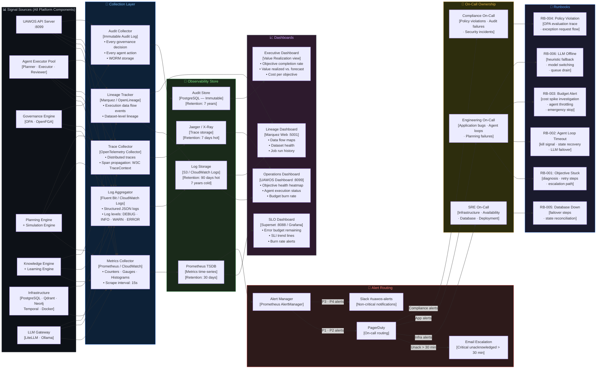

# Diagram 8 — Observability + Operations

## Purpose
Makes UAWOS operable, measurable, and supportable. Defines SLIs, SLOs, metrics/logs/traces flow, alert routing, runbook triggers, and on-call ownership.

## Questions This Diagram Answers
- How do we detect issues before users do?
- What triggers a page? What is our SLO and error budget?
- Who is on call? What do they do when alerted?
- What dashboards and runbooks exist?

## Scope
**In scope:** All observability signals, SLI/SLO definitions, alert routing, runbook mapping, on-call ownership  
**Out of scope:** Application code instrumentation details, dashboard UI screenshots

## Common Mistakes to Avoid
- ❌ Defining alerts without SLOs (alerts mean nothing without a target)
- ❌ No runbooks attached to alert conditions
- ❌ No ownership routing (who gets paged?)
- ❌ Missing error budget burn rate tracking

## Most Useful For
SRE · DevOps · Engineering

---

## Observability Signal Flow

---

## SLI / SLO Definitions

| SLI | Measurement | SLO Target | Error Budget (30d) |
|-----|------------|-----------|-------------------|
| **Objective Success Rate** | % objectives reaching Completed state | ≥ 85% | 15% failure budget |
| **API Availability** | % successful HTTP responses (non-5xx) | ≥ 99.5% | 3.6 hours/month |
| **Objective Intake Latency** | P95 time from input → Validating state | ≤ 30 seconds | — |
| **Governance Decision Latency** | P99 OPA evaluation time | ≤ 500 ms | — |
| **LLM Availability** | % LLM requests that succeed or fallback | ≥ 95% | 5% failure budget |
| **Dashboard Load Time** | P90 initial page load | ≤ 1.5 seconds | — |
| **Budget Accuracy** | Actual spend within ±20% of forecast | ≥ 80% | 20% variance budget |
| **Audit Completeness** | % actions with corresponding audit records | 100% | 0% (hard requirement) |
| **Governance Compliance Rate** | % executions passing all OPA policies | ≥ 99% | 1% exception budget |

---

## Alert Severity Definitions

| Priority | Severity | Response SLA | Examples |
|---------|---------|-------------|---------|
| P1 | Critical | 5 minutes | API down · DB down · Governance engine down |
| P2 | High | 30 minutes | SLO burn rate > 5x · LLM offline > 10 min · Budget spike > 200% |
| P3 | Medium | 4 hours | Agent loop timeout · Objective stuck > 24h · LLM latency high |
| P4 | Low | Next business day | Dependency-Track vulnerability · State file write failure |

---

## Key Metrics Reference

| Metric | Type | Label | Alert Threshold |
|--------|------|-------|----------------|
| `uawos_objective_health_score` | Gauge | `objective_id` | < 40 → P3 alert |
| `uawos_api_request_duration_seconds` | Histogram | `endpoint` | P95 > 5s → P2 |
| `uawos_agent_loop_timeout_total` | Counter | `agent_type` | > 5/hour → P3 |
| `uawos_budget_variance_ratio` | Gauge | `objective_id` | > 1.2 → P3, > 2.0 → P2 |
| `uawos_governance_policy_violation_total` | Counter | `policy_id` | > 0 → immediate alert |
| `uawos_llm_error_rate` | Gauge | `model` | > 0.1 → P2 |
| `uawos_objective_completion_rate_7d` | Gauge | — | < 0.7 → P3 |
| `uawos_audit_log_gap_seconds` | Gauge | `component` | > 60s → P1 |

---

## Runbook Quick Reference

| Runbook | Trigger | First Action |
|---------|---------|-------------|
| RB-001 | Objective stuck > 24h | Check dependency graph for cycles → `GET /api/objective/conflicts` |
| RB-002 | Agent loop > 30 min | Kill Temporal workflow → restart executor agent |
| RB-003 | Budget spike alert | Check `uawos_budget_state.json` → identify token-expensive model → throttle |
| RB-004 | Policy violation | Review OPA trace → submit exception request via Governance UI |
| RB-005 | PostgreSQL down | Check Docker container health → failover to read replica → alert SRE |
| RB-006 | LLM offline | Confirm heuristic fallback active → switch model in LiteLLM config → drain queue |

---

*Source: `Requirements Master/file.pdf` · `OTDTS.md` · `uawos_observability.py` · `uawos_governance.py`*
