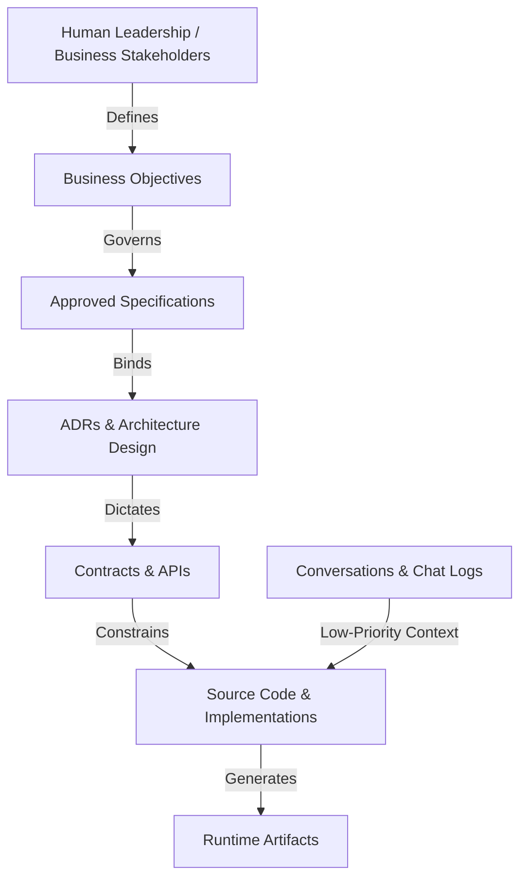
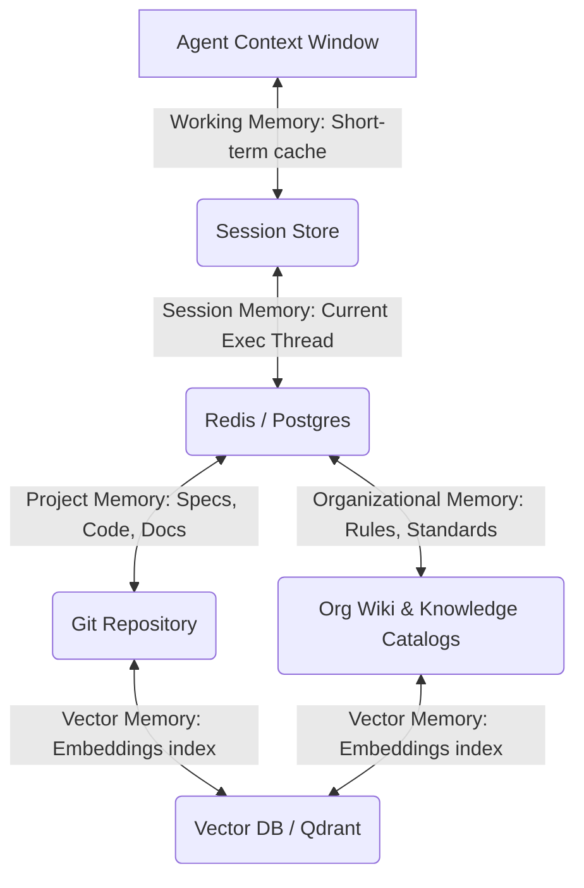
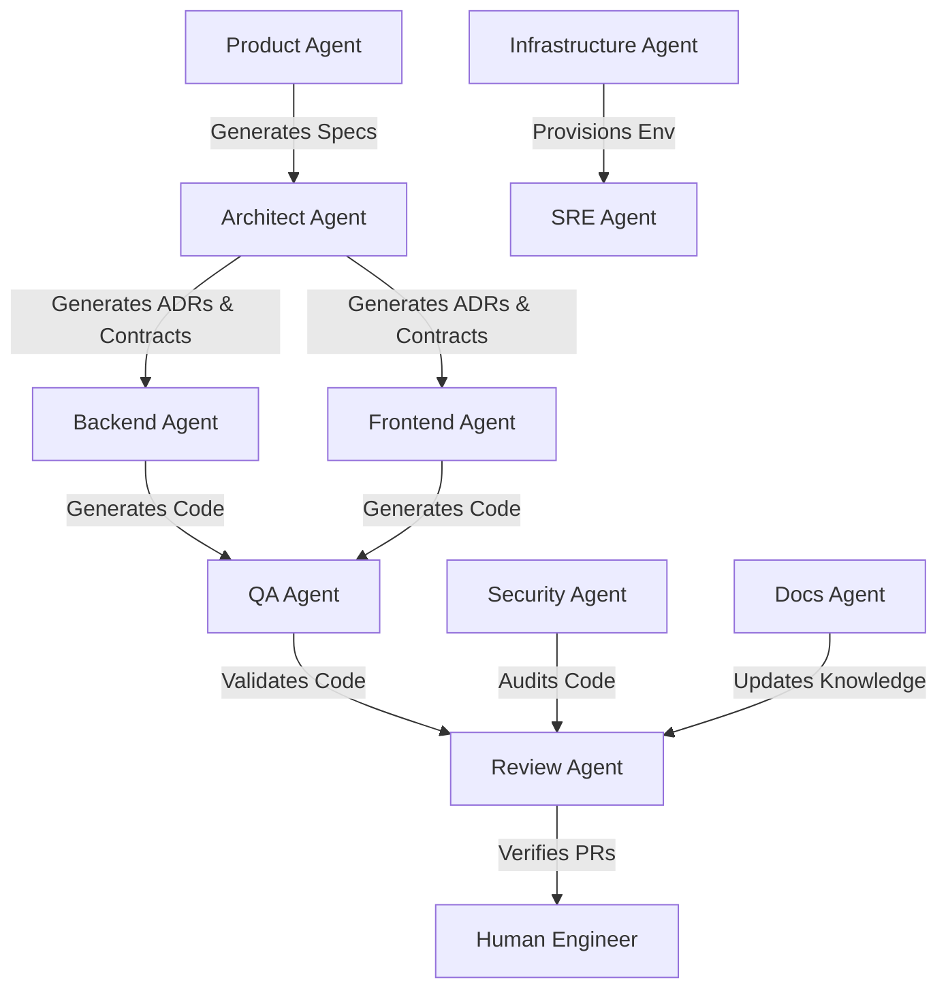
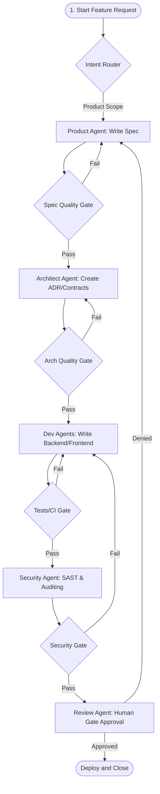
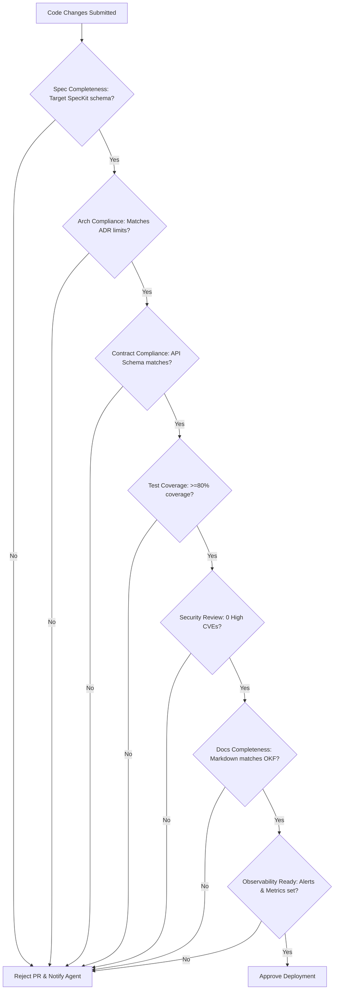
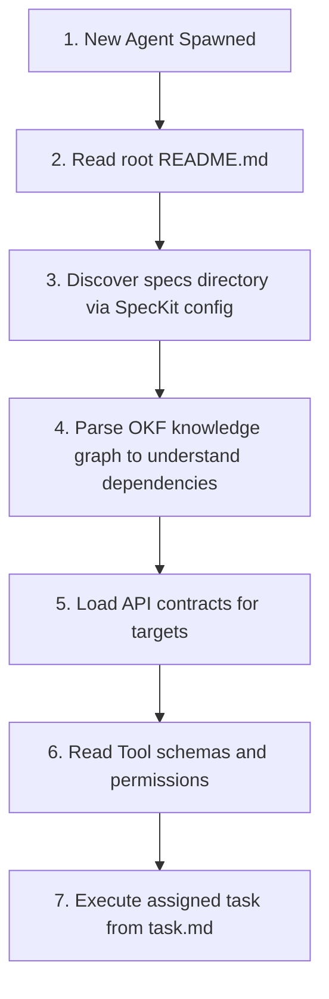

# AI Engineering Operating System (AI-EOS) Specification

This document defines the core architecture, operational workflows, and governance models for the **AI Engineering Operating System (AI-EOS)**—a specification-driven, agent-native, enterprise-grade engineering environment. The AI-EOS is designed to support both autonomous and human-supervised development across the complete software delivery lifecycle.

---

## Phase 0 — Engineering Constitution

The Engineering Constitution serves as the supreme governance framework for the repository. All human actions and autonomous agent operations are subject to this constitution.

### 1. Core Principles
The AI-EOS is built upon ten mandatory AI-native architectural principles:
*   **Specification First**: No code implementation may begin without an approved specification.
*   **Contract First**: Interfaces, data schemas, and API contracts must be defined and approved prior to writing functional code.
*   **Knowledge First**: Organizational, domain, and architectural context must be codified in the repository before feature execution.
*   **Evaluation First**: Test criteria, performance benchmarks, and AI evaluation metrics must be defined before code changes are accepted.
*   **Security First**: Vulnerability detection, secrets scanning, prompt injection defense, and access controls are embedded at the core.
*   **Automation First**: All repetitive human-agent interactions, deployments, and checks are compiled into CI/CD workflows.
*   **Observability First**: System states, agent executions, logs, and traces must be continuously captured and verified.
*   **Agent Discoverability First**: Repository layouts, tools, specifications, and runbooks must be discoverable and readable by newly onboarded agents with zero human intervention.
*   **Deterministic Execution First**: Infrastructure, tooling, environments, and orchestration channels must exhibit predictable behaviors.
*   **Human Accountability Always**: AI agents act under delegated authority. The final accountability, risk sign-off, and production deployments always rest with human engineers.

### 2. Governance, Authority, and Ownership Hierarchies


#### Authority Hierarchy
1.  **Level 1: Business Objectives**: Highest authority. Establishes the commercial, legal, and operational outcomes required.
2.  **Level 2: Approved Specifications**: Concrete functional and non-functional requirements generated in response to Business Objectives.
3.  **Level 3: Architecture Decision Records (ADRs)**: The structural choices that map specs to systems.
4.  **Level 4: Contracts**: Declared interfaces, API specs, and schemas.
5.  **Level 5: Source Code**: Synthesized software components.
6.  **Level 6: Generated Artifacts**: Compiled code, Docker images, and configuration bundles.
7.  **Level 7: Conversations**: Chat histories and temporary interaction logs.

#### Ownership Hierarchy
*   **Business Domains & specs**: Owned by the **Product Agent** and human Product Owners.
*   **architecture, contracts, and adrs**: Owned by the **Architect Agent** and human Enterprise Architects.
*   **source code & tests**: Jointly owned by the **Developer Agents** (Backend, Frontend), **QA Agent**, and human engineers.
*   **runbooks, platform, and observability**: Owned by the **SRE Agent**, **Infra Agent**, and human DevOps engineers.
*   **security and data-governance**: Owned by the **Security Agent** and human Security Officers.

### 3. Escalation and Conflict Resolution
When agents detect conflicts between requirements (e.g., a spec requesting a feature that violates a contract, or an instruction contradicting the Engineering Constitution):
*   **Automatic Halting**: The executing agent must immediately pause execution and log a structured conflict report.
*   **Resolution Protocol**:
    1.  *Self-Resolution Attempt*: The agent queries higher-priority files (e.g., ADRs or specs) to check for explicit overrides.
    2.  *Agent-to-Agent Escalation*: If unresolved, the conflict is routed to the **Review Agent** for cross-agent evaluation.
    3.  *Human Intervention*: If a conflict spans priority levels or remains ambiguous, the agent uses the system's interactive notification system to prompt a human operator for clarification. **No agent may bypass a conflict without human sign-off.**

### 4. Repository Evolution Rules
*   **Forward Compatibility**: All structural modifications to repository layouts must maintain backwards compatibility for existing agent parsers.
*   **Atomic Updates**: Every contribution (human or agent) must link a code change directly to its triggering task, ADR, contract, and specification.
*   **Continuous Evaluation**: No repository update is merged if it degrades test coverage, breaches security policies, or violates contract checks.

---

## Phase 1 — Repository Operating System

The Repository Operating System enforces a strict directory structure. Every directory is structured as a self-describing module containing metadata, ownership boundaries, and validation requirements.

| Directory Path | Purpose | Primary Owner | Lifecycle | Validation Requirements | Discoverability Rule |
| :--- | :--- | :--- | :--- | :--- | :--- |
| [`/specs`](file:///c:/Users/rajaj/Projects/UAWOS/specs) | Stores product requirements and SpecKit specifications | Product Agent | Created at project initiation; modified during feature definition | Validated against the SpecKit JSON schema | Linked from root `README.md` and indexed in `/knowledge` |
| [`/knowledge`](file:///c:/Users/rajaj/Projects/UAWOS/knowledge) | Standardized metadata-driven OKF documentation | Product / Architect | Maintained continuously as corporate knowledge evolves | Frontmatter matches the OKF schema | Evaluated as the core context source for RAG engines |
| [`/docs`](file:///c:/Users/rajaj/Projects/UAWOS/docs) | Human-centric developer guides and walkthroughs | Docs Agent | Updated alongside code changes | Markdown syntax checking and link verification | Kept in sync with `/specs` and `/architecture` |
| [`/architecture`](file:///c:/Users/rajaj/Projects/UAWOS/architecture) | System component maps and design blueprints | Architect Agent | Static after approval; updated on major upgrades | Must align with schemas defined in contracts | Referenced in all agent prompt contexts |
| [`/contracts`](file:///c:/Users/rajaj/Projects/UAWOS/contracts) | Declarative API specifications (OpenAPI, gRPC, Protobuf) | Architect Agent | Updated prior to development phase | Validated by schema compiler (e.g., spectral, swagger) | Read first by Backend/Frontend agents |
| [`/adrs`](file:///c:/Users/rajaj/Projects/UAWOS/adrs) | Architectural Decision Records | Architect Agent | Appended chronologically; immutable once approved | Formatted to ADR standard; references RFCs | Searchable via vector/semantic indexes |
| [`/runbooks`](file:///c:/Users/rajaj/Projects/UAWOS/runbooks) | Step-by-step incident response scripts and instructions | SRE Agent | Created post-deployment; updated after incidents | Executable steps must be unit-tested | Indexed by SRE Agent on system alerts |
| [`/agents`](file:///c:/Users/rajaj/Projects/UAWOS/agents) | Agent configurations, prompts, and registries | Review Agent | Updated on agent model upgrades or prompt tuning | Configuration validated against YAML registry schema | Configured as the core runner definition for workloads |
| [`/orchestration`](file:///c:/Users/rajaj/Projects/UAWOS/orchestration) | LangGraph / CrewAI workflow DAGs and state machines | Review Agent | Modified when agent workflows alter | Visualized via diagram tools; syntax validated | Read by coordination runner to spin up task forces |
| [`/memory`](file:///c:/Users/rajaj/Projects/UAWOS/memory) | Configurations for working, session, and semantic memory | Review Agent | Active runtime mounts | Schema compliance checks for session JSONs | Bound to active agent execution environments |
| [`/prompts`](file:///c:/Users/rajaj/Projects/UAWOS/prompts) | Fenced prompt templates and system instruction files | Review Agent | Updated during prompt engineering phases | Linted for parameter placeholders | Injectable directly into runtime agent context |
| [`/evals`](file:///c:/Users/rajaj/Projects/UAWOS/evals) | AI Evaluation tests, benchmarks, gold datasets | QA Agent | Updated with new features | Evals must pass accuracy and safety baselines | Executed by CI/CD during PR evaluation |
| [`/tests`](file:///c:/Users/rajaj/Projects/UAWOS/tests) | Code tests (unit, integration, contract, security) | QA Agent | Created during development | Coverage gates enforced (e.g., minimum 80% coverage) | Auto-run on all commit pushes |
| [`/ci`](file:///c:/Users/rajaj/Projects/UAWOS/ci) | CI/CD YAML configurations and validation scripts | Infra Agent | Modified when build workflows change | Validated by workflow engines (e.g., actions linter) | Orchestrator verifies build paths |
| [`/platform`](file:///c:/Users/rajaj/Projects/UAWOS/platform) | Scaffolding tools, CLI overrides, template presets | Infra Agent | Maintained for Developer Platform consistency | Presets must match SpecKit standards | Accessed via internal developer portal |
| [`/security`](file:///c:/Users/rajaj/Projects/UAWOS/security) | Threat models, security policies, secret rules | Security Agent | Audited monthly | Scanned by SAST/DAST rules | Loaded at start of any pipeline execution |
| [`/observability`](file:///c:/Users/rajaj/Projects/UAWOS/observability) | SLO/SLI dashboards, Alerting configurations | SRE Agent | Updated on service additions | Metrics must match OpenTelemetry specifications | Auto-deployed to APM systems |
| [`/data-governance`](file:///c:/Users/rajaj/Projects/UAWOS/data-governance) | Data classifications, lineages, and PII rules | Security Agent | Reviewed on schema changes | Data contracts validated against PII controls | Checked during database migrations |
| [`/infra`](file:///c:/Users/rajaj/Projects/UAWOS/infra) | Terraform, Kubernetes manifests, Cloud configurations | Infra Agent | Managed under Infrastructure-as-Code | Manifests validated against cloud policies | Managed in continuous deployment pipelines |
| [`/scripts`](file:///c:/Users/rajaj/Projects/UAWOS/scripts) | Custom validation scripts, bootstrap and cleanup | Review Agent | Continuous optimization | Shellcheck and python style guidelines checked | Discoverable in standard system PATH |

---

## Phase 2 — Specification Governance System

The Specification Governance Layer enforces a strict SpecKit-driven workflow. No implementation changes are allowed in the codebase without corresponding, approved upstream artifacts.

```
                  ┌────────────────────────┐
                  │ 1. SpecKit Spec Created│
                  └───────────┬────────────┘
                              │
                              ▼
                  ┌────────────────────────┐
                  │2. Architecture Approved│
                  └───────────┬────────────┘
                              │
                              ▼
                  ┌────────────────────────┐
                  │ 3. Contracts Approved  │
                  └───────────┬────────────┘
                              │
                              ▼
                  ┌────────────────────────┐
                  │4. Test Strategy Defined│
                  └───────────┬────────────┘
                              │
                              ▼
                 ┌──────────────────────────┐
                 │5. Implementation Phase   │
                 └──────────────────────────┘
```

### 1. Specification Template
```markdown
---
spec_id: SPEC-001
title: Photo Album Drag-and-Drop
status: proposed
version: 1.0.0
owner: product-agent
last_modified: 2026-06-20
---

# Specification: Photo Album Drag-and-Drop

## 1. Business Objective
Enable users to organize photo albums in a tile-like structure through drag-and-drop actions. This reduces time-to-organize and increases user engagement.

## 2. Functional Requirements
*   Display photo albums as rectangular tiles on the dashboard.
*   Allow mouse-drag and touch-drag behaviors to reposition album tiles.
*   Repositioned order must persist across browser refreshes.
*   Prevent nesting albums inside other albums.

## 3. Non-Functional Requirements
*   Drag interactions must render at 60 FPS (less than 16ms frame time).
*   State persistence must complete in under 200ms.
*   Accessible keyboards/screen-readers fallback for positioning.

## 4. Acceptance Criteria
*   GIVEN the dashboard with albums A, B, C, WHEN the user drags A after C, THEN the order changes to B, C, A.
*   GIVEN the drag action, WHEN an album tile is dropped onto another album tile, THEN the drop is rejected and the tile returns to its position.

## 5. Data Contract
```yaml
schema: PersistedAlbumOrder
type: object
required: [user_id, ordered_album_ids]
properties:
  user_id: { type: string }
  ordered_album_ids:
    type: array
    items: { type: string }
```

## 6. API Contract
```yaml
paths:
  /api/v1/albums/reorder:
    put:
      summary: Persist new album sequence
      requestBody:
        required: true
        content:
          application/json:
            schema: { $ref: '#/components/schemas/PersistedAlbumOrder' }
      responses:
        200:
          description: Reordering persisted successfully.
```

## 7. Test Strategy
*   **Unit**: Validate state update functions with different array orderings.
*   **Integration**: Validate endpoint persists order to SQLite database.
*   **E2E**: Simulate drag-and-drop via Playwright and assert DOM ordering.

## 8. Monitoring Strategy
*   Track reorder latencies (SLI) targeting p95 < 150ms.
*   Log serialization failure errors in API layer.

## 9. Rollback Strategy
If persistence fails or causes page crashes, fallback client-side storage to standard fetch sequencing and return UI to the previous layout sequence.
```

### 2. Architecture Review and Risk Assessment Template
```markdown
---
adr_id: ADR-001
title: Persistent Album Reordering via SQLite
status: proposed
---

# Architecture Review & Risk Assessment

## Technical Proposal
We propose persisting the album order inside a dedicated `UserAlbumOrder` table in the SQLite database, using a PUT request payload that sends the complete ordered array of album IDs.

## Risk Assessment Matrix
| Risk Identification | Severity | Likelihood | Mitigation Strategy |
| :--- | :--- | :--- | :--- |
| High database write load | Medium | Low | Throttle reorder requests using a debounce window on the client side (500ms). |
| Race conditions in updates | High | Medium | Enforce optimistic locking on the order row via an update timestamp. |
| DB connection failures | High | Low | Implement retry queues on client and log offline sync capabilities. |

## AI Review Checklist
- [ ] Confirmed database schema has appropriate indexes.
- [ ] Verified payload size constraints prevent buffer overflows.
- [ ] Validated UI fallback when connection is lost.
```

---

## Phase 3 — Knowledge Architecture

The AI-EOS integrates the Open Knowledge Format (OKF) to ensure documentation is structured, linked, and ready for RAG consumption by both human and autonomous agents.

### 1. OKF Metadata frontmatter Schema
Every knowledge file MUST begin with a structured frontmatter block matching this template:
```yaml
okf_version: "1.0.0"
domain: "architecture"
id: "KND-ARCH-002"
title: "Distributed Data Flow Architecture"
owner:
  role: "Lead Architect"
  contact: "arch-lead@enterprise.com"
last_updated: "2026-06-20T10:00:00Z"
status: "active"
dependencies:
  - "SPEC-001"
relations:
  - type: "implements"
    target_id: "SPEC-001"
  - type: "extends"
    target_id: "KND-ARCH-001"
retrieval_tags: ["data-flow", "event-bus", "synchronization"]
```

### 2. OKF Domain Guidelines
*   **Business**: Connects code modules back to revenue streams and customer segments.
*   **Product**: Tracks features, UX guidelines, and business goals.
*   **Architecture**: Service limits, component relations, technology choices.
*   **Engineering**: Coding styling, database patterns, language configurations.
*   **Security**: Compliance checklists, thread models, crypto requirements.
*   **Operations**: Monitoring targets, alerts, scaling parameters.
*   **Data**: Data dictionaries, lineage graphs, metadata classifications.
*   **Compliance**: ISO27001, GDPR, and HIPAA compliance mapping matrices.
*   **Runbooks**: Step-by-step resolution sequences for infrastructure outages.
*   **Incidents**: Post-mortem reviews and learning records.
*   **Metrics**: Mapping of business success indicators to low-level SLIs.
*   **Glossary**: Strictly bounded definition of corporate terminology.

### 3. Update, Validation, and Retrieval Rules
*   **Updates**: No agent may modify a codebase without reviewing related OKF files. If changes occur, OKF files must be updated simultaneously.
*   **Validation**: A parser runs in CI to ensure frontmatter is present, matches the `okf_schema.json`, and all links to other file IDs resolve correctly.
*   **Retrieval**: Semantic vector search retrieves relevant OKF files based on agent tasks. The RAG pipeline matches prompt context using the `retrieval_tags` and `relations`.

---

## Phase 3A — Memory Architecture

To manage cognitive load and ensure continuity across long development cycles, AI-EOS implements a multi-tiered memory architecture.



### Memory Hierarchy Configuration

| Memory Layer | Storage Strategy | Retention Policy | Expiration Rules | Retrieval Strategy | Access Control |
| :--- | :--- | :--- | :--- | :--- | :--- |
| **Working Memory** | In-memory token cache (dict / array) | Lifecycle of single agent execution | Cleared on tool completion | Immediate variable lookup | Local agent process only |
| **Session Memory** | Redis key-value store / Postgres | Active conversation session | Expires after 24 hours of inactivity | Key-value fetch using `session_id` | Restricted to initiating agent & user |
| **Project Memory** | Version-controlled files in Git | Lifetime of the codebase | Permanent | Git diffs, grep, semantic search | All authorized workspace developers |
| **Organizational Memory**| Shared enterprise knowledge vaults | Permanent across projects | Archive flag on deprecation | Vector DB RAG search over catalogs | Role-based (RBAC) organizational auth |
| **Semantic Memory** | Vector Embeddings database (Qdrant) | Permanent; updated on file commit | Regenerate on file modification | Cosine similarity lookup | Read-only for developers; write-only via CI |
| **Episodic Memory** | Execution log ledger with inputs/outputs | 90 days retention | Deleted after 90 days | Filtered query by timestamp/job ID | Read-only for SRE & Security auditors |
| **Procedural Memory** | Execution plans and runbooks | Lifetime of process structure | Upgraded on process iteration | Command index query | Read-only for agents; write-only via human PR |
| **Execution Memory** | Container state files, workspace variables | Lifetime of runtime environment | Purged on container shutdown | Environment variables & disk files | Restricted to runtime sandbox |

---

## Phase 4 — Agent Operating Model

AI-EOS defines ten agent roles. Each agent possesses explicit responsibilities, bounded input/output constraints, and clear escalation protocols.

### 1. Agent Definition Matrix



### 2. Detailed Agent Specifications

#### Product Agent
*   **Responsibilities**: Translate business proposals into specifications, user stories, and acceptance criteria.
*   **Inputs**: Business ideas, market requirements, current specs.
*   **Outputs**: Approved specifications (`/specs`), feature definitions.
*   **Knowledge Sources**: Business glossaries, customer feedback docs.
*   **Success Metrics**: Spec coverage, requirements validation rate.
*   **Escalation Rules**: Escalate to Human Product Owner if conflicting requirements exist.
*   **Failure Conditions**: Vague requirements, circular dependency in user stories.
*   **Validation Checklist**: Spec kit schema matches, acceptance criteria are verifiable.

#### Architect Agent
*   **Responsibilities**: System component boundaries, ADRs, database schema design, and API contracts.
*   **Inputs**: Specifications, existing system map, technology guidelines.
*   **Outputs**: ADR files (`/adrs`), OpenAPI contracts (`/contracts`).
*   **Knowledge Sources**: Architecture frameworks, code structure rules.
*   **Success Metrics**: Low contract drift, approved ADR count.
*   **Escalation Rules**: Escalate to Human Lead Architect when choosing non-standard technology stack.
*   **Failure Conditions**: Circular API dependencies, contract formatting errors.
*   **Validation Checklist**: OpenAPI contracts pass linting, ADRs are properly linked to specs.

#### Backend Agent
*   **Responsibilities**: Generate backend code, write unit/integration tests, optimize SQL queries.
*   **Inputs**: Contracts, database schemas, ADRs.
*   **Outputs**: Server-side source code, database migrations, backend unit tests.
*   **Knowledge Sources**: Language guidelines, framework documentation.
*   **Success Metrics**: Code correctness, execution performance.
*   **Escalation Rules**: Escalate to Backend Lead if database migration poses risk of data loss.
*   **Failure Conditions**: Test suite failures, static analysis errors.
*   **Validation Checklist**: Compilation succeeds, 80%+ test coverage.

#### Frontend Agent
*   **Responsibilities**: Generate UI screens, write UI unit tests, implement accessibility features.
*   **Inputs**: User experience guidelines, API contracts.
*   **Outputs**: UI code, CSS configurations, frontend unit tests.
*   **Knowledge Sources**: Component libraries, styling guides.
*   **Success Metrics**: Responsive rendering, low bundle sizes.
*   **Escalation Rules**: Escalate to UX Designer if mockups are incomplete or conflict.
*   **Failure Conditions**: Browser console errors, failure to load scripts.
*   **Validation Checklist**: Passes CSS/Linter check, layout renders on mobile/desktop viewports.

#### Infrastructure Agent
*   **Responsibilities**: Infrastructure provisioning (IaC), CI/CD pipelines, container orchestration.
*   **Inputs**: Architecture specifications, cloud access policies.
*   **Outputs**: Terraform scripts, Dockerfiles, YAML pipeline manifests.
*   **Knowledge Sources**: Cloud architectures, deployment manuals.
*   **Success Metrics**: Provisioning speed, pipeline execution reliability.
*   **Escalation Rules**: Escalate to Platform Lead if provisioning cost limits are exceeded.
*   **Failure Conditions**: Resource allocation failures, broken pipeline stages.
*   **Validation Checklist**: Terraform validates without errors, container builds run cleanly.

#### Security Agent
*   **Responsibilities**: Vulnerability scans, secret scanning, access policy validation, threat modeling.
*   **Inputs**: Code repository, dependency map, network configuration.
*   **Outputs**: Threat models, vulnerability remediation reports.
*   **Knowledge Sources**: CVE databases, security standards.
*   **Success Metrics**: Zero secrets leaked, clean vulnerability scans.
*   **Escalation Rules**: Escalate to CISO immediately if active exploit or leaked credential is found.
*   **Failure Conditions**: Undetected high-severity vulnerabilities.
*   **Validation Checklist**: CodeQL runs without blockers, Trivy image scan shows zero high issues.

#### QA Agent
*   **Responsibilities**: Write integration, E2E, load, and performance tests. Create mock servers.
*   **Inputs**: API contracts, execution source code, specifications.
*   **Outputs**: Playwright/Postman test suites, load test scripts, test logs.
*   **Knowledge Sources**: Test design patterns, performance requirements.
*   **Success Metrics**: High bug detection rate before deployment.
*   **Escalation Rules**: Escalate to QA Lead if testing environment is down or unstable.
*   **Failure Conditions**: High rate of flaky tests.
*   **Validation Checklist**: Regression suite passes, performance metrics meet requirements.

#### Documentation Agent
*   **Responsibilities**: Keep developer portals updated, document new modules, write API manuals.
*   **Inputs**: Newly checked-in code, ADRs, user feedback.
*   **Outputs**: Readmes, API docs, system dictionaries.
*   **Knowledge Sources**: Write styles, documentation guidelines.
*   **Success Metrics**: Searchability index, low user friction.
*   **Escalation Rules**: Escalate to Technical Writer if business terminology lacks definitions.
*   **Failure Conditions**: Stale documentation, broken internal links.
*   **Validation Checklist**: Markdown conforms to styling guidelines, links are active.

#### SRE Agent
*   **Responsibilities**: SLO/SLI tracking, incident response support, log management.
*   **Inputs**: System runtime logs, metrics databases, runbooks.
*   **Outputs**: SLO reports, alerting rules, post-mortem reviews.
*   **Knowledge Sources**: System runbooks, service architecture.
*   **Success Metrics**: High system availability, low mean time to recovery (MTTR).
*   **Escalation Rules**: Escalate to On-Call SRE Engineer on target SLO breaches.
*   **Failure Conditions**: Inactive alerting system, failed log ingestion.
*   **Validation Checklist**: Prometheus metrics register successfully, alerts trigger correctly.

#### Review Agent
*   **Responsibilities**: Pre-commit code reviews, verify quality gate alignment, run final checks.
*   **Inputs**: PR code, test execution reports, security reports.
*   **Outputs**: Pull Request review comments, gate approval certificates.
*   **Knowledge Sources**: Coding guidelines, engineering constitution.
*   **Success Metrics**: Clean code integrations, zero failed deployments.
*   **Escalation Rules**: Escalate to Lead Developer if PR has conflicting design choices.
*   **Failure Conditions**: Overriding quality gates without permission.
*   **Validation Checklist**: All quality gates checked, all mandatory checkers return success.

---

## Phase 4A — Agent Orchestration Framework

The orchestrator manages multi-agent coordination, routing, state sharing, and conflict resolution using an agent-to-agent protocol and Model Context Protocol (MCP) server definitions.

### 1. LangGraph Workflow DAG: Feature Implementation Flow


### 2. Orchestration Core Components
*   **Agent Registry**: A central ledger (`/agents/agent_registry.yaml`) containing the list of active agents, their API endpoints, and version metadata.
*   **Agent Discovery**: Dynamically resolves target agent capabilities by querying the Registry using tags (e.g., query for "db-migrations" returns `backend-agent`).
*   **Agent Routing**: Routes messages between agents using a messaging bus. The payload contains context tags, intent types, and source-of-truth pointers.
*   **Agent Scheduling**: Schedules agent tasks chronologically or in parallel according to the workflow DAG.
*   **Agent State Management**: State is persisted inside a JSON schema-validated document stored in `/memory/session_state.json`. Every state change is recorded with timestamp and active agent signature.
*   **Agent Communication Protocol**: Agents communicate via JSON payloads over standard RPC channels:
    ```json
    {
      "message_id": "msg-88712",
      "sender_id": "product-agent",
      "recipient_id": "architect-agent",
      "intent": "REQUEST_ADR",
      "payload": {
        "spec_id": "SPEC-001",
        "spec_path": "/specs/SPEC-001.md"
      },
      "context_provenance": ["SPEC-001"]
    }
    ```
*   **Agent Context Propagation**: Pointers to specifications and contracts are attached to the metadata header of all messages. This ensures agents do not lose track of the root objective.
*   **Shared Memory**: Agents share access to `/memory` files during execution. Locks are applied to prevent concurrent writes to the same workspace file.
*   **Agent Handoffs**: On completing a stage, the source agent emits a handoff payload to the orchestrator containing the file output path and success flags.
*   **Deadlock Resolution**: If Agent A is waiting for Agent B, and B is waiting for A (e.g., Backend waiting for Frontend UI spec while Frontend waits for API endpoints), the orchestrator triggers an automatic timeout. The task is returned to the **Architect Agent** to settle the interface conflict.
*   **Retry Policies**: On tool execution failure, the agent applies an exponential backoff retry (up to 3 times). If failures persist, the agent escalates to SRE/Infra human coordinators.
*   **Failure Recovery**: If an agent process crashes, the orchestrator restores execution state from `/memory/session_state.json` and spins up a fallback instance.
*   **Agent Versioning**: Major updates to agents require upgrading the API version defined in the registry. Outdated agents are automatically retired to avoid drift.

---

## Phase 5 — Context & Authority System

The Context and Authority System governs the inputs evaluated by agents during development. Pointers are loaded into context to ensure code complies with organizational goals.

### 1. Context Priority Matrix
Agents must load and evaluate context in the following strict order of priority:

| Priority | Context Category | Artifact Location | Operational Boundary |
| :--- | :--- | :--- | :--- |
| **1 (Highest)** | Business Objectives | `/specs` (Metadata Headers) | Agents can never bypass commercial/legal scope. |
| **2** | Approved Specifications | `/specs/*.md` | Restricts the features built; code must match spec limits. |
| **3** | Architecture Decisions | `/adrs/*.md` | Restricts design patterns, DB choices, system interactions. |
| **4** | Interface Contracts | `/contracts/*` | Enforces exact API structures, inputs, and outputs. |
| **5** | Knowledge Catalog | `/knowledge/*.md` | Establishes domain terminology, systems context, dependencies. |
| **6** | Reference Source Code | `/src/*` | Guides code syntax, existing styling, framework constructs. |
| **7** | Generated Artifacts | `/build/*`, `/dist/*` | Evaluates compiled size limits, resource outputs. |
| **8 (Lowest)** | Conversation Logs | `/memory/chat_history` | Used only to understand user interaction preferences. |

### 2. Conflict Resolution Procedure
If an agent detects a mismatch between context priorities (e.g., Codebase shows database SQLite but Spec claims PostgreSQL):
1.  **Flag and Trace**: The agent creates an architecture exception log.
2.  **Match Priority**: The agent defaults to the higher-priority document (in this case, the Spec priority 2 overrides the Codebase priority 6).
3.  **Refactor Proposal**: The agent generates a code rewrite task to convert SQLite to PostgreSQL.
4.  **Confirm Execution**: The rewrite task must be approved by the **Architect Agent** and verified by human review prior to running.

---

## Phase 6 — Prompt Engineering Standard

All agents must run prompts structured through the standard AI-EOS Prompt Pipeline. Custom agent prompt overrides must follow this pipeline.

### 1. Mandatory Prompt Pipeline
```
[Intent Classification] -> [Context Retrieval] -> [Task Decomposition] -> [Planning] -> [Tool Selection] -> [Execution] -> [Validation] -> [Self-Critique] -> [Finalization]
```

### 2. Pipeline Execution Steps
1.  **Intent Classification**: Inspect the prompt payload to determine if the task requires creation, refactoring, documentation, or debugging.
2.  **Context Retrieval**: Query `/knowledge` and `/specs` using semantic embeddings to retrieve the exact files governing this intent.
3.  **Task Decomposition**: Break down the task into discrete, sequentially independent operations (max 5 sub-tasks).
4.  **Planning**: Write a temporary `plan.md` outlining the steps to take.
5.  **Tool Selection**: Select tools from the Approved Tool Registry (see Phase 6A).
6.  **Execution**: Apply changes incrementally, calling tools sequentially.
7.  **Validation**: Run local scripts, unit tests, and syntax validators on the changes.
8.  **Self-Critique**: Query a secondary verification prompt to critique the output against the specification, looking for hallucinated paths.
9.  **Finalization**: Commit the changes with clear provenance tracing tags in the commit message.

### 3. Prompt Formatting Rules
*   **Role Prompting**: Always initialize prompt templates with: `"You are acting as the [Agent Role] within the AI-EOS architecture. You are bound by the Engineering Constitution."`
*   **Structured Outputs**: Require outputs formatted as structured JSON or strictly delimited Markdown.
*   **Delimited Context**: Surround system inputs with markers: `[START_CONTEXT]` and `[END_CONTEXT]`.
*   **Citation Requirements**: Every code generation or architecture proposal must cite the exact file and line number reference of the specification/contract that prompted it.
*   **Strict Prohibitions**:
    *   *No Unverified Assumptions*: If a detail is missing, query the system for clarification. Do not assume values.
    *   *No Spec Violations*: Do not generate code that deviates from the `/specs` directory requirements.
    *   *No Hidden Requirements*: Do not implement functional capabilities that were not explicitly requested in the specification.
    *   *No Hallucinated References*: Every API call and library import must exist in the `/contracts` or repository dependencies file.

---

## Phase 6A — Tool Governance

Tools are functional capabilities exposed to agents. The Tool Governance model controls what tools can execute, under what conditions, and who has validation authority.

### 1. Tool Registry and Risk Classification

| Tool Name | Purpose | Risk Classification | Permission Model | Approved Agents | Sandbox Rules | Audit Requirement |
| :--- | :--- | :--- | :--- | :--- | :--- | :--- |
| `read_file` | Read local file content | **Low** | Read-only access to workspaces | All Agents | None | Logged in session logs |
| `write_file` | Create or edit files | **Medium** | Write access inside `/src`, `/specs`, `/knowledge` | Backend, Frontend, QA, Product, Docs | Restricted from modifying git histories and core OS files | Logged with git commit hash and diff tracker |
| `run_command` | Execute commands | **High** | Runs shell processes | Infra Agent, QA Agent, SRE Agent | MUST run inside restricted container sandbox (Docker) | Complete stdout/stderr logged to security vault |
| `search_web` | Run external web search | **Low** | External network access | Product Agent, Architect Agent | Read-only browser; no session persistence | Logged in execution memory |
| `github_api` | Interface with GitHub APIs | **High** | Write access to issues and pull requests | Review Agent, Product Agent | Requires GitHub Token with scoped access | Authenticated logs stored in Audit Trail |

### 2. Tool Lifecycle and Approval Process
*   **Tool Approval**: Creating a new tool requires defining its input/output schema in `/agents/tool_schema.json`, writing a zero-trust wrapper, and passing Security Agent review.
*   **Tool Revocation**: If a tool is flagged for unstable behavior (e.g., executing commands outside the sandbox or causing system resource leaks), the **Security Agent** changes its status to `revoked` in the registry, blocking further execution.
*   **Tool Monitoring**: Every tool invocation registers CPU, memory, and token cost usage. Exceeding set parameters triggers automated tool execution termination.

---

## Phase 7 — Software Delivery Lifecycle (SDLC)

The AI-EOS enforces a strict, stage-gate Software Delivery Lifecycle. No stage may be bypassed, and transitions are governed by quality gate approvals.

```
[Idea Input]
      │
      ▼
[Specification Gate (Product Agent writes spec)]
      │
      ▼
[Architecture Gate (Architect Agent designs ADR & Contracts)]
      │
      ▼
[Approval Gate (Human Owner reviews & signs off specs/contracts)]
      │
      ▼
[Development Gate (Backend/Frontend Agents write code)]
      │
      ▼
[Testing Gate (QA Agent runs tests; minimum 80% coverage)]
      │
      ▼
[Evaluation Gate (Review Agent assesses output vs specification)]
      │
      ▼
[Security Gate (Security Agent runs SAST and credential scan)]
      │
      ▼
[Documentation Gate (Docs Agent generates/updates readme & guide)]
      │
      ▼
[Deployment Gate (Infra Agent executes Terraform deployment)]
      │
      ▼
[Monitoring Gate (SRE Agent verifies live logs and traces)]
      │
      ▼
[Improvement Gate (Learning flywheel updates prompts & database)]
```

---

## Phase 8 — Quality Gates

Quality Gates are programmatic checks executed at transitions between SDLC stages. Failing any check halts the lifecycle.



### Transition Gates Definition
1.  **Specification Gate**: Target specification must validate against the SpecKit JSON schema. Must contain explicit business objectives and measurable acceptance criteria.
2.  **Architecture Gate**: All proposed components must map to approved ADR identifiers. Risk matrix score must be calculated and logged.
3.  **Contract Gate**: Code signatures must compile successfully against OpenAPI/Protocol Buffer schema definitions in `/contracts`. Zero schema mismatches allowed.
4.  **Test Gate**: Coverage metrics must exceed 80%. Critical business rules require 100% test coverage. Regression and integration tests must run with zero failures.
5.  **Security Gate**: CodeQL vulnerability scan must return 0 high/critical issues. Secret scanning must return 0 leaked keys. Docker image checks (Trivy) must pass.
6.  **Documentation Gate**: New APIs require updated manuals. Developer walkthrough files must exist in `/docs` and match OKF format rules.
7.  **Observability Gate**: Deployment manifests must include health check paths, prometheus metric bindings, and custom logging setups.
8.  **Deployment Gate**: The environment configuration must pass dry-run provisioning tests.
9.  **Post-Deployment Gate**: Automated smoke tests must run on live infrastructure. Target system latencies (SLIs) must comply with active Service Level Objectives (SLOs).

---

## Phase 9 — Testing & Evaluation System

The Testing and Evaluation System enforces programmatic validation of application code, architecture configurations, and AI agent performance.

### 1. Test Layer Classifications
*   **Unit Tests**: Validate individual code routines, modules, and functions. Enforced on every commit.
*   **Integration Tests**: Validate boundaries between services (e.g., Database integrations, Message queue brokers).
*   **Contract Tests**: Ensure client and server implementations comply with interface schemas.
*   **End-to-End (E2E) Tests**: Simulate complete user journeys (e.g., user drag-and-drop album tile UI actions) using automated browser environments.
*   **Load Tests**: Verify system behavior under peak concurrent requests (e.g., K6 load simulations).
*   **Security Tests**: Automated pentesting, static code analysis (SAST), and dependency vulnerability scans (DAST).
*   **Chaos Tests**: Inject infrastructure errors (e.g., terminating database nodes, introducing network packet loss) to verify high availability.
*   **AI Evaluation Tests**: Assess AI agent response accuracy, adherence to prompt instructions, and tool calling limits.

### 2. Evaluation Standards
*   **Regression Suites**: A repository of historic test outputs. New pull requests are validated against this baseline to ensure zero functional degradation.
*   **Gold Standard Comparisons**: A curated dataset of specifications, code, and expected runtime artifacts. Used to evaluate agent output quality.
*   **Failure Repositories**: All runtime test failures and incident patterns are committed to a failure database. Agents evaluate these patterns to avoid repeating historic errors.

---

## Phase 10 — CI/CD Governance

The CI/CD Governance Layer automates quality verification and controls deployment boundaries. The pipeline prevents any deployment that fails to meet specification and security criteria.

### 1. Pipeline Verification Matrix

| Validation Phase | Executing Trigger | Validation Rules | Action on Failure |
| :--- | :--- | :--- | :--- |
| **PR Validation** | Pull Request Opened | Checks SpecKit conformity, runs static scans, runs unit tests. | Blocks PR merging; notifies owner agent with logs. |
| **Merge Validation** | Code Merged to `develop` | Runs integration tests, contract compliance check, SAST scan. | Reverts merge action; creates failure ticket in issue tracker. |
| **Deployment Validation** | Tagged release on `main` | Runs dry-run Terraform checks, validates IAM permissions. | Halts deployment pipeline; preserves old target state. |
| **Post-Deployment** | Successful deployment | Runs automated smoke tests, chaos checks, verifies metric feeds. | Triggers automatic rollback script to restore stable version. |

### 2. Custom CI Pipeline Scripts
To automate this, the system relies on custom Node/Python runners (mapped in our `/scripts` scaffolding folder):
*   `validate_okf.js`: Validates all modified markdown frontmatter tags against `/governance/ai_eos_scaffolding/okf_schema.json`.
*   `verify_observability_manifests.py`: Parses the codebase to ensure all new endpoints have matching OpenTelemetry logger bindings.

---

## Phase 11 — Security Governance

Security Governance establishes a zero-trust workspace environment for both human engineers and autonomous agents.

### 1. Zero-Trust Access Model
*   **Least Privilege**: Agents run with scoped credentials. For example, a Frontend Agent has write access to UI folders only.
*   **IAM Isolation**: Compute runtimes (containers) are isolated using strict namespace policies.
*   **Secrets Management**: Plaintext keys are strictly prohibited in the codebase. All secrets are stored in a dedicated key vault (e.g., HashiCorp Vault) and loaded into agent environments at runtime using environment variables.

### 2. AI-Specific Safety and Security Controls
*   **Prompt Injection Mitigation**: Inputs from external sources (e.g., user feedback text fields) are parsed, sanitized, and separated from agent system instructions using explicit delimiters:
    ```
    System: Follow instructions to write tests.
    User Input: [SANITIZED] user data...
    ```
*   **Knowledge Poisoning Defenses**: All files added to `/knowledge` undergo structural reviews. No OKF file is accepted if its source provenance links are broken or unverified.
*   **Supply Chain Safeguards**: Third-party packages, dependencies, and agent integrations require SHA-256 integrity hash verification. Automatic checkers block packages with low popularity metrics or active CVE reports.

---

## Phase 12 — Observability System

The Observability System tracks the performance, latency, and correctness of both the software applications and the AI agents.

### 1. Service Level Indicators (SLIs) and Service Level Objectives (SLOs)
*   **API Success Rate (SLI)**: Percentage of HTTP response codes between 200 and 499.
    *   *SLO Target*: 99.9% success rate over a rolling 30-day window.
*   **API Latency (SLI)**: p95 response time for HTTP requests.
    *   *SLO Target*: p95 < 200ms.
*   **Agent Execution Latency (SLI)**: Time taken to resolve a coding task.
    *   *SLO Target*: Mean execution time < 10 minutes.
*   **Agent Drift Rate (SLI)**: Frequency of agent-generated code requiring manual refactoring.
    *   *SLO Target*: Drift rate < 5%.

### 2. Incident Management and Alerting
*   **Error Budgets**: When an error budget is consumed (e.g., API success rate drops below 99.9% due to database bottlenecks), new deployment tasks are automatically halted. The development workforce is re-routed to resolve operational stability issues.
*   **Alert Routing**: System failures and threshold breaches trigger automated alerts. Low-priority issues route to the **SRE Agent** for self-healing attempts. Critical outages escalate to the human on-call engineer.

---

## Phase 13 — Autonomous Agent Readiness

A core requirement of the AI-EOS is **Zero-Human Onboarding**. Newly provisioned agents must be able to understand the codebase and start executing tasks without human assistance.



### Discovery Rules
1.  **Entry Point**: Every AI-EOS repository must contain a standardized root `README.md` containing pointers to `/specs`, `/knowledge`, and `/agents`.
2.  **Self-Describing Layout**: The directory structure matches the repository OS specification (Phase 1). Agents query the SpecKit configuration file to locate operational directories.
3.  **Dependency Graph Mapping**: OKF documents contain cross-links in their frontmatter. Agents build an in-memory knowledge graph by parsing OKF file relations.
4.  **Runnable Specifications**: Runbook and contract templates include execution scripts (e.g., `./scripts/run_smoke_tests.sh`). Agents execute these commands to check system dependencies.

---

## Phase 14 — AI Economics & Cost Governance

To control operational expenditures, AI-EOS implements token budgeting, context window optimization, and model routing rules.

### 1. Budget Allocations
*   **Token Budget**: Each project is allocated a monthly maximum token usage. Each agent execution logs token consumption.
*   **Context Budgets**: Limit the number of lines and directories loaded into agent context. Agents use semantic indexing (Qdrant) to filter files rather than loading the entire codebase.
*   **Retrieval Budgets**: Enforce limits on the depth of RAG retrievals (e.g., max 5 relevant context documents per prompt).

### 2. Model Routing and Cache Policies
*   **Model Routing Matrix**:
    *   *Simple tasks* (e.g., styling tweaks, doc updates) route to lightweight models (e.g., Gemini Flash, GPT-4o-mini).
    *   *Complex tasks* (e.g., system design, security auditing) route to reasoning models (e.g., Gemini Ultra, Claude 3.5 Sonnet).
*   **Cache Policies**: Prompt preambles (e.g., system constitutions, tools, schemas) are stored in model context caches. This reduces token counts and input costs.
*   **Cost Optimization**: If token budgets are depleted to 90%, the orchestrator restricts automated runs and flags cost allocations to human coordinators.

---

## Phase 15 — Model Governance

Model Governance manages LLM upgrades, evaluates performance drift, and coordinates fallback execution paths.

### 1. Model Registry and Certification
*   **Model Registry**: A catalog (`/agents/model_registry.yaml`) of approved foundation models, API providers, and cost structures.
*   **Certification Process**: Before a new model is approved for production tasks, it must pass a standardized benchmark suite (e.g., code generation accuracy, security compliance, instruction adherence).
*   **Model Routing**: Tasks are assigned to certified models according to complexity and budget constraints.

### 2. Model Lifecycle Policies
*   **Upgrade Policy**: Model versions are pinned in configurations. Transitioning to a newer model version requires running regression tests on the agent validation framework (`/evals`).
*   **Retirement Policy**: Models flagged for deprecation by cloud providers or demonstrating quality degradation are phased out within 30 days.
*   **Fallback Models**: If a primary LLM endpoint encounters outage or rate limits, the orchestrator redirects the request to an designated fallback model (e.g., switching from primary Claude to fallback Gemini) to preserve service continuity.

---

## Phase 16 — Human Oversight Framework

The Human Oversight Framework defines the boundary of autonomous execution. High-risk operations require explicit human sign-off.

### Risk Approval Matrix

| Risk Classification | Example Operations | Required Human Approver | Security Approval | Architecture Approval | Executive Approval |
| :--- | :--- | :--- | :--- | :--- | :--- |
| **Low Risk** | Code styling updates, documentation revisions, unit test additions. | **Not Required** (Auto-merged on passing quality gates) | No | No | No |
| **Medium Risk** | Database schema additions, non-critical API modifications, library upgrades. | **Technical Lead** | Optional | Required | No |
| **High Risk** | Data migration changes, security policy updates, major system dependencies. | **Lead Architect & QA Lead** | Required | Required | No |
| **Critical Risk** | Production deployments, data deletion tasks, encryption updates. | **VP of Engineering & CISO** | Required | Required | Required |

---

## Phase 17 — AgentOps Framework

AgentOps provides observability, reliability auditing, and performance tracking for autonomous agent networks.

### 1. Performance Tracking
*   **Agent Health Metrics**: Heartbeat logs, network connectivity latencies, memory consumption.
*   **Agent Observability**: Central trace repository capturing prompt tokens, execution latencies, and tool outcomes.
*   **Agent Traces**: Standardized OpenTelemetry-based tracing of multi-agent interactions. Tracks child runs generated by parent agent tasks.

### 2. Auditing and Drift Detection
*   **Drift Detection**: Analyzes code quality over time. Flags agents whose generation patterns systematically trigger linter errors or security alerts.
*   **Agent Reliability**: Monitors success/fail execution ratios. If an agent fails a task three consecutive times, it is taken offline and routed for debugging.
*   **Failure Analysis**: On task failures, a post-mortem generator (Review Agent) compiles details on tool errors, planning mismatches, and incorrect context. Pointers are added to the continuous learning database.

---

## Phase 18 — Data Governance

Data Governance ensures privacy controls, data protection policies, and schema lineage maps are maintained throughout development.

### 1. Data Classification Model
*   **Public**: Available to any external system (e.g., product catalogs, docs).
*   **Internal**: Accessible by all team developers and standard agents (e.g., config maps, build files).
*   **Confidential**: Accessible under scoped IAM roles (e.g., analytics datasets, financial schemas).
*   **Restricted**: Strictly protected (e.g., user passwords, credit card data, PII).

### 2. Lineage, Catalog, and PII Policies
*   **Data Catalog**: Standardized dictionary (`/data-governance/data_dictionary.json`) outlining database tables, classifications, and system owners.
*   **Data Lineage**: Visual graph tracing data flows from inputs (e.g., API requests) to database storage.
*   **PII Policy**: Agents are prohibited from writing PII data to logs or training caches. String patterns matching names, emails, and phone numbers are automatically sanitized.
*   **Retention Policies**: Configured database schemas must contain data expiration fields (e.g., `deleted_at`) to comply with regulatory mandates (e.g., GDPR right-to-be-forgotten).

---

## Phase 19 — Continuous Learning System

The Continuous Learning System forms a loop where development outcomes are analyzed to optimize future agent operations.

```
[System Execution Failures]
            │
            ▼
[Root Cause Analysis (Review Agent extracts error metadata)]
            │
            ▼
[Prompt Evolution (Update system prompt templates with safeguards)]
            │
            ▼
[Knowledge Evolution (Update OKF documentation with troubleshooting)]
            │
            ▼
[Evaluation Updates (Add failure case to validation test suite)]
            │
            ▼
[Governance Review (Human Architects approve prompt/policy changes)]
            │
            ▼
[Performance Optimization (System runs more reliably on next iteration)]
```

### Learning Loop Components
*   **Failure Collection**: Captured logs of test failures, production crashes, and manual review rejections.
*   **Root Cause Analysis (RCA)**: Review Agent processes failures to find structural causes (e.g., missing API parameter validation).
*   **Prompt Evolution**: Refines system instruction sets and prompt templates to include safeguards against discovered failures.
*   **Knowledge Evolution**: Automatically updates OKF documentation to add troubleshooting chapters.
*   **Evaluation Updates**: The QA Agent writes regression tests modeling the failure event. The test is added to the CI/CD pipeline to block similar regression.

---

## Phase 20 — Platform Engineering System

Platform Engineering simplifies agent-native development by establishing golden paths, scaffolding tools, and self-service environments.

### 1. Golden Paths
Golden Paths are predefined, automated paths to compile, test, and release services. Developers (human and agent) follow these paths using templates to minimize architectural variations.
*   **Service Initialization Path**: Run `./scripts/platform_init.sh --service <name>` to provision directories, SpecKit settings, OKF structures, and Dockerfiles.
*   **CI/CD Pipeline Setup**: Golden workflows are imported from `/platform/ci_presets/` to establish testing environments immediately.

### 2. Self-Service Infrastructure and Provisioning
*   **Developer Portal**: A central interface (e.g., backstage, internal portal) displaying service ownership maps, metrics, and API schemas.
*   **Environment Provisioning**: Automated cloud resource provisioning using validated Terraform templates (`/infra/golden_terraform/`). Agents request staging environments via YAML files; resources are automatically provisioned within standard IAM limits.
*   **Scaffolding presets**: Prebuilt language templates (Python FastAPI, Go gin, Next.js UI) containing embedded health-check endpoints, security headers, and OpenTelemetry logging integrations.

---

## 30/60/90 Day Implementation Roadmap

A phased deployment schedule for rolling out the AI Engineering Operating System across an organization.

### Phase 1: Bootstrapping & Foundation (Days 1–30)
*   **Goal**: Establish repository structures, specify configuration guidelines, and install SpecKit CLI.
*   **Tasks**:
    *   Initialize target repositories with the Repository OS directory structures (Phase 1).
    *   Install and configure the Specify CLI across CI/CD execution environments.
    *   Generate and merge the project's Engineering Constitution (Phase 0).
    *   Generate metadata templates for Open Knowledge Format integration (Phase 3).
*   **Deliverables**: A git repository initialized with constitutional rules, SpecKit YAML configurations, and OKF schema validation pipelines.

### Phase 2: Agent Integration & Quality Gates (Days 31–60)
*   **Goal**: Integrate multi-agent orchestration frameworks and enforce automated quality gates.
*   **Tasks**:
    *   Deploy the Agent Registry and install system prompts for Product, Architect, and QA agents.
    *   Configure LangGraph/CrewAI execution environments to manage task handoffs.
    *   Enforce transition gates: block PRs failing SpecKit analyses or CodeQL scans (Phase 8).
    *   Integrate Vector databases (Qdrant) to support Semantic Memory retrievals.
*   **Deliverables**: Active multi-agent coordination pipelines executing tasks, with automated gate blockers and basic vector RAG context.

### Phase 3: Observability, Cost Governance, and Autonomy (Days 61–90)
*   **Goal**: Enable zero-human onboarding, cost allocation policies, and continuous feedback loops.
*   **Tasks**:
    *   Deploy AgentOps dashboards tracking token costs, agent latencies, and drift ratios (Phase 17).
    *   Configure model routing matrices to balance task complexity and token budget usage.
    *   Establish the Continuous Learning loop: automate prompt updates based on regression test failures.
    *   Run zero-human agent onboarding drills to verify discoverability.
*   **Deliverables**: Fully operational, self-healing, cost-bounded AI-EOS platform supporting autonomous agent development with human-in-the-loop oversight.
